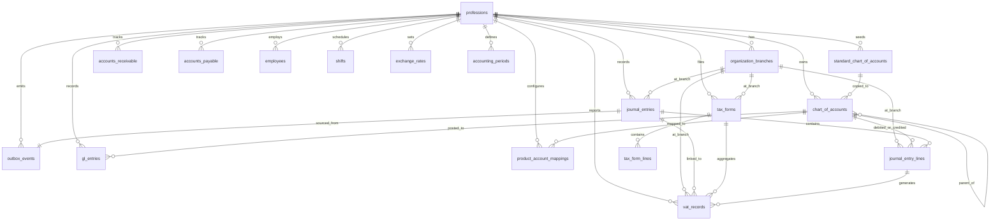

# Accounting System ER Diagram

## รายละเอียดตาราง (Table Details)

### `organization_branches`
| Column | Type | Key | Description |
|--------|------|-----|-------------|
| id | UUID | PK | รหัสสาขา |
| profession_id | UUID | FK → professions | องค์กรเจ้าของ |
| branch_code | TEXT | UQ | รหัสสาขา (HQ, B01) |
| branch_name | TEXT | | ชื่อสาขา |
| tax_id | TEXT | | เลขผู้เสียภาษี (ถ้าแยก) |

### `outbox_events`
| Column | Type | Key | Description |
|--------|------|-----|-------------|
| id | UUID | PK | รหัส event |
| profession_id | UUID | FK → professions | องค์กร |
| aggregate_type | TEXT | | pos_sale, procurement_gr, hr_payroll, manual |
| aggregate_id | UUID | | รหัส aggregate |
| event_type | TEXT | | เช่น pos.sale.completed |
| payload | JSONB | | ข้อมูล event |
| status | TEXT | | pending, published, failed, processing |
| retry_count | INT | | จำนวน retry |

### `chart_of_accounts`
| Column | Type | Key | Description |
|--------|------|-----|-------------|
| id | UUID | PK | รหัสบัญชี |
| profession_id | UUID | FK → professions | องค์กร |
| standard_account_id | UUID | FK → standard_chart_of_accounts | อ้างอิง master (nullable) |
| branch_id | UUID | FK → organization_branches | สาขา (nullable) |
| account_code | VARCHAR(20) | UQ | รหัสบัญชี (1111, 4111) |
| account_name | VARCHAR(255) | | ชื่อบัญชี |
| account_name_en | VARCHAR(255) | | ชื่อบัญชีภาษาอังกฤษ |
| account_type | SMALLINT | | 1=สินทรัพย์, 2=หนี้สิน, 3=ทุน, 4=รายได้, 5=ค่าใช้จ่าย |
| parent_id | UUID | FK → chart_of_accounts | บัญชีแม่ |
| is_custom | BOOLEAN | | `true` = สร้าง/แก้ไขโดยผู้ใช้ |
| is_active | BOOLEAN | | เปิดใช้งาน |
| is_default | BOOLEAN | | บัญชีเริ่มต้น |
| bank_account_no | VARCHAR(50) | | เลขที่บัญชีธนาคาร |
| display_order | INT | | ลำดับการแสดงผล |

### `standard_chart_of_accounts`
| Column | Type | Key | Description |
|--------|------|-----|-------------|
| id | UUID | PK | รหัส master account |
| account_code | TEXT | UQ | รหัสบัญชีมาตรฐาน |
| account_name | TEXT | | ชื่อบัญชีมาตรฐาน |
| account_type | TEXT | | asset, liability, equity, revenue, expense |
| is_active | BOOLEAN | | เปิดใช้งาน |
| created_at | TIMESTAMPTZ | | สร้างเมื่อ |
| updated_at | TIMESTAMPTZ | | แก้ไขเมื่อ |

### `gl_entries` (General Ledger / บัญชีแยกประเภท)
| Column | Type | Key | Description |
|--------|------|-----|-------------|
| id | UUID | PK | รหัสรายการ |
| profession_id | UUID | FK → professions | องค์กร |
| entry_date | DATE | | วันที่บันทึก |
| account_id | UUID | FK → chart_of_accounts | บัญชี |
| order_id | UUID | FK → orders | อ้างอิงใบสั่งซื้อ (nullable) |
| payment_txn_id | UUID | FK → payment_transactions | ธุรกรรมการชำระเงิน (nullable) |
| debit_amount | DECIMAL(12,2) | | ยอดเดบิต |
| credit_amount | DECIMAL(12,2) | | ยอดเครดิต |
| description | TEXT | | รายละเอียด |
| reference_no | TEXT | | เลขที่อ้างอิง |
| created_by | UUID | FK → users | ผู้บันทึก |
| created_at | TIMESTAMPTZ | | สร้างเมื่อ |

### `journal_entries`
| Column | Type | Key | Description |
|--------|------|-----|-------------|
| id | UUID | PK | รหัสรายการ |
| profession_id | UUID | FK → professions | องค์กร |
| branch_id | UUID | FK → organization_branches | สาขา |
| entry_number | VARCHAR(50) | UQ | เลขที่รายการ |
| entry_date | DATE | | วันที่บันทึก |
| reference_type | VARCHAR(50) | | pos_sale, procurement_gr, manual |
| reference_id | UUID | | รหัสอ้างอิง |
| source_event_id | UUID | FK → outbox_events | event ต้นทาง |
| memo | TEXT | | คำอธิบาย |
| currency_code | VARCHAR(3) | | สกุลเงิน |
| exchange_rate | NUMERIC | | อัตราแลกเปลี่ยน |
| status | VARCHAR(20) | | draft, posted, reversed |

### `journal_entry_lines`
| Column | Type | Key | Description |
|--------|------|-----|-------------|
| id | UUID | PK | รหัสบรรทัด |
| journal_entry_id | UUID | FK → journal_entries | รายการแม่ |
| account_id | UUID | FK → chart_of_accounts | บัญชี |
| branch_id | UUID | FK → organization_branches | สาขา |
| debit_amount | NUMERIC | | ยอดเดบิต |
| credit_amount | NUMERIC | | ยอดเครดิต |
| base_debit_amount | NUMERIC | | ยอดเดบิตสกุลหลัก |
| base_credit_amount | NUMERIC | | ยอดเครดิตสกุลหลัก |
| description | TEXT | | รายละเอียด |

### `vat_records`
| Column | Type | Key | Description |
|--------|------|-----|-------------|
| id | UUID | PK | รหัส VAT |
| profession_id | UUID | FK → professions | องค์กร |
| journal_entry_id | UUID | FK → journal_entries | รายการบัญชี |
| document_type | VARCHAR(20) | | tax_invoice, purchase_invoice |
| document_number | VARCHAR(50) | UQ | เลขที่เอกสาร |
| vat_type | VARCHAR(10) | | output (ขาย), input (ซื้อ) |
| vat_rate | NUMERIC | | อัตรา VAT |
| vat_base_amount | NUMERIC | | ฐานภาษี |
| vat_amount | NUMERIC | | ภาษี |
| reporting_period | VARCHAR(7) | | YYYY-MM |

### `tax_forms`
| Column | Type | Key | Description |
|--------|------|-----|-------------|
| id | UUID | PK | รหัสฟอร์ม |
| profession_id | UUID | FK → professions | องค์กร |
| form_type | VARCHAR(10) | | ภ.ง.ด.1/3/53/30, ภ.พ.30 |
| tax_year | INT | | ปีภาษี |
| tax_period | VARCHAR(7) | | YYYY-MM หรือ YYYY-QN |
| status | VARCHAR(20) | | draft, filed, amended |
| total_tax_amount | NUMERIC | | ยอดภาษีรวม |
| xml_payload | TEXT | | XML e-Filing |
| json_payload | JSONB | | ข้อมูล JSON |

### `tax_form_lines`
| Column | Type | Key | Description |
|--------|------|-----|-------------|
| id | UUID | PK | รหัสบรรทัด |
| tax_form_id | UUID | FK → tax_forms | ฟอร์มแม่ |
| line_type | VARCHAR(20) | | summary, detail, attachment |
| amount | NUMERIC | | ยอดเงิน |
| tax_amount | NUMERIC | | ภาษี |

### `accounts_receivable` (ลูกหนี้การค้า)
| Column | Type | Key | Description |
|--------|------|-----|-------------|
| id | UUID | PK | รหัสลูกหนี้ |
| profession_id | UUID | FK → professions | องค์กร |
| customer_id | UUID | FK → customers | ลูกค้า |
| order_id | UUID | FK → orders | ใบสั่งซื้อ |
| invoice_number | TEXT | | เลขที่ใบแจ้งหนี้ |
| amount | DECIMAL(12,2) | | ยอดเงิน |
| paid_amount | DECIMAL(12,2) | | ยอดที่ชำระแล้ว |
| balance | DECIMAL(12,2) | | ยอดคงเหลือ |
| due_date | DATE | | วันครบกำหนด |
| status | TEXT | | open, partial, paid, overdue, written_off |
| notes | TEXT | | หมายเหตุ |
| created_at | TIMESTAMPTZ | | สร้างเมื่อ |
| updated_at | TIMESTAMPTZ | | แก้ไขเมื่อ |

### `accounts_payable` (เจ้าหนี้การค้า)
| Column | Type | Key | Description |
|--------|------|-----|-------------|
| id | UUID | PK | รหัสเจ้าหนี้ |
| profession_id | UUID | FK → professions | องค์กร |
| supplier_id | UUID | FK → suppliers | ผู้จำหน่าย |
| po_id | UUID | FK → purchase_orders | ใบสั่งซื้อ |
| invoice_number | TEXT | | เลขที่ใบแจ้งหนี้ |
| amount | DECIMAL(12,2) | | ยอดเงิน |
| paid_amount | DECIMAL(12,2) | | ยอดที่ชำระแล้ว |
| balance | DECIMAL(12,2) | | ยอดคงเหลือ |
| due_date | DATE | | วันครบกำหนด |
| status | TEXT | | open, partial, paid, overdue, written_off |
| notes | TEXT | | หมายเหตุ |
| created_at | TIMESTAMPTZ | | สร้างเมื่อ |
| updated_at | TIMESTAMPTZ | | แก้ไขเมื่อ |

### `employees` (พนักงาน)
| Column | Type | Key | Description |
|--------|------|-----|-------------|
| id | UUID | PK | รหัสพนักงาน |
| profession_id | UUID | FK → professions | องค์กร |
| user_id | UUID | FK → users | ผู้ใช้งานระบบ |
| employee_code | TEXT | | รหัสพนักงาน |
| full_name | TEXT | | ชื่อ-นามสกุล |
| department | TEXT | | แผนก |
| position | TEXT | | ตำแหน่ง |
| base_salary | DECIMAL(12,2) | | เงินเดือนพื้นฐาน |
| commission_rate | DECIMAL(5,2) | | อัตราค่าคอมมิชชั่น (%) |
| is_active | BOOLEAN | | สถานะการทำงาน |
| created_at | TIMESTAMPTZ | | สร้างเมื่อ |
| updated_at | TIMESTAMPTZ | | แก้ไขเมื่อ |

### `shifts` (ตารางเวร)
| Column | Type | Key | Description |
|--------|------|-----|-------------|
| id | UUID | PK | รหัสเวร |
| profession_id | UUID | FK → professions | องค์กร |
| employee_id | UUID | FK → employees | พนักงาน |
| shift_date | DATE | | วันที่เวร |
| start_time | TIMESTAMPTZ | | เวลาเริ่ม |
| end_time | TIMESTAMPTZ | | เวลาสิ้นสุด |
| shift_type | TEXT | | morning, afternoon, night, full |
| branch_id | UUID | FK → organization_branches | สาขา |
| notes | TEXT | | หมายเหตุ |
| created_at | TIMESTAMPTZ | | สร้างเมื่อ |
| updated_at | TIMESTAMPTZ | | แก้ไขเมื่อ |

### `product_account_mappings`
| Column | Type | Key | Description |
|--------|------|-----|-------------|
| id | UUID | PK | รหัส mapping |
| profession_id | UUID | FK → professions | องค์กร |
| product_id | UUID | | รหัสสินค้า |
| product_type | VARCHAR(20) | | inventory_item, service, package, medicine |
| category_hint | TEXT | | หมวดหมู่สำหรับ smart recommendation |
| revenue_account_id | UUID | FK → chart_of_accounts | บัญชีรายได้ |
| cogs_account_id | UUID | FK → chart_of_accounts | บัญชีต้นทุน |
| inventory_account_id | UUID | FK → chart_of_accounts | บัญชีสินค้า |
| adjustment_account_id | UUID | FK → chart_of_accounts | บัญชีปรับปรุง |
