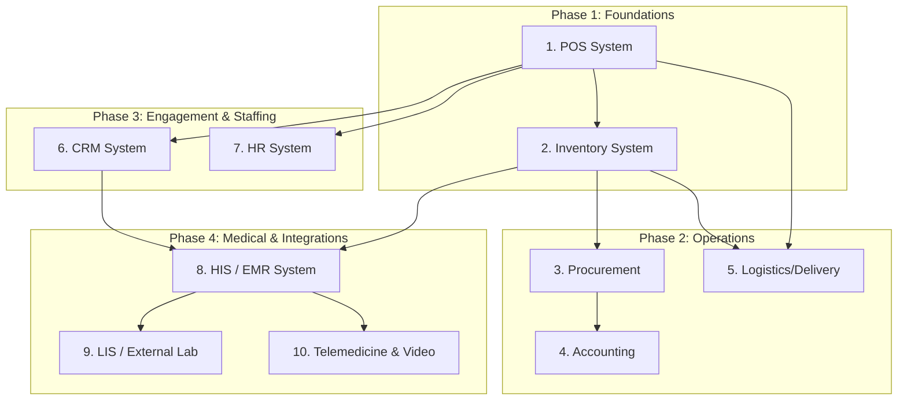

# Sheserved ERP - Core Architecture

## ภาพรวม (Overview)

> **หมายเหตุสำหรับองค์กรที่ได้รับสิทธิ์ขาย:** ทุกองค์กรที่มีค่า `uses_pos_system = true` จะได้รับ **ระบบ ERP ทั้งหมด** ให้ทดลองใช้งานเต็มระบบในระยะเวลาที่ Sheserved กำหนด เมื่อหมดช่วงทดลอง องค์กรจะต้องเลือกสมัคร **Subscription Plan** เพื่อใช้งานต่อ โดยโมดูลที่ไม่ได้อยู่ในแพลนจะถูกล็อก (Locked) แต่ข้อมูลเดิมทั้งหมดยังคงถูกเก็บรักษาไว้อย่างปลอดภัย (ดูรายละเอียดใน [ระบบ Subscription & Licensing](#ระบบ-subscription--licensing-erp-service-management))

## ภาพรวมระบบ (System Overview)
เอกสารนี้เป็นจุดศูนย์กลาง (Master File) ที่ใช้อธิบายโครงสร้างและสถาปัตยกรรมของ Sheserved ERP (Enterprise Resource Planning) สำหรับคลินิกและศูนย์บริการด้านสุขภาพ 
ระบบ ERP นี้เกิดจากการเชื่อมโยงระบบย่อย (Modules) ต่างๆ เข้าด้วยกันเพื่อให้ข้อมูลทำงานสอดคล้องกันแบบ Single Source of Truth

## สถาปัตยกรรมหลัก (Core Architecture Principle)
- **Multi-Tenant ERP Isolation:** ทุกองค์กร (Profession/Clinic) ที่ได้รับสิทธิ์ในการค้าขาย (เช่น มีสถานะ `uses_pos_system = true`) จะได้รับสิทธิ์ในการใช้งานระบบ ERP ที่จำเป็นทั้งหมดเป็น **"ของตนเอง"** โดยปริยาย ข้อมูลทุกตารางในระบบ ERP จะถูกออกแบบให้แยกขาดจากองค์กรอื่นอย่างเด็ดขาดด้วยการอ้างอิง `profession_id` (Tenant-based Data Isolation)
- **Multi-Branch Support:** ภายใต้ 1 องค์กร (`profession_id`) ระบบรองรับการขยายสาขา (Branches) โดยใช้แนวทาง "Branch as Location/Sub-tenant" ผ่านคอลัมน์ `branch_id` สาขาสามารถเลือกได้ว่าจะใช้ Tax ID รวมกับองค์กรแม่ หรือแยกนิติบุคคล/Tax ID ย่อยของตนเอง (กำหนดล่วงหน้าก่อนเริ่มขาย) พนักงานสามารถถูกกำหนดสิทธิ์แยกรายสาขาได้ หรือสามารถรับสิทธิ์ระดับส่วนกลาง (HQ) เพื่อดูรวมทุกสาขาก็ได้
- **Storage Mode & Failover Strategy (Local-First Hybrid):** ศูนย์บริการสามารถเลือกโครงสร้างฐานข้อมูลได้
  - **Supabase Cloud (บังคับใช้งานกับบางระบบ):** ใช้สำหรับ Auth (ดึงข้อมูลผู้ใช้ผ่าน `ServiceLocator` ตาม `auth_data_guidelines.md` เสมอ), ระบบ Chat/Telemedicine, และระบบคิวสำรองข้อมูล (Sync Queue)
  - **Self-host PostgreSQL (ค่าเริ่มต้นสำหรับ HIS/EMR):** ให้บริการฐานข้อมูล ERP และเวชระเบียนที่ฝั่งคลินิก (Local Server) เพื่อปกป้องข้อมูลผู้ป่วย (PDPA) อย่างไรก็ตาม คลินิกสามารถปรับเปลี่ยนให้เป็น Cloud-only หรือ Hybrid ได้ตามต้องการ
  - **Auto Failover & Sync:** หากเซิร์ฟเวอร์ Self-host ล่ม `DataBroker` ใน Flutter จะสลับไปเก็บข้อมูลชั่วคราวลง `erp_sync_queue` บน Supabase อัตโนมัติ และเมื่อระบบกลับมาออนไลน์ จะเริ่มซิงค์ข้อมูลลง Self-host เป็นอันดับแรก โดยใช้กฎ **Last-Write-Wins (หรือ Timestamp-Based Merge)** ในการแก้ไขความขัดแย้ง (Conflict Resolution)
- **Data Governance & Consent Management (ระบบขออนุญาตและตรวจสอบการเข้าถึงข้อมูล):** แม้ศูนย์บริการจะตั้งค่าเก็บข้อมูลไว้ที่ Self-host ทั้งหมด แต่ระบบต้องรองรับกลไกการดึงข้อมูล (Data Retrieval) อย่างโปร่งใสและถูกต้องตามกฎหมาย:
  - **การร้องขอและอนุมัติ (Request & Approval):** หากมีการร้องขอข้อมูลจากภายนอก (เช่น ส่วนกลาง, หรือการส่งต่อเคส) จะต้องผ่านกระบวนการยืนยันความยินยอม (Consent) จากเจ้าของข้อมูลหรือผู้มีอำนาจก่อนเสมอ
  - **ประวัติการเข้าถึง (Audit & Access Log):** ระบบจะต้องบันทึกประวัติทุกขั้นตอนอย่างละเอียด ได้แก่ ประวัติการร้องขอ, ประวัติการอนุมัติ, เวลาดำเนินการ, และ **ต้องบันทึกสำเนาข้อมูลที่ถูกส่งออกไป (Data Payload)** ไว้ทุกรายการ เพื่อให้สามารถตรวจสอบย้อนหลัง (Audit Trail) ได้ 100% (สอดคล้องกับ PDPA)

## การติดตั้ง Self-host ฝั่งคลินิก (การจำลองใน Phase พัฒนา)
เพื่อไม่ให้กระทบกับระบบและฐานข้อมูลหลักของ Sheserved การพัฒนาฟีเจอร์ Self-host จะถูกจำลองในสภาพแวดล้อมดังนี้:
1. **แยก Environment เด็ดขาด:** ติดตั้ง PostgreSQL Database และ Data API สำหรับฝั่งคลินิกลงบน **External Drive อีกลูกหนึ่ง** (ไม่ได้รันบน Drive หรือ Server ตัวเดียวกับระบบเดิม)
2. **การตั้งค่า (Cloud Configuration):** ในระบบส่วนกลาง (Supabase) จะเพิ่มฟิลด์ `storage_mode = 'hybrid'` และ `self_host_api_url` เข้าไปในตาราง `professions`
3. **Data Routing (Flutter App):** เมื่อผู้ใช้ Login ผ่าน Sheserved Auth สำเร็จ `DataBroker` จะเช็ค Config ว่าคลินิกนี้เป็น Hybrid หรือไม่ หากใช่ การเรียก API ของหมวด ERP จะถูกส่งพุ่งตรงไปยัง IP ของ External Drive แทน (โดยแนบ Auth Token ไปด้วยเพื่อความปลอดภัย)
4. **หน้าจอตั้งค่าและเลือก Drive (Setup UI):** ต้องมีหน้าจอสำหรับผู้ดูแลระบบของคลินิก โดย**ระบบจะทำการแสกนและค้นหา IP ของเซิร์ฟเวอร์ฐานข้อมูลในเครือข่ายให้อัตโนมัติ (Auto-Discovery)** เพื่ออำนวยความสะดวก พร้อมทั้งอนุญาตให้ผู้ดูแลระบบสามารถแก้ไข (Edit) หรือกรอก IP/URL แบบแมนนวลเองได้ในกรณีที่ค้นหาไม่พบ เมื่อตั้งค่าสำเร็จ ระบบจะเปลี่ยน `storage_mode` และบันทึก `self_host_api_url` ให้โดยอัตโนมัติ

## โมดูลต่างๆ และความสัมพันธ์ (Modules & Relationships)

1. **[POS System](POS System_plan.md)**
   - **หน้าที่:** จัดการการขายหน้าร้าน (Point of Sale), รับชำระเงิน, ออกใบเสร็จ
   - **การเชื่อมโยง:** ส่งข้อมูลการขายไปตัดสต๊อกใน *Inventory*, ส่งข้อมูลรายได้ไปที่ *Accounting*, ให้แต้มสะสมใน *CRM*, และมีช่องทาง **API (POS Injection)** เพื่อรับคำสั่งซื้อ (Sales Order) จากตะกร้าสินค้าส่วนกลาง (Global Platform Shopping Cart)

2. **[Inventory / Stock System](INVENTORY_SYSTEM_PLAN.md)**
   - **หน้าที่:** จัดการคลังสินค้า, นับสต๊อก, ล็อตสินค้า, วันหมดอายุ
   - **การเชื่อมโยง:** รับสินค้าเข้าจาก *Procurement*, ตัดสินค้าออกจากการขายใน *POS*

3. **[Procurement / Purchasing System](PROCUREMENT_SYSTEM_PLAN.md)**
   - **หน้าที่:** จัดซื้อจัดจ้าง, ขอซื้อ (PR), สั่งซื้อ (PO), จัดการข้อมูล Supplier
   - **การเชื่อมโยง:** เพิ่มสต๊อกเข้า *Inventory* เมื่อรับของ, ส่งบันทึกรายจ่ายไปที่ *Accounting* (Accounts Payable)

4. **[Accounting / Finance System](ACCOUNTING_SYSTEM_PLAN.md)**
   - **หน้าที่:** ระบบบัญชี, สมุดรายวัน, รับจ่าย (AR/AP), สรุปผลกำไรขาดทุน
   - **การเชื่อมโยง:** รับข้อมูลรายได้จาก *POS* และค่าใช้จ่ายจาก *Procurement* / *HR*

5. **[HR System](HR_SYSTEM_PLAN.md)**
   - **หน้าที่:** จัดการทรัพยากรบุคคล, กะการทำงาน, เงินเดือน, ค่าคอมมิชชั่น
   - **การเชื่อมโยง:** ดึงยอดขายจาก *POS* มาคำนวณค่าคอมมิชชั่นให้พนักงาน

6. **[CRM System](CRM_SYSTEM_PLAN.md)**
   - **หน้าที่:** บริหารความสัมพันธ์ลูกค้า, แต้มสะสม (Point), แพ็กเกจสมาชิก, และระบบจัดการเนื้อหา/เคสรีวิว (Phase ท้าย)
   - **การเชื่อมโยง:** นำแต้มมาใช้เป็นส่วนลดใน *POS*, เก็บประวัติการซื้อจาก *POS*, และเผยแพร่เคสรีวิวของคลินิกออกไปยังหน้าแอปฝั่งผู้ใช้ (`health_article_page.dart`) เพื่อให้ผู้ป่วยรีวิวและรับแต้มสะสม

7. **[HIS / Clinic Management System (Phase สุดท้าย)](HIS_SYSTEM_PLAN.md)**
   - **หน้าที่:** ระบบบริหารจัดการคลินิกและโรงพยาบาลแบบเต็มรูปแบบ รวมถึงแผนกผู้ป่วยนอก (OPD) และระบบเวชระเบียนอิเล็กทรอนิกส์ (Electronic Medical Record: EMR)
   - **การเชื่อมโยง:** ดึงประวัติคนไข้/การนัดหมายจาก *CRM*, ส่งคำสั่งจ่ายยาไปตัดสต๊อกที่ *Inventory* และคิดเงินที่ *POS*, เชื่อมต่อตารางแพทย์จาก *HR*
   - **ความสำคัญ:** เป็นมาตรฐานที่โรงพยาบาลและคลินิกในประเทศไทยนิยมใช้ เพื่อรองรับการเก็บประวัติการรักษา, การวินิจฉัยโรค (ICD-10), การสั่งหัตถการ, และการจัดการคิวรับบริการอย่างเป็นระบบ โดยจัดไว้ใน Phase สุดท้ายของการพัฒนา ERP

8. **[LIS / Laboratory Information System (External Lab Integration)](LAB_SYSTEM_PLAN.md)**
   - **หน้าที่:** ระบบจัดการและเชื่อมต่อกับห้องปฏิบัติการภายนอก (External Labs) เพื่อรองรับการสั่งตรวจและรับผลตรวจ
   - **การเชื่อมโยง:** รับคำสั่งตรวจจาก *HIS*, โยนยอดชำระไปที่ *POS*, บันทึกต้นทุน/หนี้ค้างจ่ายที่ *Accounting*, และเชื่อมต่อ *Logistics* กรณีจัดส่งตัวอย่าง

9. **[Telemedicine System (ระบบโทรเวชกรรม - Phase สุดท้าย)](../plans/CHAT_CONSULTATION_IMPROVEMENT_PLAN.md)** (เชื่อมโยงร่วมกับ **[Video System](../plans/VIDEO_SYSTEM_PLAN.md)**)
   - **หน้าที่:** รองรับการปรึกษาแพทย์ทางไกลผ่านระบบแชท การโทรวิดีโอ (Tele-Consultation) และการส่งต่อการช่วยเหลือเหตุฉุกเฉิน (Emergency Alert Response)
   - **การเชื่อมโยง:**
     - **HIS/EMR:** ส่งต่อบันทึกผลการวินิจฉัยโรคและแผนการรักษาจาก `consultation_notes` (Medical Summary) เข้าเป็นส่วนหนึ่งของเวชระเบียนผู้ป่วย (EMR)
     - **POS System:** รับส่งข้อมูลใบสั่งยาอิเล็กทรอนิกส์ (`prescriptions`) จากการแชท/วิดีโอคอล เพื่อเข้ากระบวนการชำระเงินค่าปรึกษาและค่ายาอัตโนมัติ
     - **Inventory / Stock:** เมื่อ POS บันทึกการชำระเงินค่ายาเสร็จสิ้น จะตัดยอดสต๊อกยาตามล็อตวันหมดอายุ (FEFO/Lot/Expiry)
     - **HR System:** บันทึกเวลาปฏิบัติงานของแพทย์ (`consultation_sessions`) และบันทึกประวัติการช่วยเหลือเหตุฉุกเฉินของอาสาสมัคร (Volunteer Response) เพื่อใช้ประเมินค่าตอบแทนหรือผลงาน
     - **Accounting / Finance:** รับรู้รายได้จากการให้บริการปรึกษาทางไกลและการจำหน่ายยา

10. **CDP (Customer Data Platform) / การเชื่อมโยงข้อมูลลูกค้าแบบองค์รวม**
   - **หน้าที่:** ควบรวมข้อมูลลูกค้า (Identity Resolution) จากทุกแหล่งเข้าด้วยกันด้วย **Global ID** เพียงหนึ่งเดียว (Single Customer View / 360-degree View)
   - **การเชื่อมโยง:** ทำงานข้ามระบบทั้งหมดโดยเฉพาะร่วมกับ **CRM** (ใช้วิเคราะห์พฤติกรรม แบ่งกลุ่มเป้าหมาย และทำ Marketing Automation), **HIS** (ดึงประวัติการรักษา), และ **POS** (ดึงยอดสั่งซื้อ) เพื่อเป็นรากฐานในการส่งมอบการบริการลูกค้า (Customer Service) ที่แม่นยำและตรงจุดที่สุด

11. **[Logistics / Delivery Management](../plans/Delivery_PLAN.md)**
    - **หน้าที่:** ระบบจัดการการจัดส่งสินค้าและยา จัดการรอบรถ ไรเดอร์ และติดตามสถานะพัสดุ
    - **การเชื่อมโยง:** เป็นสะพานเชื่อมระหว่าง **POS** (รับออเดอร์/คิดค่าส่ง), **Inventory** (เบิกของ/แพ็ค/ตัดสต๊อก), และ **Accounting** (รับรู้รายได้ค่าขนส่ง)

## ระบบจัดการเอกสารและแบบฟอร์มทางการแพทย์ (Medical Document & Form Management)
ระบบ ERP รองรับการออกเอกสารทางการแพทย์และเอกสารคลินิกอย่างครบวงจร ภายใต้แนวคิด **Customizable Templates (แบบฟอร์มที่ปรับแต่งได้)** สำหรับแต่ละองค์กร (`profession_id`):
- **ประเภทเอกสารที่รองรับ:** ใบรับรองแพทย์ (Medical Certificates), ใบส่งต่อผู้ป่วย (Referral Forms), ใบเวชระเบียน (Medical Records), สรุปผลการรักษา (Medical Summaries), แบบฟอร์มยินยอม (Consent Forms) และอื่นๆ
- **การปรับแต่งแบบฟอร์ม (Form Customization):** แต่ละคลินิก/องค์กรสามารถออกแบบ ปรับแต่งโลโก้, ข้อความหัวกระดาษ-ท้ายกระดาษ, และปรับโครงสร้างฟิลด์ข้อมูลในแบบฟอร์มให้เหมาะสมกับรูปแบบของตนเองได้
- **Smart Template Memory:** ระบบจะจดจำแบบฟอร์มและการตั้งค่าล่าสุดที่องค์กรปรับแต่ง (Auto-save latest template) และเรียกใช้แบบฟอร์มนั้นเป็นค่าเริ่มต้น (Default) ในครั้งถัดไปโดยอัตโนมัติ เพื่อความรวดเร็วในการทำงาน
- **การจัดเก็บและตรวจสอบย้อนหลัง:** เอกสารที่ถูกสร้างและพิมพ์จะถูกจัดเก็บประวัติ (Document History) เชื่อมโยงกับเวชระเบียน (EMR) ของผู้ป่วยรายนั้น เพื่อให้สามารถตรวจสอบย้อนหลังหรือพิมพ์ซ้ำได้เสมอ

## มาตรฐานบัญชีและการเงิน (Accounting & Financial Standards)
ระบบย่อยทั้งหมดใน Sheserved ERP จะถูกออกแบบและทำงานสอดคล้องกันภายใต้ **ผังบัญชีมาตรฐาน (Standard Chart of Accounts)** และ **บัญชีแยกประเภท (General Ledger)** ที่ใช้ในประเทศไทย โดยอ้างอิงจากตัวบทกฎหมายและข้อกำหนดของ **กรมสรรพากร (Revenue Department)** เป็นหลัก เพื่อให้เอกสารทางการเงิน (เช่น ใบกำกับภาษี, ใบเสร็จรับเงิน, หัก ณ ที่จ่าย) และรายงานทางบัญชีสามารถนำไปใช้ยื่นภาษีและตรวจสอบทางกฎหมายได้อย่างถูกต้อง

## ERP Dashboard (แดชบอร์ดจัดการองค์กร)

ทุกองค์กรที่ผ่านการยืนยันจาก Admin Sheserved (ตามขั้นตอนการลงทะเบียนในหมวดหมู่ที่ Sheserved กำหนด) จะได้รับหน้าจอ **ERP Dashboard** เป็นของตนเอง ซึ่งประกอบด้วย:

### 1. หน้าตั้งค่าเบื้องต้น (Organization Settings)
- ข้อมูลองค์กร (ชื่อ, ที่อยู่, เลขที่ผู้เสียภาษี, โลโก้)
- ข้อมูลการติดต่อและช่องทางการชำระเงิน
- การตั้งค่าภาษา, สกุลเงิน, และเขตเวลา

### 2. หน้าจัดการแยกรายโมดูล (Module Management Pages)
แต่ละโมดูลใน ERP จะมีหน้าจัดการของตัวเองภายใน Dashboard ขององค์กร ได้แก่:
- 🛒 **POS Management** — จัดการสินค้า, ราคา, โปรโมชั่น
- 📦 **Inventory Management** — จัดการคลังสินค้า, สต๊อก
- 🛍️ **Procurement Management** — จัดการการสั่งซื้อ, Supplier
- 📊 **Accounting Management** — ดูรายงานบัญชี, ผังบัญชี
- 👥 **HR Management** — จัดการพนักงาน, กะงาน, เงินเดือน
- 🎁 **CRM Management** — จัดการลูกค้า, แต้มสะสม, แพ็กเกจ
- 🏥 **HIS / EMR Management** — จัดการเวชระเบียน, ตรวจรักษา, สั่งยา (Phase สุดท้าย)
- 🔬 **LIS / Lab Management** — จัดการคู่ค้าแล็บ, สั่งตรวจ, รับผลตรวจ
- 📞 **Telemedicine Management** — ติดตามการปรึกษาทางแชท/วิดีโอคอล, ใบสั่งยาออนไลน์, และสถิติการแจ้งเหตุฉุกเฉิน (Phase สุดท้าย)
- 🚚 **Logistics Management** — จัดการรอบรถ, ไรเดอร์, และติดตามพิกัดการจัดส่ง

### 3. จุดเข้าสู่ระบบจากหน้าหลัก (Home Page Entry Point)
เพื่อรักษาโครงสร้าง UI (Layout) ของแอปพลิเคชันไม่ให้ผิดเพี้ยนไปจากเดิม และแยกประสบการณ์ใช้งานระหว่างผู้ใช้งานทั่วไปกับพนักงานองค์กรอย่างชัดเจน:
- **กลไกการแสดงผล (Dynamic Card Replacement):** ระบบจะตรวจสอบสถานะผู้ใช้งานที่ล็อกอินว่ามีสิทธิ์อยู่ในตาราง `employee_roles` หรือไม่
- **ผู้ใช้ทั่วไป (Consumer):** หน้าจอ Home จะแสดง `HomePharmacyCard` (สำหรับค้นหาและสั่งซื้อยา) ตามปกติ
- **พนักงาน/เจ้าขององค์กร (Staff/Owner):** ระบบจะ **ซ่อน** `HomePharmacyCard` และนำการ์ด **`HomeErpCard` (การจัดการองค์กร / ERP Dashboard)** มาวางแทนที่ในตำแหน่งเดียวกัน เพื่อเป็นจุดศูนย์กลางในการเข้าถึงระบบจัดการ ERP ของสาขาที่ตนเองได้รับสิทธิ์ โดยที่ความสูงและการจัดวางในหน้าจอ Home จะยังคงเหมือนเดิมทุกประการ

### 4. ระบบสิทธิ์การใช้งาน (Permission System)

#### หลักการ
- **ชื่อตำแหน่งกำหนดเอง:** แต่ละองค์กรสามารถสร้างและตั้งชื่อตำแหน่ง (Role) ได้เองอย่างอิสระ เช่น "หัวหน้าแผนก", "แคชเชียร์", "เภสัชกร" เป็นต้น
- **สิทธิ์แบบรายโมดูล (Per-Module Permissions):** แต่ละตำแหน่งสามารถกำหนดสิทธิ์แยกกันในแต่ละโมดูล ERP ได้อิสระ เช่น ตำแหน่ง "แคชเชียร์" มีสิทธิ์เต็มที่ใน POS แต่เป็นแค่ Viewer ใน Accounting
- **3 ระดับสิทธิ์ต่อโมดูล (3 Permission Levels per Module):**
  | ระดับ | ความสามารถ |
  |-------|------------|
  | **ระดับ 1 (Full Access)** | เข้าถึงได้ทุกฟังก์ชัน, แก้ไข, ลบ, ออกรายงาน |
  | **ระดับ 2 (Edit Access)** | ใช้งานและแก้ไขข้อมูลได้ แต่ไม่สามารถลบหรือเข้าถึงการตั้งค่าขั้นสูง |
  | **ระดับ 3 (View Only)** | ดูข้อมูลและรายงานได้เท่านั้น ไม่สามารถแก้ไขข้อมูลใดๆ |

#### การจัดการสิทธิ์
- **หน้าจัดการสิทธิ์** (`Permission Management Page`): แต่ละองค์กรมีหน้าจัดการสิทธิ์เป็นของตนเองภายใน Dashboard
- **ผู้มีสิทธิ์จัดการ:** ผู้ถือสิทธิ์สูงสุดขององค์กร (Owner/ผ่านการยืนยัน Sheserved) สามารถมอบสิทธิ์ให้พนักงานในทุกระดับ รวมถึงระดับเดียวกับตนเองได้
- **การ Scope ข้อมูล:** สิทธิ์ทั้งหมดถูก Scope ภายใน `profession_id` ขององค์กรนั้นๆ เท่านั้น และลงลึกระดับสาขาด้วย `branch_id` (หากระบุ `branch_id = NULL` หมายถึงสิทธิ์ระดับ HQ ที่ดูแลทุกสาขา)

```sql
-- ตารางเก็บข้อมูลสาขาของแต่ละองค์กร (Multi-Branch Support)
CREATE TABLE organization_branches (
  id              UUID PRIMARY KEY DEFAULT gen_random_uuid(),
  profession_id   UUID NOT NULL REFERENCES professions(id),
  branch_code     TEXT NOT NULL,                            -- เช่น 'HQ', 'B01', 'B02'
  branch_name     TEXT NOT NULL,
  is_headquarter  BOOLEAN DEFAULT false,
  tax_id          TEXT,                                     -- ถ้าเว้นว่าง จะใช้ tax_id ของ professions แทน
  branch_tax_code TEXT,                                     -- รหัสสาขาสำหรับออกใบกำกับภาษี เช่น '00000', '00001'
  address         TEXT,
  phone           TEXT,
  is_active       BOOLEAN DEFAULT true,
  created_at      TIMESTAMPTZ DEFAULT now(),
  updated_at      TIMESTAMPTZ DEFAULT now(),
  UNIQUE(profession_id, branch_code)
);

-- ตาราง DB สำหรับระบบสิทธิ์
CREATE TABLE organization_roles (
  id              UUID PRIMARY KEY DEFAULT gen_random_uuid(),
  profession_id   UUID NOT NULL REFERENCES professions(id), -- Tenant isolation
  role_name       TEXT NOT NULL,                            -- ชื่อตำแหน่งที่กำหนดเอง เช่น "แคชเชียร์"
  created_at      TIMESTAMPTZ DEFAULT now()
);

CREATE TABLE role_module_permissions (
  id              UUID PRIMARY KEY DEFAULT gen_random_uuid(),
  role_id         UUID NOT NULL REFERENCES organization_roles(id),
  module_name     TEXT NOT NULL CHECK (module_name IN ('pos', 'inventory', 'procurement', 'accounting', 'hr', 'crm', 'his', 'lis', 'telemedicine', 'logistics')),
  access_level    INTEGER NOT NULL CHECK (access_level IN (1, 2, 3)), -- 1=Full, 2=Edit, 3=View
  UNIQUE (role_id, module_name)
);

CREATE TABLE employee_roles (
  id              UUID PRIMARY KEY DEFAULT gen_random_uuid(),
  profession_id   UUID NOT NULL REFERENCES professions(id),
  branch_id       UUID REFERENCES organization_branches(id), -- ถ้า NULL = ผู้ดูแลระดับ HQ ดูแลทุกสาขา
  user_id         UUID NOT NULL REFERENCES users(id),      -- ต้องเป็นสมาชิก Sheserved
  role_id         UUID NOT NULL REFERENCES organization_roles(id),
  assigned_at     TIMESTAMPTZ DEFAULT now()
);
```

### 5. ระบบการแจ้งเตือนภายในองค์กร (Intra-Organization Notifications)
สำหรับการแจ้งเตือนระหว่างพนักงานกันเองในองค์กรเดียวกัน (ภายใต้ `profession_id` เดียวกัน) ครอบคลุมทุกระบบย่อยของ ERP ให้ปฏิบัติตามแนวทาง UI และการทำงานดังนี้:
- **ตำแหน่งแสดงผล:** แสดงบริเวณพื้นที่ **Headsector (มุมขวาบน)** ในหน้า Home ของแอปพลิเคชัน
- **การเรียงลำดับ (Sorting):** เรียงลำดับให้การแจ้งเตือนล่าสุดอยู่ด้านบนเสมอ (Newest first)
- **รูปแบบการแสดงผล (UI Design):** 
  - ใช้การ์ดที่มี **พื้นหลังสีม่วงอ่อน (Light Purple)** เพื่อให้มีความโดดเด่นและเป็นเอกลักษณ์สำหรับการแจ้งเตือนภายในองค์กร
  - **ต้องมีโลโก้ขององค์กรนำหน้าข้อความแจ้งเตือนเสมอ** โดยให้ดึงภาพโลโก้จริงจากฐานข้อมูล (เช่น ตาราง `professions`) มาแสดง

### ฟีเจอร์เปิด/ปิด (Feature Toggles)

*เพื่อให้แต่ละองค์กรสามารถกำหนดการเปิดหรือปิดโมดูลได้ตามความต้องการ*

```sql
CREATE TABLE organization_feature_flags (
  id            UUID PRIMARY KEY DEFAULT gen_random_uuid(),
  profession_id UUID NOT NULL REFERENCES professions(id),
  feature_name  TEXT NOT NULL,                -- เช่น 'crm_loyalty', 'crm_coupons', 'crm_promotions', 'pos_module', 'inventory_module'
  is_enabled    BOOLEAN NOT NULL DEFAULT true, -- true = เปิดใช้งาน, false = ปิด
  created_at    TIMESTAMPTZ DEFAULT now(),
  updated_at    TIMESTAMPTZ DEFAULT now(),
  UNIQUE (profession_id, feature_name)
);
```

---

## ระบบ Subscription & Licensing (ERP Service Management)

ระบบควบคุมการให้บริการ ERP ของ Sheserved ภายใต้โมเดล **Subscription-based Licensing** โดย Sheserved เป็นผู้กำหนดโปรแกรมการสมัครและเงื่อนไขทั้งหมด

### หลักการสำคัญ
- **Free Trial → Subscription:** ทุกองค์กรที่ได้รับอนุมัติจาก Sheserved Admin จะได้ทดลองใช้ **ทุกโมดูล ERP เต็มระบบ** ในช่วงระยะเวลาทดลองที่ Sheserved กำหนด เมื่อหมดช่วงทดลอง โมดูลจะถูกล็อก (Locked UI) แต่ **ข้อมูลเดิมทั้งหมดยังถูกเก็บรักษาไว้** อย่างปลอดภัย
- **ยกเว้นค่าธรรมเนียมสำหรับสาขา Sheserved (Free Internal Waiver):** หากเป็นสาขาหรือองค์กรภายใต้ Sheserved เอง จะได้รับก## แผนงานการพัฒนาและลำดับความสำคัญ (Development Roadmap & Phase Ordering)

เพื่อให้การทดสอบในสภาวะการใช้งานจริงมีความลื่นไหลและสามารถทำ **Integration Test แบบ Zero-Mock (ไม่ใช้ Mock Data)** จากต้นน้ำไปปลายน้ำได้ ลำดับการพัฒนาระบบ ERP ทั้ง 10 โมดูล รวมถึงระบบจัดส่ง [Logistics / Delivery Management](../plans/Delivery_PLAN.md) จะถูกจัดเรียงตามความเกี่ยวพันของข้อมูล (Data Dependencies) ดังนี้:

```mermaid
graph TD
    subgraph Phase 1: Data & Inflow Foundations (ข้อมูลหลักและรับสินค้าเข้าคลัง)
        CRM[1. CRM System - ข้อมูลลูกค้า/ผู้ป่วย]
        PRO[2. Procurement - ใบสั่งซื้อสินค้า] --> INV[3. Inventory - รับของเข้าคลัง]
    end
    subgraph Phase 2: Core Commerce & Logistics (การขายและการขนส่ง)
        INV --> POS[4. POS System - ขายและหักสต็อก]
        CRM --> POS
        POS --> LOG[5. Logistics/Delivery - การจัดส่งยาและเวชภัณฑ์]
        INV --> LOG
    end
    subgraph Phase 3: Finance & HR Operations (การเงินและพนักงาน)
        POS --> ACC[6. Accounting - บันทึกรายได้และรายจ่าย]
        PRO --> ACC
        POS --> HR[7. HR System - คำนวณคอมมิชชันและกะงาน]
    end
    subgraph Phase 4: Clinical & Advanced Integrations (การแพทย์และการเชื่อมต่อภายนอก)
        CRM --> HIS[8. HIS / EMR - สิทธิ์รักษา/เวชระเบียน]
        INV --> HIS
        HIS --> LIS[9. LIS / External Lab - สั่งตรวจแล็บ]
        HIS --> TELE[10. Telemedicine & Video]
    end
```

### เฟส 1: ข้อมูลหลักและการนำเข้าสินค้า (Data & Inflow Foundations)
เฟสเตรียมข้อมูลและป้อนสินค้าเข้าระบบเพื่อให้มีข้อมูลจริงสำหรับการทำธุรกรรมในเฟสถัดไป
1. **[CRM System](CRM_SYSTEM_PLAN.md) (ระบบลูกค้าสัมพันธ์):** จัดการโปรไฟล์ลูกค้า, คะแนนสะสม, แพ็กเกจการรักษา (เป็นพื้นฐานให้กับ POS และ HIS)
2. **[Procurement / Purchasing System](PROCUREMENT_SYSTEM_PLAN.md) (ระบบจัดซื้อ):** ออกเอกสารขอซื้อ/สั่งซื้อ (PR/PO) เพื่อซื้อสินค้าเข้าคลัง
3. **[Inventory / Stock System](INVENTORY_SYSTEM_PLAN.md) (ระบบคลังสินค้า):** จัดการเก็บสินค้าคงคลัง, ล็อตสินค้า, วันหมดอายุ โดยรับข้อมูลจริงจากใบสั่งซื้อของระบบ Procurement

### เฟส 2: การขายหน้าร้านและการจัดส่ง (Core Commerce & Logistics)
เฟสการออกเอกสารทางการค้าและการเคลื่อนย้ายสินค้าออกนอกองค์กร
4. **[POS System](POS System_plan.md) (ระบบขายหน้าร้าน):** ดึงประวัติลูกค้าจริงจาก CRM และสินค้าในสต็อกจริงจาก Inventory มาทำรายการขายพร้อมตัดสต็อกทันที
5. **[Logistics / Delivery Management](../plans/Delivery_PLAN.md) (ระบบจัดส่ง):** ดึงออเดอร์ยาหรือสินค้าที่ชำระเงินเรียบร้อยแล้วจาก POS/Inventory มาจัดคิวรอบรถและมอบหมายงานให้ไรเดอร์จัดส่งจริง

### เฟส 3: บัญชีการเงินและการจัดการพนักงาน (Finance & HR Operations)
เฟสประเมินผลการดำเนินการและการให้ผลตอบแทนพนักงาน
6. **[Accounting / Finance System](ACCOUNTING_SYSTEM_PLAN.md) (ระบบบัญชี):** รับข้อมูลการชำระเงินจริงจาก POS และยอดค่าใช้จ่ายจัดซื้อจาก Procurement เพื่อบันทึกบัญชีแยกประเภทอัตโนมัติ
7. **[HR System](HR_SYSTEM_PLAN.md) (ระบบทรัพยากรบุคคล):** บันทึกชั่วโมงทำงาน และดึงข้อมูลการขายจริงจาก POS ไปคำนวณค่าคอมมิชชันพนักงานโดยตรง

### เฟส 4: ระบบการแพทย์และการเชื่อมต่อภายนอก (Clinical & Advanced Integrations)
เฟสสุดท้ายที่มีความซับซ้อนสูงและต้องอาศัยฐานข้อมูลคนไข้ (CRM) และคลังยา (Inventory) ในการทดสอบ
8. **[HIS / Clinic Management System](HIS_SYSTEM_PLAN.md) (ระบบบริหารคลินิก/เวชระเบียน EMR):** จัดการคิวคนไข้ (จาก CRM), บันทึกการวินิจฉัย (EMR), และการสั่งยา (โดยตัดคลังยาจาก Inventory)
9. **[LIS / Laboratory Information System (External Lab Integration)](LAB_SYSTEM_PLAN.md) (ระบบแล็บ):** เชื่อมต่อส่งใบสั่งตรวจจาก HIS ไปยังแล็บภายนอก และส่งกลับผลตรวจเข้า EMR
10. **[Telemedicine System](../plans/CHAT_CONSULTATION_IMPROVEMENT_PLAN.md) & [Video System](../plans/VIDEO_SYSTEM_PLAN.md) (ระบบโทรเวชกรรม):** ให้บริการพบแพทย์ทางไกลผ่าน Video Call บันทึกประวัติเข้า EMR และสั่งยาไปยังห้องยาของ HIS หรือระบบ Logistics ต่อไป

---

### สิ่งที่ยังไม่ได้เชื่อมต่อตามแผน
- **Routing**: ยังไม่ได้กำหนด route สำหรับ `/erpHome`, `/erpDashboard`, `/posManagement`, ฯลฯ ใน `MaterialApp` หรือระบบ router
- **โมดูลที่ขาด**: ยังไม่มีไฟล์ UI จริงสำหรับ **Procurement Management**, **Accounting Management**, **HR Management**, **CRM Management**, **Permission Management**
- **เชื่อมโยง Dashboard**: `ErpDashboardPage` ยังไม่เชื่อมต่อกับหน้าโมดูลย่อย (ยังคงเป็น `onTap` ที่ placeholder)
- **Feature Toggles**: ตาราง `organization_feature_flags` ยังไม่ได้ถูกนำมาใช้ในการเปิด/ปิดโมดูล UI
- **HomeErpCard Route**: ยังไม่ได้อัปเดต navigation จาก `HomeErpCard` ไปยัง `ErpHomePage`
- **Permission Page**: ยังไม่มี UI สำหรับจัดการสิทธิ์ (`Permission Management Page`)
- **KPI Dashboard**: มีการออกแบบแผนงานแล้วที่ `KPI_DASHBOARD_PLAN.md` (ใช้ระบบสิทธิ์ร่วมกับ HR) แต่ยังไม่มีการสร้างหน้าจอ UI จริง

*‡∏´‡∏°‡∏≤‡∏¢‡πć∏´‡∏ï‡∏∏: ‡∏™‡∏≤‡∏°‡∏≤‡∏£‡∏ñ‡∏ч∏•‡∏¥‡∏Ň∏ó‡∏µ‡πà‡∏ä‡∏∑‡πà‡∏≠‡πŇ∏ï‡πà‡∏•‡∏∞‡∏£‡∏∞‡∏ö‡∏ö‡πć∏û‡∏∑‡πà‡∏≠‡πć∏LJπâ‡∏≤‡πч∏õ‡∏î‡∏π/‡πŇ∏Ňπâ‡πч∏LJ∏£‡∏≤‡∏¢‡∏•‡∏∞‡πć∏≠‡∏µ‡∏¢‡∏î‡πŇ∏ú‡∏ô‡∏á‡∏≤‡∏ô‡πć∏ä‡∏¥‡∏á‡∏•‡∏∂‡∏Ňπч∏î‡πâ*∏™‡∏£‡πâ‡∏≤‡∏á‡∏ê‡∏≤‡∏ô‡∏LJπâ‡∏≠‡∏°‡∏π‡∏• (Subscription Schema)

```sql
-- 1. แพลนการสมัคร (สร้างโดย Sheserved Admin / ERP Service Manager)
CREATE TABLE subscription_plans (
  id                UUID PRIMARY KEY DEFAULT gen_random_uuid(),
  plan_name         TEXT NOT NULL,                          -- เช่น 'Starter', 'Pro', 'Enterprise'
  plan_description  TEXT,
  billing_cycle     TEXT NOT NULL DEFAULT 'MONTHLY',        -- 'MONTHLY', 'YEARLY'
  price             DECIMAL(12,2) NOT NULL DEFAULT 0,       -- ราคา (บาท)
  trial_days        INTEGER NOT NULL DEFAULT 30,            -- จำนวนวันทดลองใช้
  is_custom         BOOLEAN DEFAULT false,                  -- true = แพลนพิเศษเฉพาะองค์กร
  target_profession_id UUID REFERENCES professions(id),     -- ถ้าเป็น Custom Plan → ระบุองค์กรเป้าหมาย (NULL = แพลนกลาง)
  is_active         BOOLEAN DEFAULT true,
  created_by        UUID NOT NULL REFERENCES users(id),     -- ERP Service Manager ที่สร้าง
  created_at        TIMESTAMPTZ DEFAULT now(),
  updated_at        TIMESTAMPTZ DEFAULT now()
);

-- 2. โมดูลที่เปิดใช้ได้ในแต่ละแพลน + โควต้า
CREATE TABLE subscription_plan_modules (
  id                UUID PRIMARY KEY DEFAULT gen_random_uuid(),
  plan_id           UUID NOT NULL REFERENCES subscription_plans(id) ON DELETE CASCADE,
  module_name       TEXT NOT NULL,  -- 'pos', 'inventory', 'procurement', 'accounting', 'hr', 'crm', 'his', 'lis', 'telemedicine', 'logistics'
  is_enabled        BOOLEAN NOT NULL DEFAULT true,
  UNIQUE (plan_id, module_name)
);

-- 3. โควต้าจำกัดการใช้งานของแต่ละแพลน
CREATE TABLE subscription_plan_quotas (
  id                UUID PRIMARY KEY DEFAULT gen_random_uuid(),
  plan_id           UUID NOT NULL REFERENCES subscription_plans(id) ON DELETE CASCADE,
  quota_key         TEXT NOT NULL,  -- เช่น 'max_patients', 'max_pos_transactions_per_day', 'max_reports_per_month'
  quota_value       INTEGER NOT NULL DEFAULT -1,            -- -1 = ไม่จำกัด (Unlimited)
  UNIQUE (plan_id, quota_key)
);

-- 4. การสมัครของแต่ละองค์กร (1 องค์กร : 1 Active Subscription)
CREATE TABLE organization_subscriptions (
  id                UUID PRIMARY KEY DEFAULT gen_random_uuid(),
  profession_id     UUID NOT NULL REFERENCES professions(id) ON DELETE CASCADE,
  plan_id           UUID NOT NULL REFERENCES subscription_plans(id),
  status            TEXT NOT NULL DEFAULT 'TRIAL',
                    -- 'TRIAL', 'ACTIVE', 'EXPIRED', 'SUSPENDED'
  is_internal_free  BOOLEAN DEFAULT false,                  -- true = ยกเว้นค่าธรรมเนียมสำหรับสาขา/องค์กรภายในของ Sheserved เอง
  trial_start_date  DATE NOT NULL DEFAULT CURRENT_DATE,
  trial_end_date    DATE NOT NULL,                          -- วันหมดทดลอง
  subscription_start_date DATE,                             -- วันเริ่มสมัครจริง (หลังชำระเงิน)
  subscription_end_date   DATE,                             -- วันหมดอายุสมาชิก
  payment_method    TEXT,           -- 'CREDIT_CARD', 'BANK_TRANSFER', 'FREE_INTERNAL'
  auto_renew        BOOLEAN DEFAULT false,
  created_at        TIMESTAMPTZ DEFAULT now(),
  updated_at        TIMESTAMPTZ DEFAULT now()
);

-- 5. ประวัติการชำระเงินค่า Subscription
CREATE TABLE subscription_payments (
  id                UUID PRIMARY KEY DEFAULT gen_random_uuid(),
  subscription_id   UUID NOT NULL REFERENCES organization_subscriptions(id) ON DELETE CASCADE,
  amount            DECIMAL(12,2) NOT NULL,
  payment_method    TEXT NOT NULL,  -- 'CREDIT_CARD', 'BANK_TRANSFER'
  payment_status    TEXT NOT NULL DEFAULT 'PENDING',
                    -- 'PENDING', 'COMPLETED', 'FAILED', 'REFUNDED'
  transaction_ref   TEXT,           -- เลขอ้างอิงธุรกรรม
  approved_by       UUID REFERENCES users(id),               -- ERP Service Manager ที่อนุมัติ (กรณี BANK_TRANSFER)
  paid_at           TIMESTAMPTZ,
  created_at        TIMESTAMPTZ DEFAULT now()
);

-- 6. ตัวนับการใช้งานจริง (Usage Counters) — Reset ตามรอบบิลลิ่ง
CREATE TABLE organization_usage_counters (
  id                UUID PRIMARY KEY DEFAULT gen_random_uuid(),
  profession_id     UUID NOT NULL REFERENCES professions(id) ON DELETE CASCADE,
  quota_key         TEXT NOT NULL,  -- ต้องตรงกับ subscription_plan_quotas.quota_key
  current_value     INTEGER NOT NULL DEFAULT 0,
  period_start      DATE NOT NULL,
  period_end        DATE NOT NULL,
  updated_at        TIMESTAMPTZ DEFAULT now(),
  UNIQUE (profession_id, quota_key, period_start)
);

-- RLS
ALTER TABLE subscription_plans             ENABLE ROW LEVEL SECURITY;
ALTER TABLE subscription_plan_modules      ENABLE ROW LEVEL SECURITY;
ALTER TABLE subscription_plan_quotas       ENABLE ROW LEVEL SECURITY;
ALTER TABLE organization_subscriptions     ENABLE ROW LEVEL SECURITY;
ALTER TABLE subscription_payments          ENABLE ROW LEVEL SECURITY;
ALTER TABLE organization_usage_counters    ENABLE ROW LEVEL SECURITY;
```

### ตัวแปรโควต้ามาตรฐาน (Standard Quota Keys)

โมดูลใหม่ทุกตัวใน ERP จะถูกเพิ่ม `quota_key` เข้าตาราง `subscription_plan_quotas` โดยอัตโนมัติ:

| Module | quota_key | คำอธิบาย |
|--------|-----------|----------|
| **POS** | `max_pos_transactions_per_day` | จำนวนรายการขายต่อวัน |
| **POS** | `max_pos_branches` | จำนวนสาขาที่เปิดใช้ POS |
| **Inventory** | `max_inventory_skus` | จำนวน SKU สินค้าในคลัง |
| **Procurement** | `max_purchase_orders_per_month` | จำนวน PO ต่อเดือน |
| **Accounting** | `max_reports_per_month` | จำนวนรายงานบัญชีที่ออกได้ต่อเดือน |
| **HR** | `max_employees` | จำนวนพนักงานในระบบ |
| **CRM** | `max_patients` | จำนวนลูกค้า/ผู้ป่วยในระบบ |
| **CRM** | `max_coupons` | จำนวนคูปองที่สร้างได้ |
| **HIS/EMR** | `max_visits_per_month` | จำนวน Visit ที่เปิดได้ต่อเดือน |
| **HIS/EMR** | `max_medical_documents_per_month` | จำนวนเอกสารทางการแพทย์ที่พิมพ์ได้ |
| **LIS** | `max_lab_orders_per_month` | จำนวนใบสั่งตรวจแล็บต่อเดือน |
| **Telemedicine** | `max_teleconsult_minutes_per_month` | จำนวนนาทีวิดีโอคอลต่อเดือน |
| **Logistics** | `max_delivery_rounds_per_month` | จำนวนรอบจัดส่งต่อเดือน |
| **Global** | `max_branches` | จำนวนสาขาสูงสุดที่เปิดได้ |

### กระบวนการทำงาน (Subscription Workflow)

1. **องค์กรลงทะเบียน:** Sheserved Admin อนุมัติ → ระบบสร้าง `organization_subscriptions` สถานะ `TRIAL` พร้อมกำหนด `trial_end_date`
2. **ช่วงทดลอง:** องค์กรใช้ทุกโมดูลได้เต็มระบบ ไม่จำกัดโควต้า
3. **หมดช่วงทดลอง:** ระบบเปลี่ยนสถานะเป็น `EXPIRED` → ทุกโมดูลแสดงเป็น **Locked** (กดแล้วขึ้นหน้า Upgrade)
4. **สมัครแพลน:** องค์กรเลือกแพลนและชำระเงิน (Credit Card ตัดอัตโนมัติ หรือ โอนเงินแล้ว ERP Service Manager กดอนุมัติ)
5. **ใช้งานตามโควต้า:** ระบบตรวจสอบ `organization_usage_counters` เทียบกับ `subscription_plan_quotas` ก่อนทุกการกระทำสำคัญ → หากเกินโควต้าจะแสดงข้อความแจ้งเตือนให้อัปเกรดแพลน
6. **ต่ออายุ:** หากตั้งค่า `auto_renew = true` ระบบจะพยายามตัดบัตรเครดิตอัตโนมัติเมื่อใกล้หมดอายุ หากตัดไม่ได้ → แจ้งเตือน → หากไม่ดำเนินการภายใน Grace Period → สถานะเปลี่ยนเป็น `SUSPENDED`

### การตรวจสอบโควต้าในระบบ (Quota Enforcement Logic)

ระบบจะตรวจสอบโควต้า **ณ จุดที่มีการกระทำสำคัญ** (Write Operation) ทุกครั้ง:

```
Flutter App ‚Üí Repository Layer ‚Üí QuotaGuard Middleware ‚Üí Supabase RPC

ขั้นตอน:
1. Repository เรียก QuotaGuard.check(professionId, quotaKey)
2. QuotaGuard ดึง subscription ปัจจุบัน (ตรวจสอบฟิลด์ `is_internal_free`) + โควต้าของแพลน + usage counter
3. หาก `is_internal_free = true` → ยกเว้นการตรวจสอบทั้งหมด → อนุญาตทันที (สิทธิ์เทียบเท่า Enterprise, Unlimited Quota)
4. หาก current_value < quota_value → อนุญาต → เพิ่ม counter +1
5. หาก current_value >= quota_value → ปฏิเสธ → แสดง UpgradeDialog
6. หาก quota_value = -1 → ไม่จำกัด → อนุญาตทันที
```

---

## รายละเอียดหน้าจอและการทำงาน (UI/UX Screen Specifications)

### 1. หน้าจอแจ้งเตือนและอัปเกรดแพลน (Upgrade Dialog / Locked State Screen)

เมื่อองค์กรพยายามเข้าใช้งานโมดูลที่ไม่ได้อยู่ในแพลน หรือมีสิทธิ์การใช้งาน (Quota) เต็มขีดจำกัดแล้ว ระบบจะแสดง Dialog หรือ Bottom Sheet สำหรับอัปเกรดแพลนทันที

#### A. กรณีเข้าใช้งานโมดูลที่ถูกล็อก (Locked Module Clicked)
- **พฤติกรรม (Behavior):** แสดงเป็นหน้าจอ Overlay หรือ Bottom Sheet ด้านล่าง โดยมีลักษณะกึ่งหน้าต่างป๊อปอัป มีดีไซน์แบบ Glassmorphism สวยงาม โดดเด่น
- **รายละเอียดที่แสดงในหน้าจอ:**
  - **ไอคอนโมดูลและชื่อโมดูล** ที่ต้องการเข้าใช้งาน (เช่น "โมดูลเวชระเบียน HIS" หรือ "ระบบแล็บ LIS")
  - **สถานะปัจจุบัน:** แสดงป้ายกำกับโดดเด่น เช่น `ทดลองใช้สิ้นสุดแล้ว` หรือ `ไม่อยู่ในแพลนปัจจุบันของคุณ`
  - **ข้อเสนอการอัปเกรด (Upgrade Offers):** แสดงการ์ดแพลนแนะนำที่รองรับโมดูลนี้ (เปรียบเทียบความคุ้มค่า เช่น Starter vs Pro)
  - **ปุ่มดำเนินการ (Call to Action):**
    - ปุ่ม **"อัปเกรดแพลนทันที"** (ปุ่มหลัก: สีม่วงไล่เฉด - Primary Purple Gradient) สำหรับเปิดหน้าชำระเงิน/เลือกแพลน
    - ปุ่ม **"ติดต่อฝ่ายบริการลูกค้า"** (ปุ่มรอง: Outline) เพื่อสอบถามข้อมูลเพิ่มเติม
    - ปุ่ม **"ปิดหน้าต่าง"** (ปิด Dialog กลับไปหน้าแดชบอร์ดหลัก)

#### B. กรณีโควต้าใช้งานเต็ม (Quota Reached Dialog)
- **พฤติกรรม (Behavior):** แสดงหน้าต่างป๊อปอัปเตือนทันทีเมื่อพยายามทำรายการใหม่ที่เกินโควต้า (เช่น กำลังจะออกใบเสร็จ POS ใบที่ 101 ในแพลนที่จำกัด 100 ใบต่อวัน)
- **รายละเอียดที่แสดงในหน้าจอ:**
  - **หัวข้อชัดเจน:** `ขออภัย โควต้าการใช้งานของคุณเต็มแล้ว`
  - **แถบแสดงเปอร์เซ็นต์ (Progress Bar):** แสดงปริมาณการใช้งานจริงเทียบกับโควต้าของแพลนปัจจุบัน เช่น `การทำรายการ POS: 100 / 100 รายการ (100%)`
  - **คำแนะนำ:** "กรุณาอัปเกรดเป็นแพลนที่สูงขึ้นเพื่อทำการออกบิลต่อ หรือรอรีเซ็ตโควต้าในรอบถัดไป"
  - **ปุ่มอัปเกรดด่วน (Quick Upgrade):** พุ่งตรงไปยังขั้นตอนการชำระเงินของแพลนถัดไปเพื่อใช้งานต่อได้ทันทีโดยไม่ให้กระบวนการขาย/บริการหยุดชะงัก

---

### 2. หน้าจอจัดการแพลนสำหรับ ERP Service Manager (ERP Subscription Management Console)

พนักงาน Sheserved ในกลุ่ม **ผู้จัดการบริการ ERP (ERP Service Manager)** จะเข้าใช้งานผ่านหน้า Dashboard ส่วนกลาง โดยมีฟังก์ชันจัดการหลักดังนี้:

#### A. หน้าหลักการจัดการบริการ (Subscription Dashboard Overview)
- **Metrics Dashboard:** 
  - จำนวน Active Subscriptions ทั้งหมด แยกตามประเภทแพลน (Starter, Pro, Enterprise, Custom)
  - ยอดรายได้รวมรายเดือน (MRR) และรายปี (ARR)
  - จำนวนรายการชำระเงินที่รอการอนุมัติ (Pending Bank Transfers)
- **ระบบค้นหาและกรอง (Search & Filter):** ค้นหาตามชื่อองค์กร (`profession_id`), สถานะการสมัคร (`TRIAL`, `ACTIVE`, `EXPIRED`), หรือประเภทแพลน
- **รายการแจ้งเตือนสิทธิ์ (Alerts List):** แสดงองค์กรที่ใกล้หมดอายุทดลองใช้ (Trial) หรือยอดค้างชำระ

#### B. หน้าสร้างและแก้ไขแพลนการใช้งาน (Plan Creator / Editor Screen)
- **ข้อมูลทั่วไป (General Info):** ช่องกรอก ชื่อแพลน, คำอธิบายแพลน, ราคาต่อเดือน/ต่อปี, จำนวนวันทดลองใช้ฟรี
- **การเลือกเปิด/ปิดโมดูล (Module Selection - Toggle Checklist):**
  - รายการ Checklist โมดูล ERP ทั้งหมด 10 โมดูล (POS, Inventory, Procurement, Accounting, HR, CRM, HIS, LIS, Telemedicine, Logistics)
  - สวิตช์สลับ (Toggle Switch) เพื่อกำหนดว่าแพลนนี้สามารถใช้โมดูลนี้ได้หรือไม่ (`is_enabled`)
- **การตั้งค่าขีดจำกัดโควต้า (Quota Limits Configuration):**
  - ช่องกรอกข้อมูลตัวเลขจำกัดการใช้งานตามตัวแปรโควต้ามาตรฐาน (เช่น จำนวนสาขาสูงสุด, จำนวนพนักงานสูงสุด, จำนวนรายการขายต่อวัน)
  - มีช่องเช็คบ็อกซ์ "ไม่จำกัด" (Unlimited) เพื่อส่งค่า `-1` ไปยังฐานข้อมูล

#### C. หน้าสร้างแพลนพิเศษเฉพาะองค์กรและการยกเว้นค่าบริการ (Custom Plan & Free Waiver Manager)
- **การกำหนดสถานะยกเว้นค่าบริการ (Free Waiver Toggle):**
  - **ข้อจำกัดการมองเห็นและการเข้าถึง (Strict Visibility & Access Control):** 
    - **ปุ่มสวิตช์นี้จะต้องถูกซ่อนโดยเด็ดขาดและเข้าถึงไม่ได้โดยบุคคลภายนอก** (เช่น พนักงาน, ผู้จัดการคลินิก หรือเจ้าขององค์กรทั่วไปที่ใช้งานระบบ ERP)
    - ระบบจะยินยอมให้เฉพาะผู้ใช้ที่อยู่ในกลุ่ม **`ERP Service Manager` (พนักงานภายในของ Sheserved ที่ผ่านการยืนยันสถานะ `sheserved_internal`)** เท่านั้นที่จะมีสิทธิ์มองเห็นและปรับแก้สวิตช์นี้ได้ ผ่านการตรวจสอบ Role และการใช้ RLS Policies ฝั่ง Backend
  - **สถานที่ตั้ง:** อยู่ในการจัดการรายละเอียดข้อมูลองค์กร (Organization Detail View) หรือในหน้าจอจัดทำแพลนพิเศษ (Custom Plan Config Screen) ภายใน Subscription Console ของ **ERP Service Manager**
  - **การออกแบบ UI:** 
    - มีสวิตช์เปิด/ปิด (Switch Widget) ที่มีป้ายกำกับชัดเจน: `[ ] ยกเว้นค่าบริการสำหรับหน่วยงานภายใน Sheserved (Free Internal Waiver)`
    - เมื่อผู้ใช้ทำการเปิดใช้งาน (Toggle On) ระบบจะแสดง Dialog Warning เพื่อยืนยัน: *"คุณแน่ใจหรือไม่ที่จะเปิดใช้งานฟรีถาวรให้กับองค์กรนี้? การดำเนินการนี้จะกำหนดให้สิทธิ์การใช้งานขององค์กรนี้เป็น Unlimited และยกเว้นการชำระเงินทั้งหมด"*
    - เมื่อกดยืนยัน ค่า `is_internal_free` ในตาราง `organization_subscriptions` จะถูกตั้งค่าเป็น `true` และระบบจะบังคับตั้งค่า `payment_method = 'FREE_INTERNAL'` และสถานะ subscription เป็น `ACTIVE` โดยไม่มีวันหมดอายุโดยอัตโนมัติ
- **การจับคู่แพลนเฉพาะราย (One-to-One Association):**
  - ค้นหาและระบุองค์กรปลายทาง (`target_profession_id`) ที่จะได้รับสิทธิ์แพลนนี้
  - ตั้งราคาพิเศษเฉพาะดีลองค์กรนั้นๆ และกำหนดวันหมดอายุตามสัญญาข้อตกลง
  - สามารถเปิด/ปิดโมดูล และปรับแต่งตัวเลขโควต้าได้อิสระนอกเหนือจากแพลนมาตรฐาน (Standard Plans) (หาก `is_internal_free` เป็นจริง ระบบจะข้ามการบังคับใช้ตัวเลขโควต้าเหล่านี้)

#### D. หน้ายืนยันการชำระเงินด้วยเงินโอน (Bank Transfer Verification Screen)
- **รายการรอตรวจสอบ (Pending Approval Queue):** แสดงรายการที่ลูกค้าโอนเงินและแนบหลักฐานสลิป (Slip Uploaded)
- **รายละเอียดการตรวจสอบ:**
  - ภาพสลิปการโอนเงิน (คลิกเพื่อขยายภาพขนาดใหญ่และซูมตรวจความถูกต้องได้)
  - ยอดเงินโอน, วันเวลาที่โอน, ธนาคารต้นทาง
  - รายละเอียดแพลนและองค์กรที่ขอเปิดใช้
- **ปุ่มจัดการ (Action Buttons):**
  - ปุ่ม **"อนุมัติ (Approve)"** -> เปลี่ยนสถานะเป็น `ACTIVE`, กำหนดวันเริ่ม-หมดอายุ, อัปเดต `approved_by` ในตาราง `subscription_payments` และส่ง Notification แจ้งเตือนผู้ใช้องค์กร
  - ปุ่ม **"ปฏิเสธ (Reject)"** -> แสดงช่องให้กรอกเหตุผลที่ปฏิเสธ (เช่น ยอดเงินโอนไม่ตรง, แนบรูปภาพไม่ชัดเจน) เพื่อส่งแจ้งเตือนให้ลูกค้าแนบหลักฐานชำระเงินเข้ามาใหม่อีกครั้ง

---

---

### การเชื่อมโยงระบบโทรเวชกรรมและการแจ้งเหตุฉุกเฉิน (Telemedicine & Emergency System Integration - Phase สุดท้าย)

เพื่อเตรียมรองรับเคสผู้ป่วยและการสื่อสารทางไกลที่ถูกส่งต่อมาจากระบบแชท [CHAT_CONSULTATION_IMPROVEMENT_PLAN.md](../plans/CHAT_CONSULTATION_IMPROVEMENT_PLAN.md) และระบบวิดีโอช่วยเหลือฉุกเฉิน [VIDEO_SYSTEM_PLAN.md](../plans/VIDEO_SYSTEM_PLAN.md) ระบบ ERP จะทำหน้าที่เชื่อมโยงข้อมูลในลักษณะ Single Source of Truth ดังนี้:

#### 1. การบูรณาการร่วมกับระบบเวชระเบียน (HIS / EMR Sync)
* **การบันทึกประวัติรักษาระยะไกล:** เมื่อแพทย์และคนไข้สิ้นสุดการปรึกษาทางไกล (Tele-consultation session) ข้อมูลผลการวินิจฉัยโรค (ICD-10) อาการสำคัญ และแผนการรักษาจากตาราง `consultation_notes` (Medical Summary) จะถูกส่งเข้าสู่ฐานข้อมูลหลักของ HIS ภายใต้ตาราง EMR ของคนไข้รายนั้นทันที โดยจำแนกตาม `profession_id` ของแพทย์/คลินิกที่ให้บริการ
* **ภาพและคลิปวิดีโอทางแพทย์:** สื่อมัลติมีเดีย (รูปภาพแสดงอาการ, วิดีโอแจ้งเหตุ) ที่ส่งผ่านห้องแชทและคอล ซึ่งผ่านขั้นตอนการทำ **Face Blur และประทับลายน้ำ (PDPA Compliance)** แล้ว จะถูกเก็บบันทึกและเชื่อมโยงกับแถบประวัติรักษาในระบบ EMR เพื่อให้แพทย์ใช้พิจารณาประกอบการติดตามผลรักษา

#### 2. การสั่งยาและการตัดคลังสินค้า (E-Prescription & Inventory Integration)
* **ใบสั่งยาออนไลน์:** ใบสั่งยาอิเล็กทรอนิกส์ (`prescriptions`) ที่เกิดขึ้นในห้องแชทจะส่งข้อมูลยารายการย่อย (Medications JSON) ไปยังห้องยาของระบบ HIS โดยอัตโนมัติ
* **การคัดกรองตามหลัก FEFO:** ระบบห้องยาของ HIS จะดึงข้อมูลสต๊อกยารายการดังกล่าวจากระบบ **Inventory** เพื่อตรวจสอบวันหมดอายุและล็อตสินค้า และทำการจองยาโดยเลือกใช้ล็อตที่ใกล้หมดอายุก่อนตามหลัก FEFO (First Expired, First Out)

#### 3. การชำระเงินและการเงิน (POS, CRM & Accounting Integration)
* **การสร้างบิลอัตโนมัติ:** เมื่อแพทย์ยืนยันส่งใบสั่งยา ระบบ **POS System** จะได้รับใบแจ้งหนี้จำหน่ายยาและค่าปรึกษาเพื่อให้คนไข้กดยืนยันชำระเงินผ่านช่องทาง Payment Gateway บนแอปพลิเคชัน
* **การรับรู้รายได้และแต้มสะสม:** เมื่อยอดเงินชำระเสร็จสมบูรณ์:
  - POS จะสั่งการให้ Inventory ตัดสต๊อกยาออกจากระบบถาวร
  - ระบบ **Accounting** จะบันทึกการรับรู้รายได้ (General Ledger) ทันที
  - ระบบ **CRM** จะคำนวณคะแนนสะสม (Loyalty Points) และประมวลผลการใช้สิทธิ์คูปอง/แพ็กเกจของผู้ซื้อ

#### 4. การจัดการบุคลากรทางการแพทย์และอาสาสมัคร (HR Integration)
* **ค่าตอบแทนและชั่วโมงการปรึกษา:** ระบบจะดึงประวัติระยะเวลาการโทร/แชทจากตาราง `consultation_sessions` ในช่วงกะเวลาปฏิบัติงานมาคำนวณเป็นค่าคอมมิชชันหรือค่าธรรมเนียมวิชาชีพแพทย์ในระบบ **HR System**
* **สถิติการออกเหตุอาสาสมัคร:** ในระบบช่วยเหลือฉุกเฉิน (Video System) ประวัติของเจ้าหน้าที่ในการกดยืนยันให้ความช่วยเหลือผู้ป่วย (`Volunteer Response`) จะถูกนำไปแปลงเป็นผลงานช่วยเหลือสังคม ชั่วโมงจิตอาสา หรือคำนวณเบี้ยเลี้ยงพิเศษในระบบ HR ต่อไป

---

## แผนงานการพัฒนาและลำดับความสำคัญ (Development Roadmap & Phase Ordering)

เพื่อให้ง่ายต่อการแตกงานย่อย (Task Breakdown) และคำนึงถึงความเกี่ยวพันของข้อมูล (Data Dependencies) ลำดับการพัฒนาระบบ ERP ทั้ง 10 โมดูล รวมถึงระบบจัดส่ง [Logistics / Delivery Management](../plans/Delivery_PLAN.md) จะถูกแบ่งออกเป็น 4 เฟสหลักดังนี้:



### เฟส 1: ระบบรากฐานการค้า (Core Commerce Foundations)
เป็นเฟสแรกสุดที่ต้องทำเนื่องจากระบบอื่นๆ ต้องใช้ฐานข้อมูลสินค้าและรายการขาย
1. **[POS System](POS System_plan.md) (ระบบขายหน้าร้าน):** จัดการสินค้า ราคาขาย และการรับชำระเงิน
2. **[Inventory / Stock System](INVENTORY_SYSTEM_PLAN.md) (ระบบคลังสินค้า):** จัดการ SKU, ล็อตสินค้า, วันหมดอายุ และการตัดสต็อกสินค้าทันทีเมื่อ POS ขายออก

### เฟส 2: ระบบบริหารหลังบ้านและขนส่ง (Operational & Logistics Support)
เฟสที่ช่วยสนับสนุนการขายและการเคลื่อนย้ายสินค้า
3. **[Procurement / Purchasing System](PROCUREMENT_SYSTEM_PLAN.md) (ระบบจัดซื้อ):** ทำหน้าที่ออก PR/PO เพื่อนำสินค้าเข้าคลัง (Inventory)
4. **[Logistics / Delivery Management](../plans/Delivery_PLAN.md) (ระบบจัดส่ง):** เชื่อมโยงเพื่อนำสินค้าหรือยาที่ชำระเงินจาก POS/HIS ไปจัดส่งผ่านพนักงานขับรถหรือไรเดอร์
5. **[Accounting / Finance System](ACCOUNTING_SYSTEM_PLAN.md) (ระบบบัญชี):** รับรู้รายได้จาก POS และรายจ่ายจาก Procurement เพื่อลงบันทึกสมุดรายวันขั้นต้น

### เฟส 3: ระบบจัดการบุคลากรและลูกค้าสัมพันธ์ (Engagement & Staffing)
เฟสสำหรับการขยายขีดความสามารถการบริการลูกค้าและการบริหารองค์กร
6. **[CRM System](CRM_SYSTEM_PLAN.md) (ระบบลูกค้าสัมพันธ์):** จัดการโปรไฟล์ลูกค้า, คะแนนสะสม, แพ็กเกจการรักษา และการรีวิวสินค้าเพื่อสะสมแต้ม
7. **[HR System](HR_SYSTEM_PLAN.md) (ระบบทรัพยากรบุคคล):** จัดการกะการทำงานพนักงาน และดึงยอดขายจาก POS มาคำนวณค่าคอมมิชชัน

### เฟส 4: ระบบการแพทย์และการเชื่อมต่อภายนอก (Advanced Clinical & Integrations)
เฟสสุดท้ายที่มีความซับซ้อนสูงและต้องอาศัยฐานข้อมูลคนไข้ (CRM) และคลังยา (Inventory) เป็นพื้นฐาน
8. **[HIS / Clinic Management System](HIS_SYSTEM_PLAN.md) (ระบบบริหารคลินิก/เวชระเบียน EMR):** จัดการคิวคนไข้, บันทึกการรักษาของแพทย์ (EMR), และการสั่งจ่ายยา
9. **[LIS / Laboratory Information System (External Lab Integration)](LAB_SYSTEM_PLAN.md) (ระบบแล็บ):** เชื่อมต่อส่งใบสั่งตรวจจาก HIS ไปยังแล็บภายนอก และส่งกลับผลตรวจเข้า EMR
10. **[Telemedicine System](../plans/CHAT_CONSULTATION_IMPROVEMENT_PLAN.md) & [Video System](../plans/VIDEO_SYSTEM_PLAN.md) (ระบบโทรเวชกรรม):** ให้บริการพบแพทย์ทางไกลผ่าน Video Call บันทึกประวัติเข้า EMR และสั่งยาข้ามไปยังระบบจัดส่ง (Logistics)

---

### สิ่งที่ยังไม่ได้เชื่อมต่อตามแผน
- **Routing**: ยังไม่ได้กำหนด route สำหรับ `/erpHome`, `/erpDashboard`, `/posManagement`, ฯลฯ ใน `MaterialApp` หรือระบบ router
- **โมดูลที่ขาด**: ยังไม่มีไฟล์ UI จริงสำหรับ **Procurement Management**, **Accounting Management**, **HR Management**, **CRM Management**, **Permission Management**
- **เชื่อมโยง Dashboard**: `ErpDashboardPage` ยังไม่เชื่อมต่อกับหน้าโมดูลย่อย (ยังคงเป็น `onTap` ที่ placeholder)
- **Feature Toggles**: ตาราง `organization_feature_flags` ยังไม่ได้ถูกนำมาใช้ในการเปิด/ปิดโมดูล UI
- **HomeErpCard Route**: ยังไม่ได้อัปเดต navigation จาก `HomeErpCard` ไปยัง `ErpHomePage`
- **Permission Page**: ยังไม่มี UI สำหรับจัดการสิทธิ์ (`Permission Management Page`)
- **KPI Dashboard**: มีการออกแบบแผนงานแล้วที่ `KPI_DASHBOARD_PLAN.md` (ใช้ระบบสิทธิ์ร่วมกับ HR) แต่ยังไม่มีการสร้างหน้าจอ UI จริง

*หมายเหตุ: สามารถคลิกที่ชื่อแต่ละระบบเพื่อเข้าไปดู/แก้ไขรายละเอียดแผนงานเชิงลึกได้*
