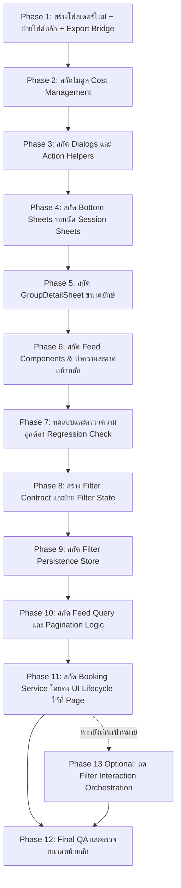

# แผนการจัดโครงสร้างและแยกชิ้นส่วน Sport Club (Sport Club Refactoring Plan)

เอกสารนี้ระบุขั้นตอน รายละเอียดการแยกชิ้นส่วน (Component Breakdown) และแนวทางการย้ายไฟล์ `sport_club_page.dart` (เดิม 7,770 บรรทัด) ไปสู่โมดูลใหม่ที่ `lib/features/sport_club/` เพื่อเพิ่มขีดความสามารถในการบำรุงรักษา (Maintainability), ลดขนาดไฟล์หน้าหลักลงเหลือ ~500 บรรทัด และเปิดทางให้สามารถทำ Unit / Widget Testing ได้อย่างมีประสิทธิภาพ

---

## 1. วัตถุประสงค์และผลลัพธ์ที่คาดหวัง (Objectives & Goals)

1. **ลดขนาดและภาระของหน้าหลัก (Single Responsibility Principle):**
   * ลดขนาด `sport_club_page.dart` จาก **7,770 บรรทัด (368 KB)** ให้เหลือเพียง **~450–600 บรรทัด**
   * หน้าหลักจะทำหน้าที่เพียง **Scaffold, App Bar, Feed List Controller, Pagination และ State Orchestration**
2. **แยกขอบเขตการ Re-render (Scoped Re-rendering):**
   * Bottom Sheets ขนาดใหญ่ และ Dialogs มี State ภายในตัวเอง แยกขาดจากฟีด ไม่กระตุ้นให้ฟีดหลักต้อง Rebuild ทั้งหน้า
3. **การทดสอบแบบแยกส่วน (Component Testability):**
   * แยก Widget แต่ละตัวออกมาเป็นไฟล์เดี่ยวที่มี Props/Callbacks ชัดเจน สามารถเขียน Golden Test หรือ Widget Test รายชิ้นได้
4. **ความเข้ากันได้แบบ 100% (Zero Regression & Backward Compatibility):**
   * เส้นทางเดิม `/community/sport-club` และ Arguments ต่างๆ ยังคงทำงานได้เหมือนเดิม 100%
   * ทำ Export Bridge ที่ Path เดิมเพื่อป้องกัน Broken Imports จากไฟล์อื่นๆ

---

## 2. โครงสร้างโฟลเดอร์เป้าหมาย (Target Directory Architecture)

```text
lib/features/sport_club/
├── domain/
│   └── sport_club_filter.dart                # Immutable filter contract และ derived filter state
├── application/
│   ├── sport_club_filter_store.dart          # Persistence ของ filter แยกจาก Geolocator/UI
│   ├── sport_club_group_query.dart           # Query/pagination logic ที่ทดสอบได้โดยไม่ผูกกับ Page
│   └── sport_club_booking_service.dart       # Use case การจองที่รับ data-source callback
├── presentation/
│   ├── pages/
│   │   └── sport_club_page.dart             # หน้าหลัก Scaffold + Feed Controller (~500 บรรทัด)
│   ├── widgets/
│   │   ├── feed/                            # ส่วนประกอบบนหน้าฟีดหลัก
│   │   │   ├── sport_category_chips.dart    # แถบเลือกชนิดกีฬาแนวนอน
│   │   │   ├── quick_filter_row.dart        # แถบฟิลเตอร์ด่วน (เปิดรับ, สมาชิก, ผู้ดูแล, รัศมี)
│   │   │   ├── radius_slider_control.dart   # Slider กำหนดระยะทางรัศมี
│   │   │   ├── group_card.dart              # การ์ดแสดงข้อมูลก๊วนบนฟีด
│   │   │   └── empty_filter_state.dart      # UI เมื่อค้นหาก๊วนไม่พบ
│   │   ├── sheets/                          # Bottom Sheets ขนาดยักษ์
│   │   │   ├── group_detail_sheet.dart      # รายละเอียดก๊วน + สมาชิก + ตำแหน่ง + รอบนัด (~1,450 บรรทัดเดิม)
│   │   │   ├── session_picker_sheet.dart    # เลือกและจองรอบนัด + เลือกตำแหน่งผู้เล่น (~660 บรรทัดเดิม)
│   │   │   ├── create_session_sheet.dart    # สร้างรอบนัดใหม่ (~480 บรรทัดเดิม)
│   │   │   ├── edit_session_sheet.dart      # แก้ไขรอบนัด (~390 บรรทัดเดิม)
│   │   │   ├── edit_group_sheet.dart        # แก้ไขก๊วน + สลับรูปแบบสนาม 1/2 ฝั่ง (~380 บรรทัดเดิม)
│   │   │   └── advanced_filter_sheet.dart   # แผ่นตัวกรองค้นหาขั้นสูง (~200 บรรทัดเดิม)
│   │   ├── cost/                            # โมดูลจัดการค่าใช้จ่ายก๊วนและรอบนัด
│   │   │   ├── session_cost_items_view.dart # แสดงรายละเอียดค่าใช้จ่ายของรอบ
│   │   │   ├── session_cost_editor.dart     # ฟอร์มแก้ไข/เพิ่มรายการค่าใช้จ่ายรอบ
│   │   │   └── group_cost_manager.dart      # หน้าต่างจัดการค่าใช้จ่ายมาตรฐานก๊วน
│   │   └── dialogs/                         # Dialogs ย่อยและ Action Helpers
│   │       ├── change_position_dialog.dart  # เปลี่ยนตำแหน่งของผู้เล่นในรอบ
│   │       ├── booking_action_dialogs.dart  # อนุมัติ / ปฏิเสธการจอง / เตะออกจากรอบ
│   │       └── member_action_dialogs.dart   # เตะสมาชิก / บล็อกผู้ใช้ / Blocklist sheet
```

---

## 3. รายละเอียดการแยกชิ้นส่วน (Component Extraction Mapping)

### 3.1 กลุ่ม Bottom Sheets (`presentation/widgets/sheets/`)

| ไฟล์ใหม่ | เมธอดเดิมใน `sport_club_page.dart` | บรรทัดเดิม | สรุปหน้าที่และ Props ที่รับเข้า |
|:---|:---|:---:|:---|
| `group_detail_sheet.dart` | `_showGroupDetailSheet` | 4134–5588 (~1,450 บรรทัด) | **แสดงรายละเอียดก๊วน:** แบนเนอร์, ป้ายระดับ, ข้อมูลผู้จัด, รายการสมาชิก, คำขอเข้าร่วมที่รออนุมัติ, ค่าใช้จ่ายมาตรฐาน, ตำแหน่งที่เปิดรับ (`PositionLineupView`), ขยายดูรอบนัด<br>**Props:** `groupId`, `onGroupUpdated`, `onSessionRequested`, `onEditGroup` |
| `session_picker_sheet.dart` | `_showSessionPickerSheet` | 431–1090 (~660 บรรทัด) | **เลือกและจองรอบนัด:** แสดงลิสต์รอบที่เปิดรับ, แถบสรุปตำแหน่งว่าง, mini canvas เลือกระดับและตำแหน่ง, ยืนยันการจอง<br>**Props:** `groupId`, `requiresOwnerApproval`, `onBookSuccess` |
| `create_session_sheet.dart` | `_showCreateSessionSheet` | 3653–4133 (~480 บรรทัด) | **สร้างรอบนัด:** เลือกวันเวลา, ปัดเศษ 30 นาที, กำหนดความจุ, เลือกตำแหน่งของ Owner (`owner_position_id`), ค่าใช้จ่ายเฉพาะรอบ<br>**Props:** `groupId`, `onSessionCreated` |
| `edit_session_sheet.dart` | `_showEditSessionSheet` | 5970–6361 (~390 บรรทัด) | **แก้ไขรอบนัด:** เปลี่ยนวันเวลา, ความจุ, สลับตำแหน่งเจ้าของก๊วน, อัปเดตรายการค่าใช้จ่าย<br>**Props:** `session`, `groupId`, `onSessionUpdated` |
| `edit_group_sheet.dart` | `_showEditGroupSheet` | 5589–5969 (~380 บรรทัด) | **แก้ไขก๊วน:** เปลี่ยนชื่อ, คำอธิบาย, รูปภาพ, สลับรูปแบบสนาม (1 ฝั่ง / 2 ฝั่ง / ปิด) พร้อม Safety Guard `can_reduce_group_field_layout`<br>**Props:** `group`, `onGroupSaved` |
| `advanced_filter_sheet.dart` | `_showAdvancedFilterSheet` | 7544–7770 (~220 บรรทัด) | **ค้นหาขั้นสูง:** ช่องพิมพ์ค้นหาชื่อก๊วน, ดรอปดาวน์เลือกจังหวัด/อำเภอ<br>**Props:** `currentFilter`, `onApplyFilter` |

---

### 3.2 กลุ่มระบบค่าใช้จ่าย (`presentation/widgets/cost/`)

| ไฟล์ใหม่ | เมธอดเดิมใน `sport_club_page.dart` | บรรทัดเดิม | สรุปหน้าที่และ Props ที่รับเข้า |
|:---|:---|:---:|:---|
| `session_cost_items_view.dart` | `_buildSessionCostItemsView`, `_buildSessionMetaView` | 1285–1467 (~180 บรรทัด) | แสดงสรุปค่าใช้จ่ายเฉพาะรอบ (ค่าคอร์ท, ค่าลูก, ค่าโค้ช) ในแบบ Read-only |
| `session_cost_editor.dart` | `_buildSessionCostItemsSection` | 1468–1775 (~310 บรรทัด) | ฟอร์มเพิ่ม/ลบ/แก้ไข รายการค่าใช้จ่ายในหน้าสร้างหรือแก้ไขรอบนัด |
| `group_cost_manager.dart` | `_buildGroupCostStandardsManager` | 1776–2212 (~440 บรรทัด) | แผงสำหรับผู้จัดการก๊วนในการตั้งค่ามาตรฐานราคาของก๊วน (เช่น คิดเหมา, หารเฉลี่ย) |

---

### 3.3 กลุ่มหน้าฟีดและตัวกรอง (`presentation/widgets/feed/`)

| ไฟล์ใหม่ | เมธอดเดิมใน `sport_club_page.dart` | บรรทัดเดิม | สรุปหน้าที่และ Props ที่รับเข้า |
|:---|:---|:---:|:---|
| `sport_category_chips.dart` | `_buildSportChip`, `_buildSportChipLabel` | 3590–3617, 7287–7299 (~60 บรรทัด) | รายการชิปประเภทกีฬาแนวนอน (ฟุตบอล, แบด, บาส ฯลฯ) |
| `quick_filter_row.dart` | `_buildQuickFilterRow` | 3355–3540 (~185 บรรทัด) | ชิปตัวกรองด่วน: `ยังเปิดรับ`, `เป็นสมาชิก`, `ก๊วนที่ดูแล`, `รัศมี X กม.` พร้อม Badge |
| `radius_slider_control.dart` | `_buildRadiusControl` | 3300–3354 (~55 บรรทัด) | Slider สำหรับปรับระยะทางรัศมี (1–50 กม.) และปุ่ม Reset `×` |
| `group_card.dart` | ส่วนหนึ่งของ `build` และ Actions | 2300–3200 (~400 บรรทัด) | การ์ดแสดงข้อมูลก๊วนในฟีด: รูปหน้าปก, ป้ายสถานะ, Badge ระดับทักษะ, ปุ่ม Join/Detail |
| `empty_filter_state.dart` | `_buildEmptyFilterState`, `_buildSkeletonCard` | 3541–3589, 7220–7286 (~115 บรรทัด) | หน้าจอเมื่อค้นหาไม่พบข้อมูล และ Skeleton Card ขณะกำลังโหลดข้อมูล |

---

### 3.4 กลุ่มจัดการสมาชิกและ Dialogs (`presentation/widgets/dialogs/`)

| ไฟล์ใหม่ | เมธอดเดิมใน `sport_club_page.dart` | บรรทัดเดิม | สรุปหน้าที่และ Props ที่รับเข้า |
|:---|:---|:---:|:---|
| `change_position_dialog.dart` | `_showChangePositionDialog` | 6533–6727 (~195 บรรทัด) | Dialog เลือกสลับตำแหน่งในสนามสำหรับสมาชิกที่ได้รับการอนุมัติแล้ว |
| `booking_action_dialogs.dart` | `_approveSingleBooking`, `_showRejectAllDialog`, `_removeParticipantFromSessionDialog` | 6728–6870 (~140 บรรทัด) | กล่องยืนยันการอนุมัติ, ปฏิเสธทั้งหมด, หรือถอนผู้เล่นออกจากรอบ |
| `member_action_dialogs.dart` | `_removeMemberDialog`, `_blockUserDialog`, `showBlocklistSheet` | 6871–7219 (~350 บรรทัด) | ถอดถอนสมาชิกออกจากก๊วน, บล็อกผู้ใช้, และรายการ Blacklist ของก๊วน |

---

## 4. แผนการดำเนินการแบ่งตามระยะ (Phased Execution Plan)



### Phase 1: เตรียมสภาพแวดล้อมและจัดตั้ง Directory (Zero Risk)
1. สร้างโฟลเดอร์ตามโครงสร้าง:
   - `lib/features/sport_club/presentation/pages/`
   - `lib/features/sport_club/presentation/widgets/feed/`
   - `lib/features/sport_club/presentation/widgets/sheets/`
   - `lib/features/sport_club/presentation/widgets/cost/`
   - `lib/features/sport_club/presentation/widgets/dialogs/`
2. คัดลอก `sport_club_page.dart` ไปที่ `lib/features/sport_club/presentation/pages/sport_club_page.dart`
3. ปรับไฟล์เดิม `lib/features/community/find_buddies/presentation/pages/sport_club_page.dart` ให้เป็น Export Bridge:
   ```dart
   // Backward compatibility bridge
   export 'package:sheserved/features/sport_club/presentation/pages/sport_club_page.dart';
   ```
4. อัปเดต Import ใน `lib/main.dart` ให้ชี้ไปยัง Path ใหม่
5. ตรวจสอบด้วย `flutter analyze` ยืนยันว่าไม่มี Compile Error

---

### Phase 2: สกัดโมดูล Cost Management (~930 บรรทัด)
1. สกัด `SessionCostItemsView` ออกมาเป็น Stateless/StatefulWidget อิสระ
2. สกัด `SessionCostEditor` (ฟอร์มกรอกรายการค่าใช้จ่าย)
3. สกัด `GroupCostManager` (แผงตั้งค่ามาตรฐานค่าใช้จ่ายก๊วน)
4. ปรับหน้าหลักให้เรียกใช้คลาสเหล่านี้ ลดขนาดลงไปได้ทันที ~900 บรรทัด

---

### Phase 3: สกัดกลุ่ม Dialogs และ Action Helpers (~850 บรรทัด)
1. ย้าย `ChangePositionDialog` ออกมายัง `dialogs/change_position_dialog.dart`
2. ย้าย `BookingActionDialogs` ออกมายัง `dialogs/booking_action_dialogs.dart`
3. ย้าย `MemberActionDialogs` (รวม Blocklist Sheet) ออกมายัง `dialogs/member_action_dialogs.dart`
4. หน้าหลักเรียกใช้ผ่าน Static helper method เช่น `ChangePositionDialog.show(context, ...)`

---

### Phase 4: สกัด Bottom Sheets จัดการรอบนัด (~1,530 บรรทัด)
1. สร้าง `CreateSessionSheet` ใน `widgets/sheets/create_session_sheet.dart`
2. สร้าง `EditSessionSheet` ใน `widgets/sheets/edit_session_sheet.dart`
3. สร้าง `SessionPickerSheet` ใน `widgets/sheets/session_picker_sheet.dart`
4. สร้าง `EditGroupSheet` ใน `widgets/sheets/edit_group_sheet.dart`

---

### Phase 5: สกัด Group Detail Sheet ขนาดยักษ์ (~1,450 บรรทัด)
1. สกัด `GroupDetailSheet` ออกมาเป็นไฟล์ `widgets/sheets/group_detail_sheet.dart`
2. เชื่อมโยง Callbacks: `onGroupUpdated`, `onSessionBooked`, `onNavigateToCreateSession`
3. ปรับ `sport_club_page.dart` ให้เรียกเปิด `GroupDetailSheet.show(context, groupId: ...)`

---

### Phase 6: สกัด Feed Components และจัดระเบียบหน้าหลัก (~850 บรรทัด)
1. สกัด `SportCategoryChips`, `QuickFilterRow`, `RadiusSliderControl`
2. สกัด `GroupCard` และ `EmptyFilterState`
3. ตรวจสอบโค้ดใน `sport_club_page.dart`:
   * จะเหลือเพียง Controller, Scroll pagination, Fetch API, และ Layout หลัก
   * หลังจบ Phase 6 หน้าหลักเป็น modular baseline ประมาณ **917 บรรทัด** เนื่องจากยังมี filter state, feed query และ booking orchestration อยู่
   * เป้าหมาย **450–600 บรรทัด** จะประเมินอีกครั้งหลัง Phase 8–12 โดยไม่ย้าย logic ที่ผูกกับ Widget lifecycle โดยไม่จำเป็น

---

### Phase 7: การทดสอบและควบคุมคุณภาพ (Quality Assurance)
1. **Automated Test:** รันคำสั่งทดสอบเดิมทั้งหมด
   ```bash
   flutter test test/features/community/find_buddies/presentation/widgets/position_lineup_test.dart
   flutter analyze
   ```
2. **Manual Functional Checklist:**
   * [ ] ฟีดโหลดก๊วนกีฬาและการแบ่งหน้า (Pagination) ถูกต้อง
   * [ ] ตัวกรองด่วน (เปิดรับ, สมาชิก, ผู้ดูแล, รัศมีกิโลเมตร) ทำงานได้แม่นยำ
   * [ ] การเปิดดูรายละเอียดก๊วน (Group Detail Sheet) แสดงข้อมูลครบถ้วน
   * [ ] การจองรอบนัดพร้อมระบุตำแหน่งผู้เล่น (Position Lineup) บันทึกและตัดสล็อตถูกต้อง
   * [ ] การสร้างรอบนัดใหม่พร้อมตำแหน่งผู้จัด (Owner Auto-join) ทำงานได้ปกติ
   * [ ] การแก้ไขก๊วนและสลับรูปแบบสนาม (1 ฝั่ง / 2 ฝั่ง) ไม่ติดปัญหา Invariant

---

### ลำดับ Phase ต่อเนื่องหลังจาก Baseline (Phase 8–13)

จากการวิเคราะห์ coupling ของ `sport_club_page.dart` **ไม่ควรเริ่มด้วยการย้าย Feed Query ทันที** แม้เป็น logic ที่ต้องการทดสอบมากที่สุด เพราะปัจจุบัน `_fetchGroupPage` อ่าน filter state จาก `_SportClubPageState` โดยตรงหลายตัว และ `FitnessBuddiesRepository` เป็น concrete class ที่ผูกกับ Supabase การย้ายก่อนกำหนด contract จะทำให้ต้องแก้ API ซ้ำในภายหลัง

จึงปรับลำดับจากข้อเสนอเดิมเป็น:

1. **Filter Contract/State Model ก่อน** เพื่อให้ Query และ Persistence ใช้ข้อมูลรูปแบบเดียวกัน
2. **Filter Persistence Store** แยก SharedPreferences ออกจาก Geolocator และ Widget lifecycle
3. **Feed Query และ Pagination Logic** ใช้ callback/data-source port เพื่อให้ unit test ได้จริงโดยไม่ผูกกับ Supabase concrete class
4. **Booking Service** ย้ายเฉพาะ data/use-case logic ส่วน Navigator, SnackBar, `mounted` และการ reload ยังคงอยู่ที่ Page
5. **Final QA** ประเมินขนาดหน้าหลักและ regression ก่อนพิจารณา extraction เพิ่มเติม

> ลำดับนี้เห็นด้วยกับหลักการไม่แตะ FAB creation flow และ orchestration ที่ผูกกับ Widget lifecycle ในรอบแรก แต่ไม่รับประกันว่าการทำ Phase 8–11 เพียงอย่างเดียวจะลดหน้าหลักเหลือ 550–600 บรรทัดพอดี ตัวเลขจริงต้องวัดหลัง refactor; หากยังเกินเป้าจึงค่อยพิจารณา Phase 13 แบบมีเงื่อนไข

### Phase 8: สร้าง Filter Contract และย้าย Filter State (Foundation)

1. สร้าง `domain/sport_club_filter.dart` เป็น immutable value object สำหรับข้อมูล filter ที่ใช้ร่วมกัน:
   * `sportId`, `q`, `province`, `district`
   * `openOnly`, `joinedOnly`, `managedOnly`
   * `locationEnabled`, `radiusKm`
2. เพิ่ม `copyWith`, ค่าเริ่มต้น, `activeCount`, `summary` และ operation สำหรับ clear filter โดยรักษา semantics เดิม
3. เปลี่ยน Page จาก scalar filter fields เป็น `_filter` object ใน behavior-preserving change
4. ให้ `_userLat`, `_userLng`, permission request, `Navigator`, `SnackBar`, `mounted` และ `_intentHandled` เป็น runtime/UI state ของ Page ต่อไป ไม่ย้ายเข้า domain model
5. ไม่ persist `_showRadiusControl`; ให้ derive จาก `locationEnabled` และพิกัดที่พร้อมใช้งานแทน
6. เพิ่ม unit test สำหรับ `copyWith`, default values, `activeCount`, `summary` และ clear behavior แล้วรัน `flutter analyze` กับ regression test เดิม

### Phase 9: สกัด Filter Persistence Store (Pure Persistence Boundary)

1. สร้าง `application/sport_club_filter_store.dart` รับ `userId` เป็น argument และมีเมธอด `load`/`save` สำหรับ `SportClubFilter`
2. คง prefix และ key เดิม (`sport_club_filters_v1_`, `sportId`, `q`, `province`, `district`, `openOnly`, `joinedOnly`, `managedOnly`, `locationEnabled`, `radiusKm`) เพื่อ backward compatibility
3. Store ต้องไม่เรียก `AuthService`, `Geolocator`, `Navigator`, `BuildContext` หรือ `setState`
4. ย้าย `jsonDecode`/`jsonEncode` และ `SharedPreferences` ออกจาก Page โดยให้ Page ยังคงเป็นผู้จัดการ restore พิกัดและ permission
5. malformed/missing storage ต้อง fallback เป็นค่า default โดยไม่ทำให้ feed ใช้งานไม่ได้ และต้องแยกข้อมูลตาม user ID
6. เพิ่ม unit test สำหรับ load/save, user isolation, malformed data และ missing data โดยใช้ in-memory SharedPreferences

### Phase 10: สกัด Feed Query และ Pagination Logic

1. ย้าย `_GroupPageResult` และ `_fetchGroupPage` ไปที่ `application/sport_club_group_query.dart`
2. รับ `SportClubFilter`, runtime location, membership/admin/blocked sets, page size และ admin flag เป็น input แบบ explicit ห้ามอ่าน state จาก `_SportClubPageState`
3. ใช้ callback หรือ data-source port สำหรับ `listGroups`, `filterGroupIdsWithAnySessions` และ `filterGroupIdsWithUpcomingSessions` แทนการผูกกับ `FitnessBuddiesRepository` โดยตรง เพื่อให้ทดสอบได้โดยไม่ต้องต่อ Supabase
4. ย้าย stale-request check ให้เป็น validator/callback หรือให้ caller ตรวจในจุดที่เหมาะสม โดยคง behavior ป้องกันผลลัพธ์จาก request เก่า
5. ต้องรักษา semantics เดิมทั้งหมด: location filtering, sorting, open-only, joined/managed filter, Sheserved-admin bypass, blocked-group visibility และ pagination offset
6. เพิ่ม unit test อย่างน้อยสำหรับ empty page, multi-page filtering, open-only/upcoming sessions, joined/managed combination, admin bypass, location radius, sorting และ stale request

### Phase 11: สกัด Booking Service โดยคง UI Lifecycle ไว้ที่ Page

1. สร้าง `application/sport_club_booking_service.dart` สำหรับการเรียก booking use case โดยรับ repository/data-source callback ที่ mock ได้
2. Service รับ `sessionId`, `userId` และ optional `positionId` แล้วคงการส่ง `positionId` ไปยัง repository อย่างถูกต้อง
3. Page ยังคงรับผิดชอบ login redirect, arguments (`/community/sport-club`, `groupId`, `intent`), success SnackBar, error SnackBar, `mounted` check และ `_reload`
4. คงข้อความและ behavior เดิมทั้งกรณีอนุมัติทันทีและกรณีรอเจ้าของอนุมัติ
5. เพิ่ม unit test สำหรับ success, position booking, repository error และไม่เรียก booking เมื่อไม่มี user
6. ห้ามสร้าง helper ที่รับ `BuildContext` จำนวนมากเพียงเพื่อย้ายบรรทัดออกจาก Page หากยังไม่ช่วยแยก responsibility จริง

### Phase 12: Final QA และตรวจขนาดหน้าหลัก

1. รัน test ใหม่ของ domain/application และคำสั่งเดิม:
   ```bash
   flutter test test/features/community/find_buddies/presentation/widgets/position_lineup_test.dart
   flutter analyze
   ```
2. ตรวจ manual checklist เดิม โดยเน้น filter persistence, pagination, booking พร้อม position และ login redirect
3. ตรวจว่า export bridge, route `/community/sport-club` และ route arguments ยังทำงานเหมือนเดิม
4. วัดบรรทัด `sport_club_page.dart` หลัง Phase 8–11 และบันทึกผลจริง ไม่ใช้ตัวเลขประมาณการแทนผลตรวจ
5. หาก behavior และ test ผ่าน แม้จำนวนบรรทัดยังอยู่ประมาณ 600–700 ให้ถือว่าเป็นผลลัพธ์ที่ยอมรับได้ชั่วคราว ดีกว่าการย้าย lifecycle logic แบบฝืนโครงสร้าง

### Phase 13 (Optional): ลด Filter Interaction Orchestration

ทำเฉพาะเมื่อหลัง Phase 12 หน้าหลักยังเกินเป้าหมายอย่างมีนัยสำคัญ และพบ ownership ที่ชัดเจนจากการ review:

1. พิจารณาสกัด `_toggleQuickFilter`, `_resetRadiusFilter`, `_clearAllFilters` และการ apply advanced filter เป็น callback-based coordinator ขนาดเล็ก
2. คง Geolocator permission, Navigator, `mounted`, SnackBar และการเรียก reload ที่ผูกกับ lifecycle ไว้ที่ Page หรือส่งผ่าน callback ที่ชัดเจน
3. ห้ามเปลี่ยนเป็น `ChangeNotifier`/controller ขนาดใหญ่เพียงเพื่อให้จำนวนบรรทัดลดลง และไม่สกัด FAB creation flow ในรอบนี้
4. เพิ่ม test สำหรับการเปลี่ยน filter และรัน Phase 12 ซ้ำหลังการเปลี่ยนแปลง

---

### ผลลัพธ์การทำจริง (Actual Results — บันทึกหลังดำเนินการ)

| รายการ | ผลจริง |
|:---|:---|
| ขนาด `sport_club_page.dart` | **773 บรรทัด** (baseline หลัง Phase 6: 917, ต้นฉบับเดิม: 7,769 — ลดรวม ~90%) |
| โมดูลใหม่ | `domain/sport_club_filter.dart` + `application/{sport_club_filter_store, sport_club_group_query, sport_club_booking_service, sport_club_intent}.dart` |
| Automated tests | 33 tests ใหม่ผ่านทั้งหมด + regression เดิม (`position_lineup_test.dart`, 22 tests) ผ่าน — รวม 55 tests, `flutter analyze` บนโมดูลสะอาด |
| Phase 13 ที่ทำจริง | สกัด `resolveSportClubIntent` (pure, ทดสอบได้), รวม `_membershipSnapshot` ที่ซ้ำใน `_init`/`_reload`, เพิ่ม `_applyFilter` helper — **ไม่ได้** สร้าง coordinator เพราะ domain model ดูดซับ logic แล้วและเหลือเพียง lifecycle glue |
| ขนาดที่เหลืออยู่ในหน้าหลัก | `build` (~160), FAB creation flow (~80), booking UI glue, intent callbacks — ทั้งหมดผูกกับ Widget lifecycle ตามที่ตกลงไว้ |

**สรุป:** 773 บรรทัด อยู่เหนือเป้า 600 เล็กน้อย แต่ส่วนที่เหลือทั้งหมดเป็น lifecycle orchestration ที่การสกัดต่อจะเพิ่ม indirection มากกว่าประโยชน์ — ถือว่าบรรลุวัตถุประสงค์ maintainability + testability ของแผนแล้ว (logic ที่ซับซ้อนทั้งหมดย้ายไปอยู่ในโมดูลที่ unit test ได้)

---

## 5. การประเมินผลกระทบหลัง Phase 8–13 และแผนแก้ไข (Impact & Remediation)

### 5.1 ระดับความเสี่ยงโดยรวม

Phase 8–13 ไม่มีการเปลี่ยนแปลง Database schema หรือ Remote API contract จึงไม่กระทบข้อมูลถาวรโดยตรง แต่เป็นการเปลี่ยน application behavior ในจุดที่เกี่ยวกับ filter, pagination, location และ booking ซึ่งมีความเสี่ยง **ระดับปานกลางถึงสูง** หากไม่มี regression test เฉพาะทาง

| Phase | ระดับความเสี่ยง | จุดที่ต้องระวังหลัก | เกณฑ์หยุดงาน |
|:---|:---:|:---|:---|
| Phase 8 | สูง | scalar filter หลายตัวถูกแทนด้วย value object และ semantics ของ clear/filter | model test หรือ analyzer ของไฟล์ที่แก้ไม่ผ่าน |
| Phase 9 | ปานกลาง | persisted filter เดิม, user isolation, malformed storage และ async restore | key เดิมอ่านไม่ได้ หรือข้อมูลข้าม user |
| Phase 10 | สูง | offset pagination, visibility rule, stale request และจำนวน network calls | ผลลัพธ์/ลำดับ/จำนวนหน้าต่างจาก baseline |
| Phase 11 | ปานกลาง | `positionId`, login intent, error mapping และการ reload หลัง booking | booking หรือ redirect behavior เปลี่ยน |
| Phase 12 | ต่ำถึงปานกลาง | การยืนยันผลรวมและ manual device behavior | test, analyze หรือ checklist สำคัญไม่ผ่าน |
| Phase 13 | ปานกลางถึงสูง | callback orchestration และ lifecycle regression | ลดบรรทัดได้แต่ coupling หรือ testability แย่ลง |

### 5.2 ผลกระทบและวิธีป้องกัน/แก้ไข

| พื้นที่ | ผลกระทบที่คาดการณ์ | อาการเมื่อเกิดปัญหา | วิธีป้องกันและวิธีแก้ไขที่ต้องเตรียม |
|:---|:---|:---|:---|
| Compile/Import | เพิ่มไฟล์ `domain` และ `application` แต่ route เดิมต้องไม่เปลี่ยน | `main.dart` หรือ import เดิม compile ไม่ผ่าน | คง Export Bridge, ใช้ package import, รัน `flutter analyze` ทุก phase และแก้เฉพาะ issue ใหม่ใน changed files |
| Filter semantics | ค่า filter เดิมอาจถูก reset, นับ active ผิด หรือ AND/OR เปลี่ยน | รายการก๊วนไม่ตรงกับ filter เดิม | ทำ characterization tests ของ `activeCount`, clear, joined+managed และรักษาคีย์/ค่า default เดิม |
| Filter persistence | ผู้ใช้เห็น filter ของคนอื่นหรือ filter เดิมหาย | restore ผิด user, malformed JSON ทำหน้าโหลดไม่ขึ้น | Store รับ `userId` ชัดเจน, คง `sport_club_filters_v1_`, fallback เป็น default และห้ามลบ key v1 |
| Location | การ restore flag กับพิกัดจริงอาจไม่สอดคล้องกัน | เปิด radius แต่ไม่กรอง, slider หาย หรือ permission error ทำ feed ว่าง | ไม่ persist พิกัด, ให้ Page ตรวจ permission/พิกัดใหม่, derive visibility จาก `locationEnabled` + พิกัดพร้อมใช้ และทดสอบ denied/deniedForever/error |
| Query/Pagination | การสกัดอาจทำให้ข้ามก๊วน, ซ้ำ, offset ผิด หรือ stale response เขียนทับผลใหม่ | scroll ต่อแล้วรายการหาย/ซ้ำ หรือผล filter เก่ากลับมา | ทดสอบ fixture หลายหน้า, offset/hasMore, stale validator, sorting และเปรียบเทียบผลลัพธ์ก่อน/หลังด้วย input เดียวกัน |
| Query performance | การห่อ callback อาจเพิ่ม network call โดยไม่ตั้งใจ | feed ช้าลงหรือ Supabase requests เพิ่ม | คงลำดับและจำนวน repository calls เดิม, เก็บ baseline timing/request count ใน debug test และห้ามเพิ่ม retry/cache ที่ไม่อยู่ใน scope |
| Booking | UI อาจแสดงผลสำเร็จผิด, ส่ง `positionId` หาย หรือ redirect หลัง login เสีย | จองผิดตำแหน่ง, ไม่กลับมาที่ group intent หรือไม่ reload | Service ทดสอบด้วย fake callback, Page คง login/route/SnackBar/`mounted`/reload และให้ backend transaction เป็น source of truth |
| Async lifecycle | callback จาก request/sheet อาจทำงานหลัง Page dispose | `setState() called after dispose`, sheet เปิดซ้ำ หรือ state ค้าง | คง `mounted` checks, request token/validator และไม่ย้าย BuildContext เข้า application layer |
| Backward compatibility | import เดิมและ route arguments อาจถูกใช้จากภายนอกโมดูล | `/community/sport-club` หรือ `groupId`/`intent` ใช้งานไม่ได้ | ทดสอบ bridge, route arguments (`join_group`, `review_pending`), login redirect และไม่ลบไฟล์เดิม |

### 5.3 Baseline และ Test Matrix ที่ต้องมี ก่อนถือว่าแก้ไขสมบูรณ์

ปัจจุบันมี regression test ของ `PositionLineup` แต่ยังไม่มีชุด test เฉพาะสำหรับ filter persistence, feed query/pagination และ booking service ดังนั้นต้องเพิ่ม test ก่อนหรือพร้อมกับแต่ละ phase:

```text
test/features/sport_club/domain/sport_club_filter_test.dart
test/features/sport_club/application/sport_club_filter_store_test.dart
test/features/sport_club/application/sport_club_group_query_test.dart
test/features/sport_club/application/sport_club_booking_service_test.dart
```

ก่อนเริ่ม Phase 8 ให้บันทึก baseline ต่อไปนี้:

1. ผล `flutter analyze` และแยก warning เดิมใน `main.dart` ออกจาก issue ใหม่ของ Sport Club
2. ผลลัพธ์ของ filter matrix: default, open-only, joined-only, managed-only, joined+managed, location และ clear-all
3. ผล pagination ด้วยข้อมูลจำลองหลายหน้า รวมกรณี page สุดท้ายสั้นกว่า page size และกรณี filter แล้วไม่เต็มหนึ่งหน้า
4. ค่า persisted keys/defaults และพฤติกรรมเมื่อข้อมูลหายหรือ JSON เสีย
5. Booking scenarios: anonymous, immediate approval, owner approval, `positionId`, full/invalid position และ repository error

### 5.4 Acceptance Gate ราย Phase

ทุก phase ต้องผ่าน gate ของตัวเองก่อนเริ่ม phase ถัดไป:

- **Phase 8:** domain tests ผ่าน, filter matrix ไม่เปลี่ยน และ analyzer ไม่เพิ่ม issue ใหม่
- **Phase 9:** load/save tests ผ่าน, อ่านข้อมูล v1 เดิมได้, user isolation ผ่าน และไม่มี Geolocator side effect ใน Store
- **Phase 10:** query fixture tests ผ่านครบ, ผลลัพธ์/ลำดับ/`nextOffset`/`hasMore` ตรง baseline และ stale request ไม่เขียนทับผลล่าสุด
- **Phase 11:** booking service tests ผ่านครบ และตรวจ call-site ทั้ง Page, `GroupCard`, `GroupDetailSheet` และ `SessionPickerSheet`
- **Phase 12:** test suite, analyzer, route/bridge check และ manual checklist ผ่าน พร้อมบันทึกจำนวนบรรทัดจริง
- **Phase 13:** ทำเฉพาะเมื่อมีเหตุผลจาก Phase 12; ต้องพิสูจน์ว่าความรับผิดชอบชัดขึ้น ไม่ใช่เพียงย้ายบรรทัด และต้องผ่าน Phase 12 ซ้ำ

หาก gate ใดไม่ผ่าน ให้หยุดที่ phase นั้นและแก้ root cause ก่อน ไม่ควรลดความเข้มของ test หรือเพิ่ม `try/catch` เพื่อซ่อน regression

### 5.5 ขอบเขตของวิธีแก้ไข

วิธีแก้ที่เตรียมไว้ครอบคลุม application refactor และ regression จากการย้าย code แต่ไม่ถือว่าแก้ปัญหา backend/data quality หรือ device permission ได้โดยอัตโนมัติ ปัญหาเหล่านี้ต้องแยกตรวจตามสาเหตุ:

- Supabase/RPC, RLS, capacity และ position invariant: ตรวจที่ repository/database และ integration test ไม่แก้ด้วยการเปลี่ยน Page
- location permission/device service: ตรวจบน iOS/Android จริง รวม denied, deniedForever, GPS ปิด และพิกัดไม่พร้อม
- network timeout/availability: คง error boundary เดิมและตรวจว่า loading state ปิดเสมอ ไม่เพิ่ม retry แบบไม่มี policy
- performance: เปรียบเทียบ request count/timing ก่อนและหลัง ไม่ทำ cache หรือ optimistic booking ใน scope นี้

## 6. แผนการย้อนกลับ (Rollback Strategy)

เนื่องจาก Phase 1 ใช้เทคนิค **Export Bridge** และ Phase 8–13 ไม่เปลี่ยน Database schema หรือ Remote API contract การ rollback หลักเป็นการย้อนกลับ application commit ไม่ใช่การแก้ข้อมูลในฐานข้อมูล

### 6.1 หน่วย rollback และกติกา

1. ทำแต่ละ Phase เป็น commit แยกกัน ห้ามรวม Phase ที่มี risk สูงเข้าด้วยกันโดยไม่มีเหตุผล
2. ก่อนเริ่ม phase ถัดไปต้องมีผล test/analyze และ baseline ของ phase ปัจจุบันเก็บไว้
3. ห้ามลบ `lib/features/community/find_buddies/presentation/pages/sport_club_page.dart` ซึ่งเป็น Export Bridge จนกว่าจะมี compatibility decision แยกต่างหาก
4. ห้ามลบหรือเปลี่ยนความหมายของ SharedPreferences key `sport_club_filters_v1_<userId>` ในการ rollback
5. การ rollback ต้องย้อนเฉพาะ commit ของ phase ที่มีปัญหา และตรวจ `git status`, `flutter analyze` และ regression test หลังย้อนกลับทุกครั้ง

### 6.2 แผน rollback ตาม Phase

| Phase | จุด rollback | วิธีคืนสภาพ |
|:---|:---|:---|
| Phase 8 | filter model migration | คืน Page ไปใช้ scalar fields เดิม พร้อมคงค่า/คีย์ filter เดิม |
| Phase 9 | persistence store | ให้ Page ใช้ persistence implementation เดิมชั่วคราว โดยไม่เปลี่ยน stored keys |
| Phase 10 | query/pagination extraction | ให้ Page เรียก implementation เดิมของ `_fetchGroupPage` หรือ revert query adapter; ห้ามเปลี่ยน repository contract |
| Phase 11 | booking service | ให้ Page เรียก `_repo.bookSession` เดิมโดยตรง และคง login/route behavior เดิม |
| Phase 12 | QA gate | ไม่เปิดใช้งาน phase ที่ gate ไม่ผ่าน และแก้เฉพาะ phase ที่เป็นต้นเหตุ |
| Phase 13 | optional coordinator | revert coordinator แล้วคง filter interaction methods ใน Page |

### 6.3 Trigger สำหรับ rollback ทันที

- compile/analyzer error ใหม่ใน changed code
- filter ที่เคยใช้ได้ restore ไม่ได้หรือข้อมูลข้าม user
- pagination มีรายการซ้ำ/หาย, `hasMore` หรือ stale request ผิด
- booking ส่ง `positionId` ผิด, login intent หาย หรือ success/error UI เปลี่ยนโดยไม่มี requirement
- พบ `setState()` หลัง dispose, sheet เปิดซ้ำ หรือ network request เพิ่มโดยไม่มีเหตุผล
- manual critical checklist ไม่ผ่านหลังแก้ไข

หากพบปัญหา ให้หยุด rollout ที่ phase ปัจจุบัน, เก็บ failing input/log ที่ไม่เปิดเผยข้อมูลส่วนบุคคล, revert เฉพาะ phase นั้น และรัน acceptance gate ของ phase ก่อนหน้าใหม่ก่อนเริ่มแก้ไขรอบถัดไป
