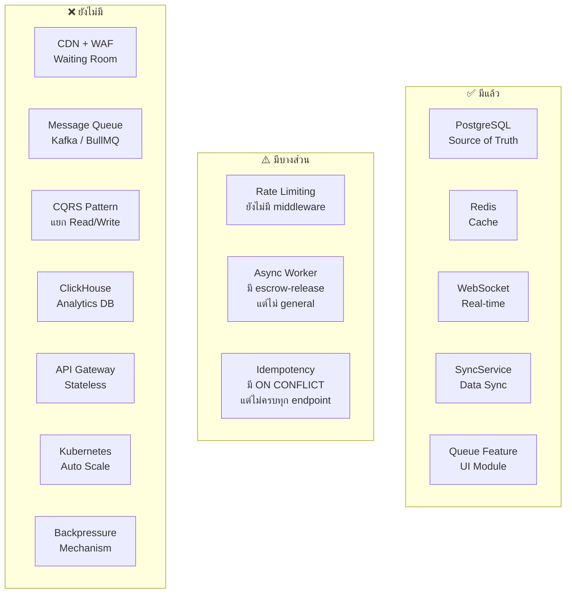
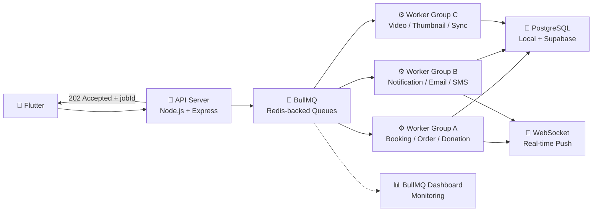
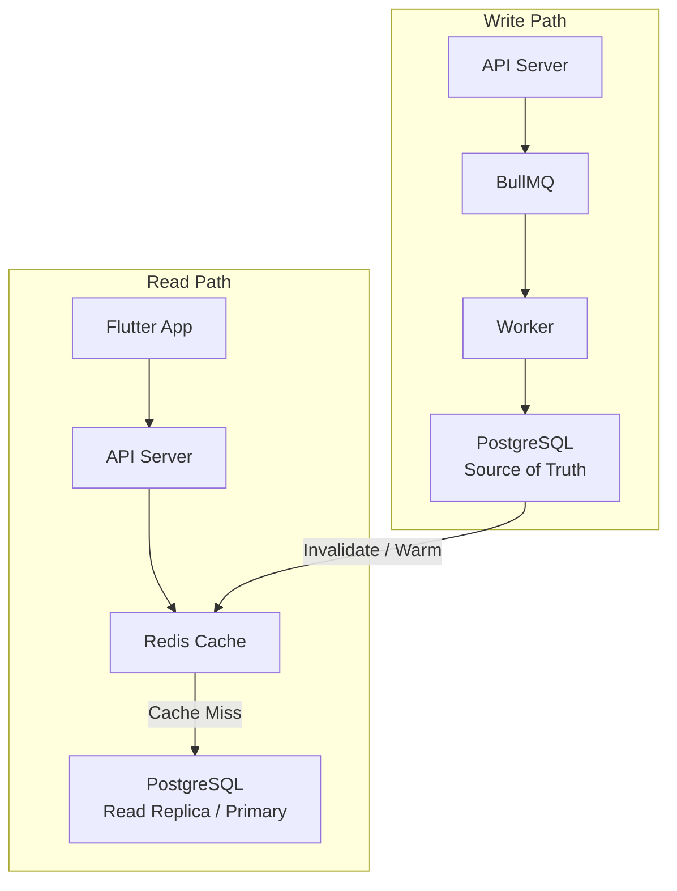

# 🏗️ Infrastructure Plan: Sheserved
## ขอบเขต: Phase 1 — Redis Middleware (ฟรี) · Phase 2 — BullMQ Queue System (ฟรี) · รากฐานสำหรับการขยายตัวในอนาคต

## สรุปภาพรวม

รูปภาพนำเสนอ **ระบบลงทะเบียนรับสิทธิที่รองรับคนแห่พร้อมกัน** (500,000+ submits/วินาที) ออกแบบด้วยหลักการ "ไม่ล่ม ปลอดภัย ข้อมูลไม่หาย" ผมได้วิเคราะห์เปรียบเทียบกับสถาปัตยกรรมปัจจุบันของ Sheserved แล้ว

## ขอบเขตของเอกสารนี้

> [!NOTE]
> เอกสารนี้เน้นเฉพาะ **Phase ที่ไม่มีค่าใช้จ่าย** ซึ่งสามารถ deploy ได้ทันทีบน infrastructure ที่มีอยู่แล้ว

| Phase | หัวข้อที่ครอบคลุม | ค่าใช้จ่าย | สถานะ |
|-------|-----------------|------------|--------|
| **Phase 1a** | Caddy Reverse Proxy (`:8080` / `:80`) | 🟢 ฟรี | ✅ **Deploy แล้ว** |
| **Phase 1b** | Rate Limiting · Idempotency · Duplicate Check · Cache-Aside (Redis Middleware) | 🟢 ฟรี | ✅ **Implemented & Wired** — ทุก endpoint มี fast gate + cache layer |
| **Phase 2** | BullMQ Queue: Consultation, Donation, Video, Sync + Health Check + Graceful Shutdown | 🟢 ฟรี | ✅ **Implemented** — ทุก queue พร้อมใช้งาน พร้อม monitoring และ graceful shutdown |
| **Phase 3** | CQRS · CDN/WAF · Analytics · Auto Scale | 🔵 วางรากฐานไว้เผื่อขยายตัว | ⏸️ ยังไม่ deploy |

> [!WARNING]
> หากต้องการเอกสารเฉพาะด้าน **Auth / Login / Register Security** ให้ดูที่ `auth_security_analysis.md` แทน

> [!TIP]
> สำหรับรายละเอียดวิเคราะห์ Caching Patterns จากรูปภาพอย่างละเอียดและแนวทางการประยุกต์ใช้กับ Sheserved ให้ดูที่ [caching_strategy.md](file:///Users/dave_macmini/sheserved/docs/infrastructure/caching_strategy.md)
> และรายละเอียดของสถาปัตยกรรมและการตั้งค่าเครือข่ายด่านหน้าสำหรับซ่อนเซิร์ฟเวอร์ ให้ดูที่ [reverse_proxy_plan.md](file:///Users/dave_macmini/sheserved/docs/infrastructure/reverse_proxy_plan.md)

---

## 1. Architecture ในรูปภาพ (Reference Architecture)

```mermaid
flowchart LR
    A["👤 ผู้ใช้งาน"] --> B["🌐 CDN/WAF\nCloudflare\nWaiting Room"]
    B --> C["🔌 API Gateway\nStateless"]
    C --> D["⚡ Redis\nFast Gate"]
    D --> E["📨 Kafka\nQueue"]
    E --> F["⚙️ Worker\nAsync"]
    
    D -.-|"ตอบกลับทันที\n✅ Accepted"| A
    
    F --> G["🐘 PostgreSQL\nSource of Truth"]
    F --> H["📊 ClickHouse\nAnalytics"]
    F --> I["📧 SMS/Email\nNotification"]
    
    D <-- J["🔴 Redis\nCache/Session"]
```

### หลักการออกแบบ 7 ข้อ

| # | หลักการ | คำอธิบาย |
|---|---------|----------|
| 1 | **Waiting Room** | คุมคนเข้าทีละรอบ ไม่ให้โหลดทะลัก |
| 2 | **Queue-based** | ใช้ Kafka รับสไลด์ ไม่ยิง DB ตรง |
| 3 | **Redis Fast Gate** | เช็คเร็ว ลดโหลด DB (Rate Limiting, Duplicate Check, Quota) |
| 4 | **Async Processing** | Worker ประมวลผลแบบ Async ไม่รอผลทันที |
| 5 | **Idempotency** | ป้องกันทำซ้ำ (ส่งซ้ำ = ไม่เกิดปัญหา) |
| 6 | **CQRS** | แยก Write Path / Read Path |
| 7 | **Rate Limiting + Backpressure** | กันไม่ให้ traffic เกิน capacity |

### เทคโนโลยีที่แนะนำ

| Component | Technology | หน้าที่ |
|-----------|-----------|---------|
| CDN + WAF + Waiting Room | Cloudflare | กรองทราฟฟิก + DDoS Protection |
| API Backend | Go / Java (Spring Boot) | Stateless API Server |
| Event Streaming | Apache Kafka | Queue รับ request |
| Cache / Fast Gate | Redis | Rate Limiting + Duplicate Check + Session |
| Transactional DB | PostgreSQL | Source of Truth |
| Analytics / Reporting | ClickHouse | Dashboard + BI |
| Deploy \& Auto Scale | Kubernetes | Container Orchestration |

---

## 2. สถาปัตยกรรมปัจจุบันของ Sheserved

```mermaid
flowchart LR
    A["📱 Flutter App"] --> B["🔄 Caddy\nReverse Proxy :8080"]
    A --> C["☁️ Supabase\nCloud BaaS"]

    B --> D["🔌 WebSocket Server\nNode.js + Express :3000"]
    D --> E["🐘 Local PostgreSQL"]
    D <-- F["🔴 Redis\nredis://localhost:6379"]

    C --> G["☁️ Supabase PostgreSQL"]

    H["🔄 SyncService"] --> E
    H --> G

    D --> I["📹 Video Processing\nFFmpeg + Bunny.net"]
```

### สิ่งที่ Sheserved มีอยู่แล้ว

| Component | สิ่งที่มี | ไฟล์หลัก |
|-----------|----------|----------|
| **Frontend** | Flutter (cross-platform) | [lib/](file:///Users/dave_macmini/sheserved/lib) |
| **Reverse Proxy** | Caddy (:8080 สำหรับ dev / :80 สำหรับ local mDNS) | [start-caddy.sh](file:///Users/dave_macmini/sheserved/websocket-server/start-caddy.sh) |
| **API Server** | Node.js + Express + Socket.io (:3000 ผ่าน Caddy) | [server.js](file:///Users/dave_macmini/sheserved/websocket-server/server.js) |
| **Database** | PostgreSQL (Local + Supabase Cloud) | [schema.sql](file:///Users/dave_macmini/sheserved/database/schema.sql) |
| **Real-time** | WebSocket (Socket.io ผ่าน Caddy :8080) | [websocket_service.dart](file:///Users/dave_macmini/sheserved/lib/services/websocket_service.dart) |
| **Cache** | Redis (มี dump.rdb แล้ว) | [.env](file:///Users/dave_macmini/sheserved/websocket-server/.env) `REDIS_URL` |
| **Sync** | SyncService (Supabase ↔ Local) | [sync_service.dart](file:///Users/dave_macmini/sheserved/lib/services/sync_service.dart) |
| **Auth** | Custom AuthService + ServiceLocator | [auth_service.dart](file:///Users/dave_macmini/sheserved/lib/services/auth_service.dart) |
| **DB Mode** | Unified / LocalOnly / SupabaseOnly | [app_config.dart](file:///Users/dave_macmini/sheserved/lib/config/app_config.dart) |
| **Queue (UI)** | Queue feature module (ว่างอยู่) | [lib/features/queue/](file:///Users/dave_macmini/sheserved/lib/features/queue) |
| **Video/Escrow** | escrow-release, payment-queue | [services/](file:///Users/dave_macmini/sheserved/websocket-server/services) |

---

## 3. Gap Analysis: สิ่งที่ขาดเทียบกับ Reference Architecture



### รายละเอียด Gap

| Component | Status | รายละเอียด |
|-----------|--------|----------|
| **CDN/WAF** | ❌ ไม่มี | ไม่มี Cloudflare / DDoS protection / Waiting Room |
| **API Gateway (Stateless)** | ⚠️ บางส่วน | `server.js` ทำหน้าที่เป็นทั้ง Gateway + Business Logic + WebSocket (**monolith**) |
| **Redis Fast Gate** | ⚠️ บางส่วน | มี Redis แล้วแต่ใช้แค่ cache ทั่วไป ยังไม่มี Rate Limiting / Duplicate Check / Quota middleware |
| **Message Queue** | ❌ ไม่มี | ไม่มี Kafka / BullMQ / RabbitMQ — request ยิงตรงเข้า DB |
| **Async Worker** | ⚠️ บางส่วน | มี [escrow-release-service.js](file:///Users/dave_macmini/sheserved/websocket-server/services/escrow-release-service.js), [thumbnail-queue.js](file:///Users/dave_macmini/sheserved/websocket-server/services/thumbnail-queue.js) แต่ไม่มี general-purpose worker pattern |
| **CQRS** | ❌ ไม่มี | Read/Write ใช้ path เดียวกันหมด |
| **ClickHouse** | ❌ ไม่มี | Analytics อ่านจาก PostgreSQL ตรง |
| **Idempotency** | ⚠️ บางส่วน | มี `ON CONFLICT DO NOTHING` ในบาง query แต่ไม่มี idempotency key pattern |
| **Backpressure** | ❌ ไม่มี | ไม่มีกลไกควบคุม flow |
| **Kubernetes** | ❌ ไม่มี | Deploy เป็น single process บน Mac Mini |

---

## 4. แผน Deploy (ไม่มีค่าใช้จ่าย)

> [!IMPORTANT]
> ทั้ง Phase 1 และ Phase 2 ใช้เฉพาะ **Redis ที่มีอยู่แล้ว** + **npm packages ฟรี** ไม่ต้องซื้อ infrastructure เพิ่มแม้แต่บาทเดียว

### 4.0 ลำดับลงมือทำจริง (เรียงจากสำคัญที่สุด)

| ลำดับ | งาน | เหตุผลที่ต้องทำก่อน | ผลลัพธ์ขั้นต่ำที่ต้องได้ |
|-------|-----|--------------------|--------------------------|
| **1** | **Shared Redis / BullMQ foundation** | เป็นฐานของทุก queue และแก้ปัญหา connection leak ให้จบก่อน | Queue ทุกตัวใช้ `redis-client.js` / shared connection เดียวกัน |
| **2** | **Consultation async flow + notification** | กระทบ UX โดยตรงและทำให้ request flow ตอบเร็วขึ้น | API ตอบ `202 Accepted` และ patient-side UI ไม่ค้าง |
| **3** | **Donation escrow release** | เกี่ยวกับเงินและ consensus ต้องมี idempotency + retry ที่เชื่อถือได้ | Worker ประมวลผล escrow release ได้ และ audit ได้ทุก job |
| **4** | **Video processing + cache invalidation** | งานหนักและมี cache staleness บ่อย ถ้าไม่คุมจะเห็นข้อมูลเก่า | Thumbnail / video metadata ถูก invalidate หรือ warm ถูกจังหวะ |
| **5** | **Health sync pipeline** | งาน sync จากอุปกรณ์มี burst และ race condition สูง | Sync worker ใช้ distributed lock และ batch write ได้ปลอดภัย |
| **6** | **Observability / graceful shutdown / migration** | ต้องมีเพื่อ operate production ได้จริงและ roll out แบบไม่พัง | มี health endpoint, DLQ, monitoring และ shutdown ที่สะอาด |

### 4.1 ลำดับการทำงานที่แนะนำใน codebase ปัจจุบัน

1. **วาง Shared Redis foundation ให้เสร็จก่อน**
   - ใช้ `redis-client.js` เป็น single source of truth สำหรับ BullMQ connection
   - ห้ามสร้าง ioredis instance ใหม่ใน queue worker เพิ่ม
   - เป้าหมายคือให้ `payment-queue-service.js`, `thumbnail-queue.js`, และ `video-service.js` ใช้ pattern เดียวกัน

2. **ย้าย consultation request ไปเป็น async flow**
   - API ฝั่ง consultation ต้องตอบ `202 Accepted` พร้อม `jobId`
   - Database ยังต้องคงสถานะ `pending` สำหรับ provider-side alert cards
   - ฝั่ง patient `ChartBoard` ควรปลดล็อกด้วย local state เช่น `_hasSubmitted` ไม่ใช่รอ DB status อย่างเดียว

3. **แยก donation escrow release ออกจาก request path**
   - เอา logic ที่เสี่ยงช้า/ซ้ำออกไปอยู่ใน worker
   - ใช้ idempotency key, retry policy, และ dead-letter handling
   - invalidate cache ของยอดรวมบริจาค/leaderboard หลัง job สำเร็จ

4. **ต่อ video processing กับ cache invalidation/warming**
   - ให้ thumbnail generation และ video metadata update สะท้อนขึ้น cache ทันที
   - งาน video ที่สำคัญกว่าให้ priority สูงกว่า
   - ตรวจว่า worker ใช้ shared Redis connection และไม่ทิ้ง job ค้าง

5. **เพิ่ม health sync pipeline พร้อม distributed lock**
   - sync job ควร batch write และล็อกต่อ user/device เพื่อกัน sync ซ้อน
   - ใช้ checkpoint cache เพื่อกัน reprocess ข้อมูลเดิม
   - job สำคัญเรื่อง consistency มากกว่าความเร็ว

6. **ปิดงานด้วย monitoring + graceful shutdown**
   - เพิ่ม health endpoint ของ queue, retry/fail counters, และ DLQ view
   - ปิด worker อย่างปลอดภัยตอน deploy/restart
   - ทำ shadow / dual write / cutover ตามลำดับก่อนลบ path เดิม

### Phase 1 — Redis Middleware & Fast Gate ✅ เสร็จแล้ว

**สถานะ:** ดำเนินการครบถ้วน — ทุก endpoint สำคัญมี fast gate และ cache layer แล้ว

**เป้าหมายของ Phase 1:**
- ทำให้ทุก request สำคัญมี fast gate ก่อนถึง business logic
- ลดการยิงซ้ำ, ลดโหลด DB, และล็อกพฤติกรรม request ให้สม่ำเสมอ
- วางรากฐาน Redis ที่ Phase 2 จะ reuse ต่อได้ทันที

#### 1.1 Redis Rate Limiting Middleware ✅

ติดตั้งใน `server.js` และใช้งานครบทุก endpoint สำคัญ:

```javascript
// websocket-server/middleware/rate-limiter.js
// - defaultRateLimiter: 60 req/min ทุก API
// - strictRateLimiter: 10 req/min สำหรับ upload/accept/approve
// - authRateLimiter: 5 req/min สำหรับ auth endpoints

app.use('/api', defaultRateLimiter);
app.post('/api/videos/upload', strictRateLimiter, ...);
app.post('/api/applications/:id/approve', strictRateLimiter, ...);
```

#### 1.2 Idempotency Key Pattern ✅

ใช้กับ endpoints ที่มีความเสี่ยง double-submit:

```javascript
// websocket-server/middleware/idempotency.js
// ใช้กับ: video upload, photo upload, application submit
app.post('/api/videos/upload', idempotencyMiddleware, ...);
app.post('/api/applications', idempotencyMiddleware, ...);
```

#### 1.3 Redis Duplicate Check ✅

ป้องกันการกดซ้ำ/ส่งซ้ำภายในระยะเวลาสั้น:

```javascript
// websocket-server/middleware/idempotency.js
// ใช้กับ: upload, accept incident, interaction, emergency health
app.post('/api/videos/upload', duplicateCheckMiddleware('video-upload', 5), ...);
app.post('/api/videos/:id/accept', duplicateCheckMiddleware('accept-incident', 10), ...);
app.post('/api/emergency-health/sessions', duplicateCheckMiddleware('emergency-health-session', 10), ...);
```

#### 1.4 Cache-Aside Pattern ✅

ลดโหลด DB ด้วยการ cache ข้อมูลที่อ่านบ่อย:

```javascript
// websocket-server/middleware/cache-aside.js
// ใช้กับ: video list, emergency list, video detail, chat history,
//         professions, users, applications, emergency health data

const data = await cacheAside(`video:emergency:list:${page}:${limit}`, async () => {
  const result = await pool.query('SELECT ... FROM videos ...');
  return result.rows;
}, TTL.DEFAULT);
```

**Cache Keys ที่ใช้:**
- `video:list:${type}:${category_id}` — รายการวิดีโอ
- `video:emergency:list:${page}:${limit}` — รายการเหตุฉุกเฉิน
- `video:meta:${id}` — ข้อมูลวิดีโอ
- `video:gps:${id}` — GPS tracks
- `video:gallery:${id}:${page}:${limit}` — รูปภาพเหตุการณ์
- `video:interactions:${id}` — ยอด view/like/donation
- `chat:active:${videoId}:${limit}` — ประวัติแชท
- `chat:archived:${videoId}:${limit}` — แชทที่ archive แล้ว
- `professions:active` — รายการอาชีพ
- `profession:${id}` — ข้อมูลอาชีพ
- `profession:fields:${id}` — ฟอร์มลงทะเบียน
- `user:${id}` — ข้อมูลผู้ใช้
- `applications:list:${status}` — รายการใบสมัคร
- `application:${id}` — ข้อมูลใบสมัคร
- `emergency-health:${incidentId}:${responderId}` — ข้อมูลสุขภาพฉุกเฉิน
- `emergency-health:settings:${userId}` — ตั้งค่าสุขภาพฉุกเฉิน
- `emergency-health:dead-man:${userId}` — Dead man's switch
- `admin:watermark:config` — ตั้งค่า watermark

---

### Phase 2 — BullMQ Queue System & Event-Driven Cache (2-4 สัปดาห์) 🟢 ฟรี

> [!TIP]
> **เลือก BullMQ แทน Kafka** — Sheserved ใช้ Node.js + Redis อยู่แล้ว (bullmq ^5.70.4 ติดตั้งแล้วใน `package.json`) ไม่ต้องติดตั้ง infra ใหม่ ประหยัดค่าใช้จ่ายและ maintenance overhead

**เป้าหมายของ Phase 2:**
- ย้ายงานที่ช้า/เสี่ยงออกจาก request path ไปอยู่ใน worker
- ตอบ API แบบ `202 Accepted` พร้อม job tracking
- ทำ cache invalidation / warming ให้สัมพันธ์กับ job lifecycle

#### 2.0 Phase 2 Overview — 6 หัวข้อที่ต้องทำให้ครบ

| # | หัวข้อ | เป้าหมาย | ผลลัพธ์ที่คาดหวัง |
|---|--------|----------|-------------------|
| 1 | **Shared Redis Connection** | ใช้ Redis เดียวกับ Phase 1 อย่างปลอดภัย | ลด connection leak และทำให้ BullMQ ใช้ infra เดิมได้จริง |
| 2 | **Consultation Async Flow & Notification** | ปลด request ที่ block UX ออกไปอยู่ใน queue | API ตอบ `202 Accepted` พร้อม `jobId` และ patient UI ไม่ค้าง |
| 3 | **Donation Escrow + Idempotency** | คุม flow เงินให้ปลอดภัยและตรวจสอบได้ | Worker release escrow ได้แบบ retry-safe และ cache ตรงเสมอ |
| 4 | **Video Processing & Cache Coordination** | ทำ thumbnail / transcode / invalidate cache ให้ถูกจังหวะ | Video metadata และ thumbnail ไม่ stale |
| 5 | **Health Sync Pipeline** | ซิงก์ข้อมูลสุขภาพแบบมี lock และ batch | Sync ไม่ชนกันและลด duplicate write |
| 6 | **Reliability & Migration** | รองรับ retry, dead-letter, monitoring, graceful shutdown | ระบบ operate ได้จริง และย้ายจาก direct write แบบไม่พัง production |

> [!NOTE]
> ถ้าจะเริ่มทำจริงใน codebase ปัจจุบัน ให้เริ่มจาก **Shared Redis foundation → consultation async flow → donation → video → health sync** เพราะลำดับนี้ลดความเสี่ยงเชิงโครงสร้างก่อน แล้วค่อยไล่ความเสี่ยงเชิงธุรกิจและข้อมูล

---

#### 🏆 ข้อเสนอแนะที่ดีที่สุด (Executive Recommendation)

> **เริ่มจาก shared foundation → consultation → donation → video → health sync**

| ลำดับ | งาน | เหตุผลที่เลือกก่อน | ผลลัพธ์ที่จับต้องได้ |
|-------|-----|---------------------|----------------------|
| **1** | `shared foundation` | ลด connection leak และทำให้ทุก queue ใช้ฐานเดียวกัน | BullMQ/Redis พร้อมใช้กับทุก service |
| **2** | `consultation` | กระทบ UX มากสุดและเป็น flow ที่ผู้ใช้เห็นผลทันที | API ตอบ `202` และ patient-side UI ไม่ค้าง |
| **3** | `donation` | งานเงินต้องเน้น idempotency / audit / retry | Escrow release มี queue tracking ชัดเจน |
| **4** | `video-processing` | งานหนัก มี cache staleness สูง และมี reference เดิมแล้ว | Thumbnail / metadata update ถูก invalidate ถูกจังหวะ |
| **5** | `sync` | งาน sync มี race condition สูง ต้องล็อกก่อน | Local-Cloud sync ไม่ชนกัน มี retry |
| **6** | `notification` | ใส่หลังจากฐานระบบนิ่งแล้ว เพราะทำได้เร็วแต่ไม่ใช่ฐานหลัก | ส่งแจ้งเตือนผ่าน queue ได้ครอบคลุม |

**หลักการ 3 ข้อที่ต้องยึดตลอด Phase 2:**

1. **ตอบเร็ว ทำช้า** — API ตอบ `202 Accepted` ทันที ไม่รอ worker เสร็จ
2. **ไม่ซ้ำ ไม่หาย** — Duplicate check ด้วย Redis `SET NX` ก่อน enqueue ทุกครั้ง
3. **Cache ตาม Queue** — Worker ทำเสร็จต้อง invalidate หรือ warm cache ทันที

> [!TIP]
> รายละเอียด caching ที่ประกอบกับ queue (invalidate-on-complete, warm-on-complete, TTL, key schema) ดูที่ [`caching_strategy.md: Phase 2`](caching_strategy.md)

#### 2.1 BullMQ Architecture สำหรับ Sheserved



#### 2.2 Queue Registry — 6 Queues หลักของ Sheserved

| Queue Name | Redis Prefix | Use Case | Priority | Concurrency | Retry |
|------------|-------------|----------|----------|-------------|-------|
| `booking` | `bull:booking:*` | จองคิวแพทย์ / โต๊ะร้านอาหาร | 🔴 สูง | 2 | 3x (exponential) |
| `order` | `bull:order:*` | สั่งอาหาร / สั่งยา → POS Injection | 🔴 สูง | 3 | 3x (exponential) |
| `donation` | `bull:donation:*` | บริจาค / Escrow release / Consensus | 🟡 กลาง | 2 | 5x (linear) |
| `notification` | `bull:notification:*` | Push / SMS / Email / Line | 🟡 กลาง | 5 | 3x (fixed) |
| `video-processing` | `bull:video:*` | Transcode / Thumbnail / Watermark | 🟢 ต่ำ | 2 | 3x (exponential) |
| `sync` | `bull:sync:*` | Local ↔ Cloud reconcile | 🟢 ต่ำ | 1 | 2x (fixed) |

> [!NOTE]
> Queue `video-processing` และ `payment-transfers` มี implementation แล้วใน `services/thumbnail-queue.js` และ `services/payment-queue-service.js` — ใช้เป็น reference pattern สำหรับ queue ใหม่

#### 2.3 โครงสร้างไฟล์ (File Structure)

```
websocket-server/
├── queues/
│   ├── index.js              # Unified exports + connection
│   ├── booking-queue.js      # Booking / Reservation jobs
│   ├── order-queue.js        # Order → POS injection
│   ├── donation-queue.js     # Donation consensus + escrow
│   ├── notification-queue.js # Multi-channel notifications
│   └── sync-queue.js         # Local-Cloud reconcile
├── services/
│   ├── thumbnail-queue.js    # ✅ Existing (BullMQ reference)
│   ├── payment-queue-service.js # ✅ Existing (Circuit breaker pattern)
│   └── socket-service.js     # Shared WebSocket broadcaster
└── server.js                 # Wire queues + graceful shutdown
```

#### 2.4 Shared Queue Connection (`queues/index.js`)

ใช้ Redis connection เดียวกับ middleware Phase 1 (`redis-client.js`) เพื่อป้องกัน connection leak:

```javascript
// websocket-server/queues/index.js
const { redis } = require('../middleware/redis-client');

const connection = redis; // reuse singleton — ไม่สร้าง connection ใหม่

// BullMQ ต้องการ maxRetriesPerRequest = null สำหรับ blocking commands
const bullConnection = {
  ...redis.options,
  url: process.env.REDIS_URL || 'redis://localhost:6379',
  maxRetriesPerRequest: null,
};

module.exports = { connection: bullConnection };
```

> [!WARNING]
> อย่าสร้าง ioredis instance ใหม่สำหรับ BullMQ — ใช้ connection config reuse จาก `redis-client.js` เพื่อลด connection count บน Redis

#### 2.5 Queue Pattern: 202 Accepted + Async Worker

ทุก endpoint ที่เข้า queue ต้องตอบ `202 Accepted` พร้อม `jobId` ทันที ไม่รอ DB:

```javascript
// websocket-server/queues/booking-queue.js
const { Queue, Worker } = require('bullmq');
const { connection } = require('./index');
const { checkDuplicate } = require('../middleware');
const socketService = require('../services/socket-service');

const bookingQueue = new Queue('booking', {
  connection,
  defaultJobOptions: {
    attempts: 3,
    backoff: { type: 'exponential', delay: 2000 },
    removeOnComplete: { count: 100 },
    removeOnFail: { count: 200 },
  },
});

// ── API Endpoint ─────────────────────────────────────
async function enqueueBooking(req, res) {
  const data = req.body;

  // Phase 1: Duplicate check (Redis Fast Gate)
  const isNew = await checkDuplicate(data.userId, 'booking');
  if (!isNew) {
    return res.status(409).json({ error: 'Duplicate booking request' });
  }

  // Phase 2: Enqueue → ตอบทันที
  const job = await bookingQueue.add('process-booking', data, {
    priority: data.isEmergency ? 1 : 5, // Emergency มาก่อน
  });

  res.status(202).json({
    status: 'accepted',
    jobId: job.id,
    message: 'Booking queued for processing',
  });
}

// ── Worker ─────────────────────────────────────────────
const bookingWorker = new Worker('booking', async (job) => {
  const { userId, restaurantId, slotDate, slotTime } = job.data;

  // 1. Validate slot ยังว่าง (DB-level SELECT FOR UPDATE)
  const slot = await pool.query(
    'SELECT * FROM booking_slots WHERE restaurant_id = $1 AND date = $2 AND time = $3 FOR UPDATE',
    [restaurantId, slotDate, slotTime]
  );

  if (slot.rows.length === 0 || slot.rows[0].available <= 0) {
    throw new Error('Slot no longer available'); // BullMQ จะ retry หรือ fail ตาม config
  }

  // 2. ลด available + บันทึก booking
  await pool.query('BEGIN');
  await pool.query(
    'UPDATE booking_slots SET available = available - 1 WHERE id = $1',
    [slot.rows[0].id]
  );
  await pool.query(
    'INSERT INTO bookings (user_id, restaurant_id, slot_id, status) VALUES ($1,$2,$3,$4)',
    [userId, restaurantId, slot.rows[0].id, 'confirmed']
  );
  await pool.query('COMMIT');

  // 3. Invalidate cache ที่เกี่ยวข้อง
  await invalidateCache(`booking:slots:${restaurantId}:${slotDate}`);

  // 4. Push real-time notification
  socketService.emitToUser(userId, 'booking-confirmed', { jobId: job.id });

  return { success: true, bookingId: result.rows[0].id };
}, { connection, concurrency: 2 });

// ── Event Handlers ─────────────────────────────────────
bookingWorker.on('completed', (job, result) => {
  console.log(`[BookingQueue] ✅ Job ${job.id} completed — bookingId=${result.bookingId}`);
});

bookingWorker.on('failed', (job, err) => {
  console.error(`[BookingQueue] ❌ Job ${job?.id} failed (attempt ${job?.attemptsMade}): ${err.message}`);
  // ถ้า exhaust แล้ว → อัปเดต status ใน DB ให้ user เห็น
  if (job.attemptsMade >= job.opts.attempts) {
    notifyUserBookingFailed(job.data.userId, job.id, err.message);
  }
});

module.exports = { bookingQueue, enqueueBooking, bookingWorker };
```

#### 2.6 Circuit Breaker Pattern (จาก payment-queue-service)

สำหรับ external API calls (Payment Gateway, SMS Provider) ใช้ Circuit Breaker ป้องกัน cascading failure:

```javascript
// websocket-server/queues/donation-queue.js
let failureCount = 0;
const MAX_FAILURES = 5;
let isCircuitOpen = false;

const donationWorker = new Worker('donation', async (job) => {
  if (isCircuitOpen) {
    throw new Error('Circuit Breaker OPEN — payment gateway unavailable');
  }

  try {
    // Call external API
    const result = await paymentGateway.transfer(job.data.amount, job.data.targetAccount);
    failureCount = 0; // Reset on success
    return result;
  } catch (err) {
    failureCount++;
    if (failureCount >= MAX_FAILURES) {
      isCircuitOpen = true;
      setTimeout(() => { isCircuitOpen = false; failureCount = 0; }, 30 * 60 * 1000);
    }
    throw err; // Let BullMQ retry
  }
}, { connection });
```

#### 2.7 Job Priority & Delayed Jobs

BullMQ รองรับ priority และ delayed execution:

```javascript
// Emergency video ขยับไปหน้าสุด
await videoQueue.add('transcode', data, { priority: 1 });

// Normal video รอได้
await videoQueue.add('transcode', data, { priority: 5 });

// Schedule notification ล่วงหน้า (e.g. นัดหมอเตือนก่อน 1 ชม.)
await notificationQueue.add('reminder', data, {
  delay: 60 * 60 * 1000, // 1 ชั่วโมง
});

// Cron job (BullMQ Pro/Repeatable jobs — ใช้ external cron + addJob แทนใน free tier)
setInterval(() => {
  syncQueue.add('reconcile', { timestamp: Date.now() });
}, 15 * 60 * 1000); // ทุก 15 นาที
```

#### 2.8 Graceful Shutdown & Worker Lifecycle

```javascript
// server.js — เพิ่มใน SIGTERM / SIGINT handler
const queues = require('./queues');

async function gracefulShutdown() {
  console.log('[Server] Graceful shutdown — pausing workers...');

  // หยุดรับ job ใหม่
  await bookingWorker.pause();
  await orderWorker.pause();
  await notificationWorker.pause();

  // รื้อ worker เสร็จก่อนปิด
  await Promise.all([
    bookingWorker.close(),
    orderWorker.close(),
    notificationWorker.close(),
  ]);

  // ปิด Redis connection
  await redis.quit();
  server.close(() => process.exit(0));
}

process.on('SIGTERM', gracefulShutdown);
process.on('SIGINT', gracefulShutdown);
```

#### 2.9 Monitoring & Dead Letter Queue

```javascript
// ── Bull Board (optional free dashboard) ─────────────────
// npm install @bull-board/express @bull-board/api
// หรือ monitor ผ่าน Redis CLI + custom endpoint

// ── Health Check Endpoint ──────────────────────────────
app.get('/health/queues', async (req, res) => {
  const [booking, order, notification] = await Promise.all([
    bookingQueue.getJobCounts(),
    orderQueue.getJobCounts(),
    notificationQueue.getJobCounts(),
  ]);

  res.json({
    booking,
    order,
    notification,
    healthy: booking.waiting < 1000 && order.waiting < 1000,
  });
});

// ── Dead Letter Pattern ──────────────────────────────────
// งานที่ fail ครบ retry → ย้ายไป `failed` queue + อัปเดต DB flag
notificationWorker.on('failed', async (job, err) => {
  if (job.attemptsMade >= job.opts.attempts) {
    await supabase
      .from('notification_logs')
      .update({ status: 'failed', error: err.message })
      .eq('job_id', job.id);
  }
});
```

#### 2.10 Migration Path: จาก Direct DB Write → Queue

ขั้นตอนการย้ายแต่ละ feature โดยไม่ break production:

| ขั้นตอน | การดำเนินการ | ความเสี่ยง |
|---------|-------------|-----------|
| **1. Shadow Mode** | Enqueue job แต่ยังไม่ให้ worker ประมวลผล → เปรียบเทียบผลกับ direct write | ต่ำ |
| **2. Dual Write** | API ทั้ง direct write + enqueue → Worker ทำงานแต่ไม่ใช้ผล | ต่ำ |
| **3. Cutover** | API ตอบ 202 + worker ประมวลผลจริง → direct write เป็น fallback | ปานกลาง |
| **4. Cleanup** | ลบ direct write ออก → ใช้ queue 100% | ต่ำ |

> [!TIP]
> เริ่มจาก **shared connection** และ **consultation async flow** ก่อน → แล้วค่อยย้ายงานที่มีผลต่อเงิน/ข้อมูลหนักอย่าง `donation`, `video`, และ `sync`

#### 2.11 สรุป Phase 2 Implementation Checklist

| # | งาน | ไฟล์ | สถานะ |
|---|-----|------|--------|
| 1 | สร้าง shared BullMQ connection helper | `websocket-server/services/bullmq-connection.js` | ✅ เสร็จแล้ว |
| 2 | Refactor queue service เดิมให้ใช้ shared connection | `websocket-server/services/payment-queue-service.js`, `thumbnail-queue.js`, `video-service.js` | ✅ เสร็จแล้ว |
| 2.5 | **Wire Phase 1 middleware เข้าทุก endpoint** (rate limit, idempotency, duplicate check, cache-aside) | `websocket-server/server.js`, `websocket-server/routes/video.js`, `websocket-server/routes/admin.js` | ✅ **เสร็จใน Phase 1** |
| 3 | วาง consultation async flow + local UI unlock contract | `lib/features/consultation/data/repositories/consultation_repository.dart`, `lib/features/consultation/presentation/pages/chart_board_page.dart` | ✅ เสร็จแล้ว |
| 4 | สร้าง/ต่อ consultation worker สำหรับ request flow | `websocket-server/services/consultation-queue.js`, `websocket-server/routes/consultation.js` | ✅ เสร็จแล้ว |
| 5 | ทำ donation queue + escrow release + cache invalidation | `websocket-server/services/donation-queue.js` | ✅ เสร็จแล้ว |
| 6 | ทำ video queue/cache coordination ให้ครบเส้นทาง | `websocket-server/services/thumbnail-queue.js`, `video-service.js` | ✅ เสร็จแล้ว |
| 7 | ทำ sync queue + distributed lock | `websocket-server/services/sync-queue.js` | ✅ เสร็จแล้ว |
| 8 | Wire queues เข้า `server.js` + graceful shutdown | `websocket-server/server.js` | ✅ เสร็จแล้ว |
| 9 | Health check endpoint `/health/queues` + DLQ monitoring | `websocket-server/server.js`, `websocket-server/queues/index.js` | ✅ เสร็จแล้ว |
| 10 | ทดสอบ Shadow / Dual Write / Cutover | Integration test | ⏳ รอ implement |

---

### 2.12 Test Plan: Phase 1 + 2 Testing Guide

> ลำดับการทดสอบแบ่งตามความเสี่ยงสูง → ต่ำ พร้อมวิธีการและสิ่งที่ต้องตรวจสอบ

#### 🔴 Priority 1 — Consultation Async Flow (เสี่ยงสูงสุด)

| # | หน้า Flutter | ขั้นตอนทดสอบ | Expected Result |
|---|-------------|-------------|-----------------|
| 1.1 | `ChartBoardPage` | กรอกข้อมูล → กด "ส่งคำขอ" | - HTTP 202 Accepted จาก `POST /api/consultations/requests`<br>- Response มี `jobId` + `consultationRequest` + `roomId`<br>- UI unlock ทันที (`_hasSubmitted = true`) ไม่รอ DB |
| 1.2 | `ChartBoardPage` → `ExpertChatRoomPage` | เปิดห้องแชทหลังส่งคำขอ | - Room ID = `consult_<consultationId>` ตรงกับที่ backend สร้าง<br>- Patient ส่งข้อความได้ทันที ไม่ error |
| 1.3 | `MyConsultationsPage` | ตรวจประวัติคำขอ | - Status = `pending` แสดงถูกต้อง<br>- Provider alerts (home header) ยังเห็น `pending` |
| 1.4 | `HealthProgramRequestDashboard` (Provider) | Provider กด "รับงาน" (`_joinRequest`) | - `assignProviderToGroup` หรือ fallback `assignProvider` ทำงานได้<br>- `syncProviderToRoomExperts` ไม่ error<br>- Chat room banner แสดง expert joined |
| 1.5 | Idempotency test | กด "ส่งคำขอ" ซ้ำเร็ว ๆ 2 ครั้ง | - ครั้งที่ 2 ได้ `X-Idempotency-Replayed: true`<br>- ไม่มี duplicate row ใน `consultation_requests` |
| 1.6 | Rate limit test | กด "ส่งคำขอ" > 60 ครั้ง/นาที | - ได้ HTTP 429 Too Many Requests |

#### 🔴 Priority 2 — Donation Escrow Queue

| # | หน้า Flutter / Event | ขั้นตอนทดสอบ | Expected Result |
|---|-----------------------|-------------|-----------------|
| 2.1 | `DonationAdminPage` | Responder กด consensus vote (approve) | - WebSocket `donate-closure-vote` → ได้ `queued: true` + `jobId`<br>- ไม่ block UI ขณะประมวลผล |
| 2.2 | `DonationAdminPage` | Admin กด "Release Escrow" | - `admin-release-escrow` → ได้ `queued: true` + `jobId`<br>- `donation-system-message` แจ้ง `donation-released` หลัง worker เสร็จ |
| 2.3 | `DonationDashboardPage` | ตรวจยอดหลัง escrow released | - ยอด net แสดงถูกต้อง<br>- Leaderboard / summary cache รีเฟรช (ไม่ stale) |
| 2.4 | Duplicate check | กด release escrow ซ้ำภายใน 5 นาที | - ได้ 409 Conflict (Duplicate Request) |

#### 🟡 Priority 3 — Video Upload & Cache

| # | หน้า Flutter | ขั้นตอนทดสอบ | Expected Result |
|---|-------------|-------------|-----------------|
| 3.1 | Emergency video upload | อัปโหลดวิดีโอใหม่ | - `POST /api/videos/upload` → 200 + video ID<br>- `video-processing` queue มี job ใหม่<br>- Progress bar อัปเดตผ่าน WebSocket (`processing` → `uploading` → `ready`) |
| 3.2 | Emergency photo upload | อัปโหลดรูป (Thai Mhung / Emergency) | - ได้ `thumbnail-generation` job<br>- Thumbnail แสดงใน feed หลัง worker เสร็จ |
| 3.3 | Feed / Trending | รีเฟรชหลัง video ready | - Video list แสดง video ใหม่โดยไม่ต้อง restart app<br>- Cache invalidation ทำงาน (`video:meta:*`, `video:list:*`) |

#### 🟡 Priority 4 — Phase 1 Middleware (ทุกหน้า)

| # | หน้า / Feature | ขั้นตอนทดสอบ | Expected Result |
|---|---------------|-------------|-----------------|
| 4.1 | ทุกหน้าที่ POST/PUT | Double-tap ปุ่ม submit เร็ว ๆ | - Idempotency key ตรงกัน → cached response<br>- ไม่เกิด duplicate data |
| 4.2 | ทุกหน้าที่ POST/PUT | Submit ซ้ำภายใน 5 นาที (ไม่มี idempotency key) | - ได้ 409 Conflict |
| 4.3 | หน้าอ่านข้อมูล (Video list, Consultation list) | โหลดครั้งแรก vs ครั้งที่สอง | - ครั้งแรกช้ากว่า (cache miss)<br>- ครั้งต่อไปเร็วขึ้น (cache hit) |
| 4.4 | หน้าอ่านข้อมูล | แก้ไขข้อมูล → รีเฟรช list | - ข้อมูลใหม่แสดงทันที (cache invalidated หลัง write) |

#### 🟢 Priority 5 — Monitoring & Background

| # | Endpoint / Tool | ขั้นตอนทดสอบ | Expected Result |
|---|---------------|-------------|-----------------|
| 5.1 | `GET /health/queues` | เปิด browser หรือ curl | - JSON แสดงสถานะทุก queue (`waiting`, `active`, `failed`, `completed`)<br>- `healthy: true` เมื่อ failed < 100 และ waiting < 1000 |
| 5.2 | `GET /health/queues/:name/failed` | curl หลังสร้าง failed job (เช่น ปิด DB ชั่วคราว) | - รายการ failed jobs แสดง `id`, `name`, `failedReason`, `stacktrace` |
| 5.3 | Graceful shutdown | กด Ctrl+C หรือ SIGTERM | - ทุก queue worker ปิดก่อน server หยุด<br>- ไม่มี job หาย (Redis ยังคง queue อยู่) |
| 5.4 | Sync queue | Restart server หรือ trigger sync | - `[SyncWorker] Starting reconcile` ใน log<br>- Distributed lock กัน sync ซ้อนกัน (ถ้า start 2 ครั้งติด จะมี 1 งาน skip) |

#### 🛠️ Automated Test Commands

```bash
# ตัวแปร
API_URL="http://localhost:3000"
USER_ID="test-user-uuid"

# ── 5.1 Health Check ──
curl -s "$API_URL/health/queues" | jq .

# ── 1.1 Consultation: Submit (202 Accepted) ──
curl -s -X POST "$API_URL/api/consultations/requests" \
  -H "Content-Type: application/json" \
  -H "x-user-id: $USER_ID" \
  -H "x-idempotency-key: test-idem-001" \
  -d '{
    "userId": "'$USER_ID'",
    "packageName": "Test Package",
    "price": 100,
    "symptoms": []
  }' | jq .

# ── 1.5 Idempotency: Submit ซ้ำด้วย key เดียวกัน ──
curl -s -X POST "$API_URL/api/consultations/requests" \
  -H "Content-Type: application/json" \
  -H "x-user-id: $USER_ID" \
  -H "x-idempotency-key: test-idem-001" \
  -d '{
    "userId": "'$USER_ID'",
    "packageName": "Test Package",
    "price": 100
  }' | jq .
# Expected: X-Idempotency-Replayed: true (ดูใน response headers)

# ── 1.6 Rate Limit: ยิง 65 ครั้งเร็ว ๆ ──
for i in {1..65}; do
  curl -s -X POST "$API_URL/api/consultations/requests" \
    -H "Content-Type: application/json" \
    -H "x-user-id: $USER_ID" \
    -H "x-idempotency-key: rate-test-$i" \
    -d '{"userId":"'$USER_ID'","packageName":"X","price":1}' > /dev/null
done
# ครั้งสุดท้ายควรได้ 429

# ── 4.2 Duplicate Check: ไม่มี idempotency key ──
curl -s -X POST "$API_URL/api/consultations/requests" \
  -H "Content-Type: application/json" \
  -H "x-user-id: $USER_ID" \
  -d '{"userId":"'$USER_ID'","packageName":"Dup","price":1}'
# ยิงซ้ำภายใน 5 นาที → 409 Conflict

# ── 5.2 DLQ Inspection ──
curl -s "$API_URL/health/queues/consultation-flow/failed?start=0&end=9" | jq .
curl -s "$API_URL/health/queues/donation-escrow/failed?start=0&end=9" | jq .
```

#### 🧪 Quick Smoke Test Script

```bash
#!/bin/bash
# run-smoke-test.sh — วางไว้ที่ project root
set -e
API="http://localhost:3000"
echo "=== Smoke Test: Phase 1 + 2 ==="

# 1. Server up?
curl -sf "$API/health/queues" > /dev/null && echo "✅ Server /health/queues OK" || { echo "❌ Server down"; exit 1; }

# 2. Consultation 202
curl -sf -X POST "$API/api/consultations/requests" \
  -H "x-user-id: smoke-user" -H "x-idempotency-key: smoke-001" \
  -H "Content-Type: application/json" \
  -d '{"userId":"smoke-user","packageName":"Smoke","price":0}' > /dev/null \
  && echo "✅ Consultation submit OK" || echo "⚠️  Consultation submit failed"

# 3. Idempotency replay
curl -sf -X POST "$API/api/consultations/requests" \
  -H "x-user-id: smoke-user" -H "x-idempotency-key: smoke-001" \
  -H "Content-Type: application/json" \
  -d '{"userId":"smoke-user","packageName":"Smoke","price":0}' > /dev/null \
  && echo "✅ Idempotency replay OK" || echo "⚠️  Idempotency replay failed"

# 4. Video read cache (cache-aside)
# สมมติมี video id: test-video-id
curl -sf "$API/api/videos/test-video-id" > /dev/null && echo "✅ Video read OK" || echo "⚠️  Video read failed"

echo "=== Smoke Test Complete ==="
```

#### 🧪 Phase 2 Queue Integration Script

> ใช้ทดสอบ BullMQ queues หลัก (consultation / donation / video / sync) เพื่อยืนยันว่า enqueue + worker logic ทำงานครบ แม้จะไม่มี service dependency บางส่วน (เช่น Supabase, ffmpeg)

```bash
cd websocket-server
node test-phase2-queues.js

# ต้องมี Redis รันอยู่ (ค่าเริ่มต้น redis://localhost:6379)
# สคริปต์จะ:
# 1. ทดสอบ consultation queue แบบ end-to-end (worker ทำงานจริง)
# 2. Enqueue-only สำหรับ donation, video, sync โดย pause worker เพื่อหลีกเลี่ยง dependency ภายนอก
# 3. ถ้า service ไหน require dependency ที่ไม่มี (เช่น SUPABASE_URL, sharp/ffmpeg) จะข้ามและแจ้งเตือน

# Requeue job ที่ fail ไปแล้ว
curl -s -X POST "$API_URL/health/queues/donation-escrow/retry" \
  -H "Content-Type: application/json" \
  -d '{"jobId":"<failedJobId>"}' | jq .
```

### 2.12.1 Complete Test Strategy

> เป้าหมายคือให้ Phase 1 + 2 ตรวจได้ครบทั้ง logic, integration, smoke, resilience, และ post-deploy verification โดยแยกชั้นชัดเจน

| ชั้นทดสอบ | เป้าหมาย | ตัวอย่างสิ่งที่ต้องตรวจ |
|----------|----------|--------------------------|
| **Unit** | ตรวจ logic ระดับ function / helper / pure logic | queue-config, retry helpers, cache key formatting, validation |
| **Integration** | ตรวจ service-to-service / API-to-worker flow | consultation submit, donation queue, video enqueue, sync reconciliation |
| **Smoke / E2E** | ตรวจ flow สำคัญที่สุดหลัง deploy | health check, request submit, worker wake-up, notification delivery |
| **Failure Injection** | ตรวจ fallback / retry / DLQ / recovery | Redis down, Supabase down, worker error, duplicate submit, sync lock contention |
| **Post-deploy Verification** | ตรวจระบบหลังปล่อยขึ้น server จริง | queue health, failed jobs, requeue endpoint, notification delivery |

#### ลำดับการรันที่แนะนำ

1. **Unit tests** ก่อน merge
2. **Integration tests** บน staging / local full stack
3. **Smoke/E2E** ก่อน deploy และหลัง deploy
4. **Failure injection** เมื่อจะตรวจ resilience หรือก่อนปิด phase

---

### 2.12.2 Detailed Test Matrix

#### A) Consultation Flow

| Test | Steps | Expected Result |
|-----|-------|-----------------|
| **Submit consultation** | กรอกข้อมูลที่ `ChartBoardPage` → ส่งคำขอ | ได้ `202 Accepted`, มี `jobId`, `consultationRequest`, `roomId` |
| **Patient unlock** | หลัง submit สำเร็จ | UI unlock ด้วย `_hasSubmitted` แม้ DB ยังเป็น `pending` |
| **Provider visibility** | เปิด `HealthProgramRequestDashboard` | ยังเห็นคำขอ status `pending` และกดรับงานได้ |
| **Idempotency** | กดส่งซ้ำด้วย key เดิม | ได้ response replay และไม่มี duplicate row |
| **Duplicate protection** | กดส่งซ้ำใน window เดียวกัน | ได้ `409 Conflict` |
| **Room repair** | ตรวจ room หลัง submit | `consult_<consultationId>` ถูกสร้าง / repair ได้ |

#### B) Donation Escrow + Notification

| Test | Steps | Expected Result |
|-----|-------|-----------------|
| **Consensus vote** | Responder กด approve | job เข้า `donation-escrow` queue, UI ไม่ block |
| **Escrow release** | Admin กด release | job เข้า queue, `donation-system-message` ถูก emit หลัง worker จบ |
| **Notification queue** | status update สำหรับเจ้าของคำร้อง | event ถูก enqueue ไป `notification-events` และมี fallback emit ถ้า queue ไม่พร้อม |
| **Duplicate release** | ยิง release ซ้ำ | ได้ 409 หรือสถานะ already released ตาม business rule |
| **DLQ inspection** | เปิด failed jobs | มีรายการ failed jobs พร้อม stacktrace |

#### C) Video Processing + Thumbnail

| Test | Steps | Expected Result |
|-----|-------|-----------------|
| **Video upload** | อัปโหลดวิดีโอใหม่ | enqueue `video-processing`, สถานะ progress ถูกส่งออก |
| **Thumbnail enqueue** | อัปโหลดรูป / video ที่ต้องสร้าง thumbnail | enqueue `thumbnail-generation` และ cache ถูก invalidate |
| **Feed refresh** | เปิดหน้า feed / trending | หลัง worker เสร็จ ข้อมูลใหม่เห็นโดยไม่ restart app |
| **Cache invalidation** | ตรวจหลัง transcode/thumbnail สำเร็จ | keys ที่เกี่ยวข้องถูกล้าง และไม่มี stale cache |

#### D) Sync Queue

| Test | Steps | Expected Result |
|-----|-------|-----------------|
| **Startup sync** | Restart server | มี job `startup` ถูก enqueue และ worker reconcile ได้ |
| **Lock contention** | ยิง sync พร้อมกัน 2 ครั้ง | มีเพียง job เดียวทำงาน อีก job skip/failed ตาม lock |
| **Dependency init** | ลืมเรียก `init()` | worker error ชัดเจนว่าขาด dependencies |
| **Cloud fallback** | ปิด cloud / Supabase ชั่วคราว | ระบบไม่ crash และ log ชัดเจน |

#### E) Phase 1 Middleware

| Test | Steps | Expected Result |
|-----|-------|-----------------|
| **Rate limit** | ยิงเกิน threshold | ได้ `429` |
| **Idempotency** | submit ซ้ำด้วย key เดิม | ได้ cached replay และไม่มี duplicate |
| **Cache hit/miss** | อ่านครั้งแรก vs ครั้งถัดไป | ครั้งถัดไปเร็วขึ้น และมี cache hit |
| **Cache invalidation** | update แล้วอ่านใหม่ | เห็นข้อมูลใหม่ทันที |

---

### 2.12.3 Failure Injection Tests

| Failure | How to Inject | Expected Recovery |
|--------|---------------|-------------------|
| **Redis down** | ปิด Redis ชั่วคราว | health endpoint บอก unhealthy, jobs ใหม่ไม่ล่มทั้งระบบ |
| **Supabase down** | ปิด / เปลี่ยน env ชั่วคราว | consultation / donation error ถูก log ชัดเจน และ fallback ที่ตั้งไว้ทำงาน |
| **Worker error** | ทำ job ข้อมูลผิด | job เข้า retry / failed ตาม config |
| **Duplicate job** | ยิงงานซ้ำหลายครั้ง | มี idempotency / duplicate guard |
| **Sync lock contention** | เรียก sync 2 ครั้งติด | มี job เดียวที่ reconcile จริง |

---

### 2.12.4 Health & Threshold Assertions

> ไม่พอแค่เรียก `/health/queues` ได้ ต้องตรวจค่าที่สำคัญด้วย

| Assertion | Pass Condition |
|----------|----------------|
| **healthy** | เป็น `true` เมื่อทุก queue อยู่ใน threshold |
| **waiting** | ไม่เกิน `thresholds.maxWaiting` |
| **failed** | ไม่เกิน `thresholds.maxFailed` |
| **latencyMs** | มีค่าเมื่อ queue มี QueueEvents และไม่ติด error |
| **lastCompletedAt / lastFailedAt** | เป็น ISO timestamp หรือ `null` เมื่อไม่มีข้อมูล |

---

### 2.12.5 Post-Deploy Smoke Checklist

1. **เปิด `/health/queues`**
   - ทุก queue ตอบกลับ
   - `healthy: true`

2. **ทดสอบ consultation submit 1 ครั้ง**
   - ได้ `202 Accepted`
   - patient unlock ได้
   - provider ยังเห็น pending

3. **ทดสอบ donation notification 1 ครั้ง**
   - เห็น event ผ่าน notification queue หรือ fallback emit

4. **ทดสอบ video upload 1 ครั้ง**
   - queue เข้าได้
   - worker status update สำเร็จ

5. **ทดสอบ requeue endpoint**
   - `POST /health/queues/:name/retry` ใช้งานได้

---

### 2.12.6 Test Data & Cleanup Rules

| Rule | รายละเอียด |
|-----|-------------|
| **Unique identifiers** | ใช้ prefix `test-*` หรือ `integration-*` ทุกครั้ง |
| **Cleanup Redis** | ลบ job / key test ก่อนและหลัง run |
| **Cleanup DB** | ลบ row test ใน DB ชุดทดสอบหลังจบ |
| **No shared state** | test แต่ละชุดต้องไม่พึ่ง state จากรอบก่อน |
| **Repeatable** | รันซ้ำได้โดยผลไม่เพี้ยน |

---

### 2.12.7 Acceptance Criteria: Phase 1 + 2 Ready to Close

Phase 1 + 2 จะถือว่าพร้อมปิดเมื่อครบทุกข้อด้านล่าง:

- **Consultation** submit ได้, patient unlock ได้, provider ยังเห็น pending
- **Donation** consensus / escrow / notification ทำงาน และมี retry/requeue ได้
- **Video** upload / transcode / thumbnail / cache invalidation ทำงานครบ
- **Sync** reconcile ได้โดยไม่ชนกัน และไม่พึ่ง global state
- **Health** endpoint แสดง queue metrics + thresholds ได้
- **Failure** injection แล้วระบบยัง recover ได้ตาม retry / DLQ rules
- **Smoke** หลัง deploy ผ่านทั้งหมด

---

### 2.13 Phase 2 Improvement Backlog

> งานด้านล่างเป็น **จุดปรับปรุงเพิ่มเติม** สำหรับทำให้ Phase 2 สมบูรณ์ที่สุด
> เรียงลำดับตามความสำคัญจากงานที่กระทบ production readiness มากที่สุด → น้อยที่สุด

| # | งานปรับปรุง | เหตุผล | สถานะ |
|---|-------------|--------|--------|
| 1 | ปิด worker / queue ให้ครบทุกตัว | กัน job ค้างและให้ graceful shutdown สมบูรณ์จริง | ✅ เสร็จแล้ว — ทุก service export `shutdown()` และ registry ปิดเอง |
| 2 | ตัดสินใจเรื่อง notification queue ให้ชัด | ถ้าจะถือว่า Phase 2 ครบตามแผนเดิม ต้องมีทางเลือกที่ชัดเจน: implement หรือ defer อย่างเป็นทางการ | ✅ เสร็จแล้ว — สร้าง `notification-queue.js` + worker + server integration |
| 3 | ทำ integration tests end-to-end สำหรับ consultation / donation / video / sync | ยืนยันว่า flow หลักไม่พังเมื่อรวมทุก layer เข้าด้วยกัน | ✅ เสร็จแล้ว — เพิ่มสคริปต์ `websocket-server/test-phase2-queues.js` |
| 4 | เพิ่ม observability ที่ลึกขึ้น | ดู lag, stalled jobs, retry count, worker crash rate และ failure trend เพื่อ debug production ได้เร็วขึ้น | ✅ เสร็จแล้ว — `/health/queues` แสดง latency/lastCompleted/lastFailed จาก BullMQ Events |
| 5 | เพิ่ม workflow สำหรับ requeue / dead-letter | จัดการ failed jobs แบบ operationally safe เมื่อระบบเริ่มใช้งานจริง | ✅ เสร็จแล้ว — มี `/health/queues/:name/failed` + `POST /health/queues/:name/retry` สำหรับ inspect + requeue |
| 6 | ทำ config ของ queue ปรับได้ผ่าน env | ปรับ concurrency, retry, backoff, และ threshold ได้โดยไม่แก้โค้ด | ✅ เสร็จแล้ว — helper `utils/queue-config.js` + ENV `QUEUE_<NAME>_*` คุม attempts/backoff/concurrency/thresholds |
| 7 | ลดการพึ่งพา global state ใน sync queue | ทำให้ sync pipeline maintainable และปลอดภัยต่อการ scale / refactor ในอนาคต | ✅ เสร็จแล้ว — `sync-queue.js` ใช้ dependency store แทน global scope + API signature ใหม่ |

#### ลำดับที่แนะนำให้ทำต่อ

> Phase 2 backlog ✅ เสร็จครบทุกข้อ — ไม่มีงานค้าง

---

## 5. Phase 3 — CQRS, Analytics, และ Scale-up (ทำในอนาคต เพราะอาจมีค่าใช้จ่าย)

> [!NOTE]
> Phase 3 **ไม่ใช่ของที่ต้องทำทันที** — จะเริ่มเมื่อ Phase 1 และ Phase 2 นิ่งแล้ว และเริ่มเห็นสัญญาณว่า read traffic, monitoring, หรือ deployment footprint โตเกินขอบเขตเดิม

### 3.0 เงื่อนไขที่จะเข้าสู่ Phase 3

| เงื่อนไข | สัญญาณ | สิ่งที่ต้องมีพร้อม |
|----------|--------|-------------------|
| **Read latency สูงขึ้น** | หน้า list / dashboard ช้าลงจากการอ่าน DB ตรง | Redis cache strategy + read path แยก |
| **Worker traffic โต** | queue job มากขึ้นต่อเนื่อง | Health check, DLQ, retry metrics |
| **Deploy เริ่มกระทบผู้ใช้** | ต้อง restart บ่อยหรือเครื่องเดียวเริ่มไม่พอ | graceful shutdown + container strategy |
| **Business ต้องการ BI** | อยากดูแนวโน้ม/รายงานมากขึ้น | analytics store หรือ dashboard layer |

### 3.1 เป้าหมายของ Phase 3

- แยก read path ออกจาก write path ให้ชัดขึ้น
- เพิ่มความสามารถในการอ่านข้อมูลโดยไม่โหลด PostgreSQL ตรงทุกครั้ง
- เตรียมระบบให้ขยายเป็น container / multi-instance ได้โดยไม่ต้อง refactor ใหม่
- ทำ dashboard และ analytics แบบคุ้มค่า โดยไม่รีบ self-host ของหนักเกินจำเป็น

### 3.2 CQRS เบื้องต้น: แยก Read / Write



#### สิ่งที่ต้องทำก่อนเริ่ม CQRS

- ทำ cache key schema ให้คงที่
- ทำ invalidation hooks จาก worker ให้ครบ
- ตรวจว่า endpoint อ่านข้อมูลหลักไม่พึ่ง state ที่ stale เกินไป

### 3.3 Analytics และรายงาน

> [!TIP]
> สำหรับ Sheserved ยังไม่จำเป็นต้อง self-host ClickHouse ทันที — เริ่มจาก **Supabase Dashboard + fl_chart** หรือ **Metabase** ก่อนจะคุ้มกว่า

| Option | ข้อดี | เหมาะกับ |
|--------|------|---------|
| **Supabase + fl_chart** (แนะนำ) | ใช้ของเดิมได้เลย | Dashboard ง่าย ๆ |
| **Metabase** (self-hosted) | ทำรายงานเร็วและยืดหยุ่น | BI ภายในทีม |
| **ClickHouse** | เร็วมากสำหรับ OLAP | ปริมาณข้อมูลใหญ่มากจริง ๆ |

### 3.4 Scale-up / Deployment Path

เมื่อ Phase 3 เริ่มจำเป็นจริง ค่อยขยับไปตามลำดับนี้:

1. **Cloudflare CDN + WAF**
   - ป้องกันทราฟฟิกภายนอก
   - ลดโหลด origin
   - ใช้ rate limit / cache rule เท่าที่จำเป็น

2. **Container / multi-instance deployment**
   - แยก API server กับ worker ให้ชัด
   - รองรับ restart ทีละตัวโดยไม่หยุดระบบทั้งหมด

3. **Shared observability layer**
   - queue health
   - error rate
   - job retry / fail count
   - slow query visibility

| Option | ค่าใช้จ่าย/เดือน | เหมาะกับ |
|--------|----------------|---------|
| **Fly.io** (แนะนำ) | $5-50 | เริ่มต้น, auto scale ง่าย |
| **Railway** | $5-20 | Deploy ง่ายสุด |
| **DigitalOcean K8s** | $24-100+ | Scale จริงจัง |
| **AWS EKS** | $73+/cluster | Enterprise |

### 3.5 สิ่งที่ยังไม่ควรทำใน Phase 3

> [!WARNING]
> Reference Architecture เดิมถูกออกแบบมาสำหรับระบบที่มีคนพร้อมกันระดับมหาศาล แต่ Sheserved ยังไม่ถึงจุดนั้น จึงไม่ควรกระโดดไปใช้ของหนักเกินความจำเป็น

| สิ่งที่ไม่จำเป็น | เหตุผล | ทางเลือก |
|-----------------|--------|---------|
| **Waiting Room เต็มรูปแบบ** | traffic ยังไม่ถึงระดับ event รุนแรง | Rate Limiting + Queue ก็พอ |
| **Kafka** | Over-engineering สำหรับ scale นี้ | BullMQ (Redis-based) |
| **ClickHouse ทันที** | ยังไม่จำเป็นสำหรับ BI ขั้นต้น | Supabase / Metabase |
| **Go/Java rewrite** | Node.js ยังรองรับงานนี้ได้ดี | ปรับ Node.js ให้ดีขึ้น |
| **Full Kubernetes** | ซับซ้อนเกินไปถ้ายังไม่โตมาก | Fly.io / Railway |

### 3.6 Success Criteria ของ Phase 3

- read request หลักตอบเร็วขึ้นอย่างเห็นได้ชัด
- dashboard/analytics ดึงข้อมูลได้โดยไม่กระทบ OLTP หนัก
- deploy/restart worker ได้โดยไม่ทำ job หาย
- มีเส้นทาง scale-up ที่ชัดเจนโดยไม่รื้อ Phase 1 และ 2

---

## Open Questions (ยังรอคำตอบ แต่เริ่ม Phase 1 และ 2 ได้เลย)

> [!IMPORTANT]
> 1. **Feature ไหนที่ต้องรองรับ concurrency สูงสุด?** — Booking? Order? Donation Event?
> 2. **ต้องการ Notification แบบไหน?** — Push Notification / SMS / Email / Line?
> 3. **Target concurrent users คือเท่าไหร่?** — 100? 1,000? 10,000?
> 4. **ต้องการทำ Phase ไหนก่อน?** หรือต้องการให้เริ่ม implement Phase 1 เลย?

### ผลกระทบของ Open Questions ต่อแต่ละ Phase

| คำถาม | Phase 1 (Redis) | Phase 2 (BullMQ) | สรุป |
|-------|---------|---------|------|
| **Q1** Feature ไหน concurrency สูงสุด? | ❌ ไม่กระทบ (Rate Limiting ใช้กับทุก endpoint) | ⚠️ กระทบแค่ **ลำดับ priority** ของ queue | เริ่มสร้าง queue สำหรับ Booking ก่อนได้เลย |
| **Q2** Notification แบบไหน? | ❌ ไม่กระทบ | ⚠️ กระทบแค่ **worker ของ notification-queue** | สร้างโครงสร้าง queue ก่อน แล้วค่อยเลือก provider ทีหลัง |
| **Q3** Target concurrent users? | ⚠️ กระทบแค่ **ตัวเลข limit** (เช่น 60 req/min) | ❌ ไม่กระทบ | ใช้ค่า default ก่อน ปรับ config ได้ทีหลัง |
| **Q4** Phase ไหนก่อน? | ✅ **Phase 1 เสร็จแล้ว** — ทุก endpoint มี fast gate + cache | ✅ **Phase 2 เสร็จแล้ว** — Queue ทุกตัว implement พร้อม monitoring และ graceful shutdown | — |

> [!NOTE]
> **สถานะปัจจุบัน:**
> - ✅ **Phase 1 เสร็จสมบูรณ์แล้ว** — ทุก endpoint มี fast gate (rate limit + idempotency + duplicate check) และ cache-aside layer พร้อมใช้งานจริง
> - ✅ **Phase 2 เสร็จสมบูรณ์แล้ว** — ทุก queue (consultation, donation, video, sync) พร้อม worker, cache invalidation, health check (`/health/queues`), DLQ monitoring และ graceful shutdown
> - ⏸️ **Phase 3 ยังไม่ต้องทำ** — รอสัญญาณ scale จริงก่อน
