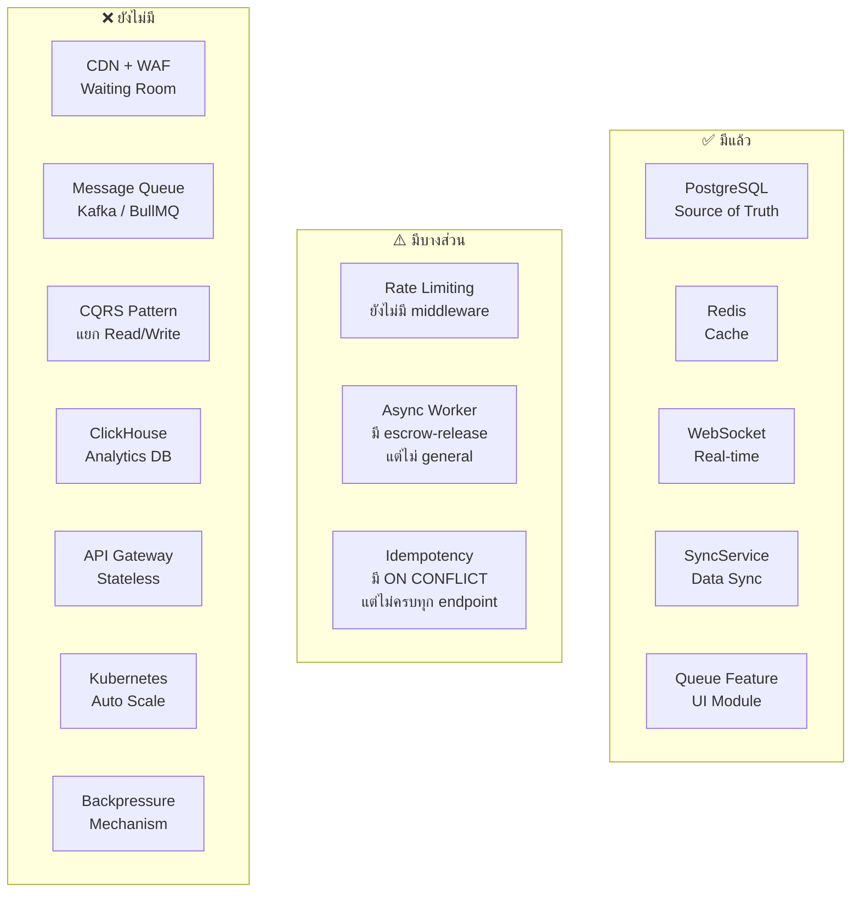
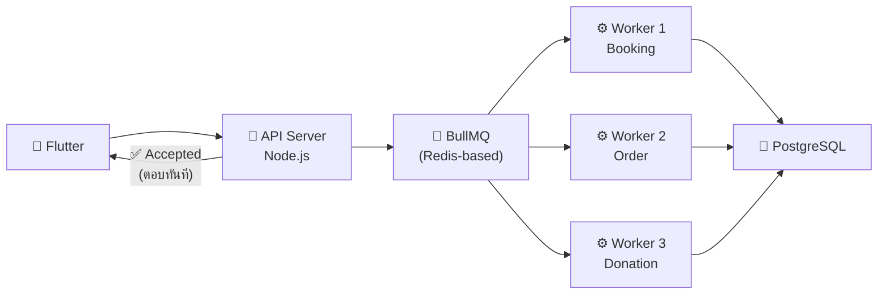
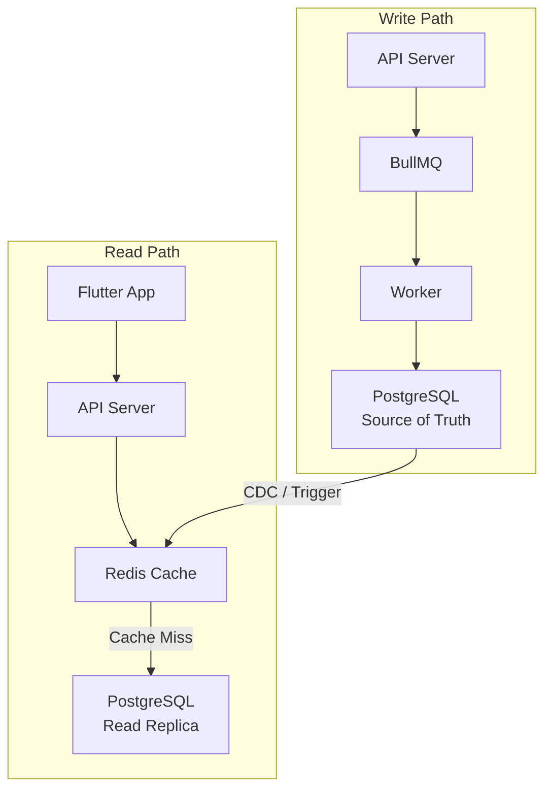
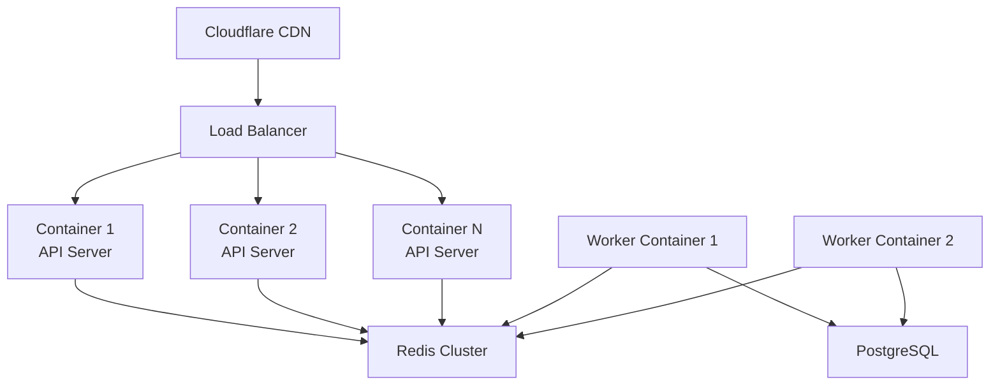

# 🏗️ Infrastructure Plan: Sheserved
## ขอบเขต: Phase 1 — Redis Middleware (ฟรี) · Phase 2 — BullMQ Queue System (ฟรี) · รากฐานสำหรับการขยายตัวในอนาคต

## สรุปภาพรวม

รูปภาพนำเสนอ **ระบบลงทะเบียนรับสิทธิที่รองรับคนแห่พร้อมกัน** (500,000+ submits/วินาที) ออกแบบด้วยหลักการ "ไม่ล่ม ปลอดภัย ข้อมูลไม่หาย" ผมได้วิเคราะห์เปรียบเทียบกับสถาปัตยกรรมปัจจุบันของ Sheserved แล้ว

---

## ขอบเขตของเอกสารนี้

> [!NOTE]
> เอกสารนี้เน้นเฉพาะ **Phase ที่ไม่มีค่าใช้จ่าย** ซึ่งสามารถ deploy ได้ทันทีบน infrastructure ที่มีอยู่แล้ว

| Phase | หัวข้อที่ครอบคลุม | ค่าใช้จ่าย | สถานะ |
|-------|-----------------|------------|--------|
| **Phase 1a** | Caddy Reverse Proxy (`:8080` / `:80`) | 🟢 ฟรี | ✅ **Deploy แล้ว** |
| **Phase 1b** | Rate Limiting · Idempotency · Duplicate Check (Redis Middleware) | 🟢 ฟรี | ⏳ รอ implement |
| **Phase 2** | BullMQ Queue: Booking, Order, Donation, Notification, Video, Sync | 🟢 ฟรี | ⏳ รอ implement |
| **อนาคต** | CQRS · CDN/WAF · Analytics · Auto Scale | 🔵 วางรากฐานไว้เผื่อขยายตัว | ⏸️ ยังไม่ deploy |

> [!WARNING]
> หากต้องการเอกสารเฉพาะด้าน **Auth / Login / Register Security** ให้ดูที่ `auth_security_analysis.md` แทน

> [!TIP]
> สำหรับรายละเอียดวิเคราะห์ Caching Patterns จากรูปภาพอย่างละเอียดและแนวทางการประยุกต์ใช้กับ Sheserved ให้ดูที่ [caching_strategy.md](file:///Users/dave_macmini/sheserved/docs/infrastructure/caching_strategy.md)
> และรายละเอียดของสถาปัตยกรรมและการตั้งค่าเครือข่ายด่านหน้าสำหรับซ่อนเซิร์ฟเวอร์ ให้ดูที่ [reverse_proxy_plan.md](file:///Users/dave_macmini/sheserved/docs/infrastructure/reverse_proxy_plan.md)

---

## 1. Architecture ในรูปภาพ (Reference Architecture)

```mermaid
flowchart LR
    A["👤 ผู้ใช้งาน"] --> B["🌐 CDN/WAF\nCloudflare\nWaiting Room"]
    B --> C["🔌 API Gateway\nStateless"]
    C --> D["⚡ Redis\nFast Gate"]
    D --> E["📨 Kafka\nQueue"]
    E --> F["⚙️ Worker\nAsync"]
    
    D -.-|"ตอบกลับทันที\n✅ Accepted"| A
    
    F --> G["🐘 PostgreSQL\nSource of Truth"]
    F --> H["📊 ClickHouse\nAnalytics"]
    F --> I["📧 SMS/Email\nNotification"]
    
    D <-- J["🔴 Redis\nCache/Session"]
```

### หลักการออกแบบ 7 ข้อ

| # | หลักการ | คำอธิบาย |
|---|---------|----------|
| 1 | **Waiting Room** | คุมคนเข้าทีละรอบ ไม่ให้โหลดทะลัก |
| 2 | **Queue-based** | ใช้ Kafka รับสไลด์ ไม่ยิง DB ตรง |
| 3 | **Redis Fast Gate** | เช็คเร็ว ลดโหลด DB (Rate Limiting, Duplicate Check, Quota) |
| 4 | **Async Processing** | Worker ประมวลผลแบบ Async ไม่รอผลทันที |
| 5 | **Idempotency** | ป้องกันทำซ้ำ (ส่งซ้ำ = ไม่เกิดปัญหา) |
| 6 | **CQRS** | แยก Write Path / Read Path |
| 7 | **Rate Limiting + Backpressure** | กันไม่ให้ traffic เกิน capacity |

### เทคโนโลยีที่แนะนำ

| Component | Technology | หน้าที่ |
|-----------|-----------|---------|
| CDN + WAF + Waiting Room | Cloudflare | กรองทราฟฟิก + DDoS Protection |
| API Backend | Go / Java (Spring Boot) | Stateless API Server |
| Event Streaming | Apache Kafka | Queue รับ request |
| Cache / Fast Gate | Redis | Rate Limiting + Duplicate Check + Session |
| Transactional DB | PostgreSQL | Source of Truth |
| Analytics / Reporting | ClickHouse | Dashboard + BI |
| Deploy \& Auto Scale | Kubernetes | Container Orchestration |

---

## 2. สถาปัตยกรรมปัจจุบันของ Sheserved

```mermaid
flowchart LR
    A["📱 Flutter App"] --> B["🔄 Caddy\nReverse Proxy :8080"]
    A --> C["☁️ Supabase\nCloud BaaS"]

    B --> D["🔌 WebSocket Server\nNode.js + Express :3000"]
    D --> E["🐘 Local PostgreSQL"]
    D <-- F["🔴 Redis\nredis://localhost:6379"]

    C --> G["☁️ Supabase PostgreSQL"]

    H["🔄 SyncService"] --> E
    H --> G

    D --> I["📹 Video Processing\nFFmpeg + Bunny.net"]
```

### สิ่งที่ Sheserved มีอยู่แล้ว

| Component | สิ่งที่มี | ไฟล์หลัก |
|-----------|----------|----------|
| **Frontend** | Flutter (cross-platform) | [lib/](file:///Users/dave_macmini/sheserved/lib) |
| **Reverse Proxy** | Caddy (:8080 สำหรับ dev / :80 สำหรับ local mDNS) | [start-caddy.sh](file:///Users/dave_macmini/sheserved/websocket-server/start-caddy.sh) |
| **API Server** | Node.js + Express + Socket.io (:3000 ผ่าน Caddy) | [server.js](file:///Users/dave_macmini/sheserved/websocket-server/server.js) |
| **Database** | PostgreSQL (Local + Supabase Cloud) | [schema.sql](file:///Users/dave_macmini/sheserved/database/schema.sql) |
| **Real-time** | WebSocket (Socket.io ผ่าน Caddy :8080) | [websocket_service.dart](file:///Users/dave_macmini/sheserved/lib/services/websocket_service.dart) |
| **Cache** | Redis (มี dump.rdb แล้ว) | [.env](file:///Users/dave_macmini/sheserved/websocket-server/.env) `REDIS_URL` |
| **Sync** | SyncService (Supabase ↔ Local) | [sync_service.dart](file:///Users/dave_macmini/sheserved/lib/services/sync_service.dart) |
| **Auth** | Custom AuthService + ServiceLocator | [auth_service.dart](file:///Users/dave_macmini/sheserved/lib/services/auth_service.dart) |
| **DB Mode** | Unified / LocalOnly / SupabaseOnly | [app_config.dart](file:///Users/dave_macmini/sheserved/lib/config/app_config.dart) |
| **Queue (UI)** | Queue feature module (ว่างอยู่) | [lib/features/queue/](file:///Users/dave_macmini/sheserved/lib/features/queue) |
| **Video/Escrow** | escrow-release, payment-queue | [services/](file:///Users/dave_macmini/sheserved/websocket-server/services) |

---

## 3. Gap Analysis: สิ่งที่ขาดเทียบกับ Reference Architecture



### รายละเอียด Gap

| Component | Status | รายละเอียด |
|-----------|--------|----------|
| **CDN/WAF** | ❌ ไม่มี | ไม่มี Cloudflare / DDoS protection / Waiting Room |
| **API Gateway (Stateless)** | ⚠️ บางส่วน | `server.js` ทำหน้าที่เป็นทั้ง Gateway + Business Logic + WebSocket (**monolith**) |
| **Redis Fast Gate** | ⚠️ บางส่วน | มี Redis แล้วแต่ใช้แค่ cache ทั่วไป ยังไม่มี Rate Limiting / Duplicate Check / Quota middleware |
| **Message Queue** | ❌ ไม่มี | ไม่มี Kafka / BullMQ / RabbitMQ — request ยิงตรงเข้า DB |
| **Async Worker** | ⚠️ บางส่วน | มี [escrow-release-service.js](file:///Users/dave_macmini/sheserved/websocket-server/services/escrow-release-service.js), [thumbnail-queue.js](file:///Users/dave_macmini/sheserved/websocket-server/services/thumbnail-queue.js) แต่ไม่มี general-purpose worker pattern |
| **CQRS** | ❌ ไม่มี | Read/Write ใช้ path เดียวกันหมด |
| **ClickHouse** | ❌ ไม่มี | Analytics อ่านจาก PostgreSQL ตรง |
| **Idempotency** | ⚠️ บางส่วน | มี `ON CONFLICT DO NOTHING` ในบาง query แต่ไม่มี idempotency key pattern |
| **Backpressure** | ❌ ไม่มี | ไม่มีกลไกควบคุม flow |
| **Kubernetes** | ❌ ไม่มี | Deploy เป็น single process บน Mac Mini |

---

## 4. แผน Deploy (ไม่มีค่าใช้จ่าย)

> [!IMPORTANT]
> ทั้ง Phase 1 และ Phase 2 ใช้เฉพาะ **Redis ที่มีอยู่แล้ว** + **npm packages ฟรี** ไม่ต้องซื้อ infrastructure เพิ่มแม้แต่บาทเดียว

### Phase 1 — Redis Middleware (1-2 สัปดาห์) 🟢 ฟรี

ใช้สิ่งที่มีอยู่แล้วให้เต็มประสิทธิภาพ

#### 1.1 Redis Rate Limiting Middleware

เพิ่ม rate limiting ให้ `server.js` ด้วย Redis ที่มีอยู่แล้ว:

```javascript
// websocket-server/middleware/rate-limiter.js
const Redis = require('ioredis');
const redis = new Redis(process.env.REDIS_URL);

async function rateLimiter(req, res, next) {
  const key = `rate:${req.ip}`;
  const current = await redis.incr(key);
  if (current === 1) await redis.expire(key, 60); // 60 requests/min
  
  if (current > 60) {
    return res.status(429).json({ error: 'Too many requests' });
  }
  next();
}
```

#### 1.2 Idempotency Key Pattern

เพิ่ม idempotency ให้ endpoints สำคัญ (booking, order, donation):

```javascript
// ป้องกัน double-submit
async function idempotencyMiddleware(req, res, next) {
  const key = req.headers['x-idempotency-key'];
  if (!key) return next();
  
  const cached = await redis.get(`idem:${key}`);
  if (cached) return res.json(JSON.parse(cached));
  
  // Store result after processing
  res._idempotencyKey = key;
  next();
}
```

#### 1.3 Redis Duplicate Check

ใช้ Redis SET เช็คว่า user ส่ง request ซ้ำหรือยัง:

```javascript
async function duplicateCheck(userId, actionType) {
  const key = `dup:${userId}:${actionType}`;
  const isNew = await redis.set(key, '1', 'NX', 'EX', 300); // 5 min TTL
  return isNew !== null; // true = first time
}
```

---

### Phase 2 — BullMQ Queue System (2-4 สัปดาห์) 🟢 ฟรี

> [!TIP]
> **เลือก BullMQ แทน Kafka** — เพราะ Sheserved ใช้ Node.js อยู่แล้ว และ BullMQ ใช้ Redis ที่มีอยู่ ไม่ต้องติดตั้ง infra ใหม่ เหมาะกับขนาดของ Sheserved มากกว่า

#### 2.1 BullMQ สำหรับ Sheserved



#### Queue ที่ควรสร้าง

| Queue Name | Use Case ใน Sheserved | Priority |
|------------|----------------------|----------|
| `booking-queue` | จอง Booking / นัดหมอ | 🔴 สูง |
| `order-queue` | สั่งอาหาร / สั่งยา | 🔴 สูง |
| `donation-queue` | การบริจาค / Escrow | 🟡 กลาง |
| `notification-queue` | ส่ง SMS / Push / Email | 🟡 กลาง |
| `video-processing` | Transcode / Thumbnail | 🟢 ต่ำ (มีบางส่วนแล้ว) |
| `sync-queue` | Local ↔ Cloud sync | 🟢 ต่ำ |

#### 2.2 ตัวอย่าง Booking Queue

```javascript
// websocket-server/queues/booking-queue.js
const { Queue, Worker } = require('bullmq');

const bookingQueue = new Queue('booking', { connection: redis });

// API: รับ booking → ตอบ accepted ทันที → เข้า queue
app.post('/api/bookings', rateLimiter, async (req, res) => {
  const bookingData = req.body;
  
  // Duplicate check
  const isNew = await duplicateCheck(bookingData.userId, 'booking');
  if (!isNew) return res.status(409).json({ error: 'Duplicate booking' });
  
  // เข้า Queue → ตอบทันที
  const job = await bookingQueue.add('process-booking', bookingData);
  res.status(202).json({ status: 'accepted', jobId: job.id });
});

// Worker: ประมวลผลจริง
const bookingWorker = new Worker('booking', async (job) => {
  const data = job.data;
  // 1. Validate
  // 2. Check availability
  // 3. Save to PostgreSQL
  // 4. Send notification
  await pool.query('INSERT INTO bookings ...', [...]);
  await notificationQueue.add('send-confirmation', { userId: data.userId });
}, { connection: redis });
```

---

## 5. รากฐานสำหรับการขยายตัวในอนาคต 🔵

> [!NOTE]
> ส่วนนี้ **ไม่มีแผน deploy ในช่วงเริ่มต้น** — วางไว้เป็นทิศทางเมื่อ traffic เติบโตถึงจุดที่จำเป็น

| Component | เมื่อไหร่ควรทำ | ตัวเลือก |
|-----------|--------------|----------|
| **CQRS** (แยก Read/Write path) | เมื่อ query ช้าลง หรือมี concurrent users >5,000 | Read Replica PostgreSQL + Redis Cache Layer |
| **Analytics Dashboard** | เมื่อมีข้อมูลเพียงพอสำหรับ BI | Supabase + fl_chart (มีอยู่แล้ว) หรือ Metabase |
| **CDN / WAF** | เมื่อ deploy ขึ้น public internet | Cloudflare Free Tier (DDoS + CDN) |
| **Auto Scale / Container** | เมื่อ single Mac Mini ไม่เพียงพอ | Fly.io หรือ Railway (เริ่มต้น $5-20/mo) |

> [!TIP]
> โครงสร้าง BullMQ ที่วางไว้ใน Phase 2 รองรับการย้ายไป CQRS และ Container ได้โดยตรง — ไม่ต้อง refactor ใหม่

---

## 6. รายละเอียด Phase ที่ยังค้างอยู่ (ยังไม่ได้ deploy)

> [!NOTE]
> ส่วนต่อไปนี้เก็บไว้เพื่อความเข้าใจทิศทางในอนาคต — **ยังไม่มีแผน implement ในช่วงเริ่มต้น**

### Phase 3: CQRS + Analytics (1-2 เดือน)

#### 3.1 แยก Read/Write Path



#### 3.2 Analytics — ใช้ Supabase Analytics แทน ClickHouse

> [!TIP]
> Sheserved ไม่จำเป็นต้องใช้ ClickHouse (ซึ่งต้อง self-host) — ใช้ **Supabase Dashboard + fl_chart** ที่มีอยู่แล้วได้เลย หรือเพิ่ม **Metabase** เชื่อมกับ PostgreSQL ก็เพียงพอ

| Option | ข้อดี | เหมาะกับ |
|--------|------|---------|
| **Supabase + fl_chart** (แนะนำ) | ใช้ได้เลย, มีอยู่แล้ว | Dashboard ง่ายๆ |
| **Metabase** (self-hosted) | Drag & drop BI | Dashboard ซับซ้อน |
| **ClickHouse** | เร็วมากสำหรับ OLAP | ข้อมูลหลายล้าน rows |

---

### Phase 4: Infrastructure Scale-up (3+ เดือน)

ทำเมื่อมี traffic จริงจัง (>10,000 concurrent users)

#### 4.1 Cloudflare CDN + WAF

```
DNS → Cloudflare (CDN + WAF + Rate Limit)
   → Origin Server (Sheserved API)
```

- เปิด **Cloudflare Free Tier** (DDoS protection + CDN)
- เพิ่ม **Waiting Room** (Cloudflare Business plan) สำหรับ event พิเศษ

#### 4.2 Container + Auto Scale



| Option | ค่าใช้จ่าย/เดือน | เหมาะกับ |
|--------|----------------|---------|
| **Fly.io** (แนะนำ) | $5-50 | เริ่มต้น, auto scale ง่าย |
| **Railway** | $5-20 | Deploy ง่ายสุด |
| **DigitalOcean K8s** | $24-100+ | Scale จริงจัง |
| **AWS EKS** | $73+/cluster | Enterprise |

---

### สิ่งที่ Sheserved ไม่จำเป็นต้องทำ (เทียบกับ Reference Architecture)

> [!WARNING]
> Reference Architecture ออกแบบมาสำหรับ **ระบบรัฐที่มีคน 500,000+ พร้อมกัน** — Sheserved เป็น **Restaurant Super App** ที่ traffic pattern แตกต่างมาก ดังนั้น:

| สิ่งที่ไม่จำเป็น | เหตุผล | ทางเลือก |
|-----------------|--------|---------|
| **Waiting Room** | ร้านอาหารไม่มีคนแห่ 500K | Rate Limiting เพียงพอ |
| **Kafka** | Over-engineering สำหรับ scale นี้ | BullMQ (Redis-based) |
| **ClickHouse** | ข้อมูลยังไม่ถึงระดับ Big Data | PostgreSQL + Metabase |
| **Go/Java rewrite** | Node.js รองรับได้ดี | ปรับ Node.js ให้ดีขึ้น |
| **Full Kubernetes** | ซับซ้อนเกินไป ณ ตอนนี้ | Fly.io / Railway |

---

## Open Questions (ยังรอคำตอบ แต่เริ่ม Phase 1 และ 2 ได้เลย)

> [!IMPORTANT]
> 1. **Feature ไหนที่ต้องรองรับ concurrency สูงสุด?** — Booking? Order? Donation Event?
> 2. **ต้องการ Notification แบบไหน?** — Push Notification / SMS / Email / Line?
> 3. **Target concurrent users คือเท่าไหร่?** — 100? 1,000? 10,000?
> 4. **ต้องการทำ Phase ไหนก่อน?** หรือต้องการให้เริ่ม implement Phase 1 เลย?

### ผลกระทบของ Open Questions ต่อแต่ละ Phase

| คำถาม | Phase 1 (Redis) | Phase 2 (BullMQ) | สรุป |
|-------|---------|---------|------|
| **Q1** Feature ไหน concurrency สูงสุด? | ❌ ไม่กระทบ (Rate Limiting ใช้กับทุก endpoint) | ⚠️ กระทบแค่ **ลำดับ priority** ของ queue | เริ่มสร้าง queue สำหรับ Booking ก่อนได้เลย |
| **Q2** Notification แบบไหน? | ❌ ไม่กระทบ | ⚠️ กระทบแค่ **worker ของ notification-queue** | สร้างโครงสร้าง queue ก่อน แล้วค่อยเลือก provider ทีหลัง |
| **Q3** Target concurrent users? | ⚠️ กระทบแค่ **ตัวเลข limit** (เช่น 60 req/min) | ❌ ไม่กระทบ | ใช้ค่า default ก่อน ปรับ config ได้ทีหลัง |
| **Q4** Phase ไหนก่อน? | ✅ ผู้ใช้เลือกให้ทำ Phase 1 และ 2 แล้ว | ✅ | — |

> [!NOTE]
> สรุปคือ **Phase 1 เริ่มได้ทันที** ไม่ต้องรอคำตอบ ส่วน **Phase 2 ก็เริ่มโครงสร้างได้เลย** ค่อยปรับแต่งรายละเอียดทีหลัง
